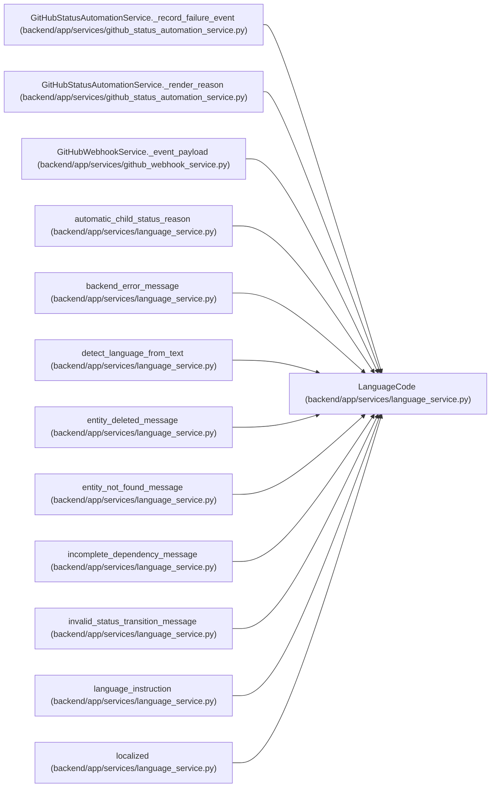

# LanguageCode

**Location:** `backend/app/services/language_service.py:11`
**Kind:** Type alias
**Bases:** —
**Module:** [language_service](../modules/language_service.md)
**Target:** `Literal['en', 'ru']`

## Description

_Auto-generated from `LanguageCode` in `backend/app/services/language_service.py`._

## Attributes

*No annotated attributes found.*

## Methods

*No public methods. Inherits from base classes.*

## Relationships

<!-- Auto-generated relationship summary. Do not edit by hand. -->

### Summary

| Module | Methods | Attributes |
|---|---:|---|
| [language_service](../modules/language_service.md) | 0 | — |

### References

| Reference | Kind | Source | Call sites |
|---|---|---|---:|
| `GitHubStatusAutomationService._record_failure_event` | type_reference | [github_status_automation_service](../modules/github_status_automation_service.md) | — |
| `GitHubStatusAutomationService._render_reason` | type_reference | [github_status_automation_service](../modules/github_status_automation_service.md) | — |
| `GitHubWebhookService._event_payload` | type_reference | [github_webhook_service](../modules/github_webhook_service.md) | — |
| `automatic_child_status_reason` | type_reference | [language_service](../modules/language_service.md) | — |
| `backend_error_message` | type_reference | [language_service](../modules/language_service.md) | — |
| `detect_language_from_text` | type_reference | [language_service](../modules/language_service.md) | — |
| `entity_deleted_message` | type_reference | [language_service](../modules/language_service.md) | — |
| `entity_not_found_message` | type_reference | [language_service](../modules/language_service.md) | — |
| `incomplete_dependency_message` | type_reference | [language_service](../modules/language_service.md) | — |
| `invalid_status_transition_message` | type_reference | [language_service](../modules/language_service.md) | — |
| `language_instruction` | type_reference | [language_service](../modules/language_service.md) | — |
| `localized` | type_reference | [language_service](../modules/language_service.md) | — |

> References: showing 12 of 41 logical references; 29 omitted by the 12-row generated summary limit.
