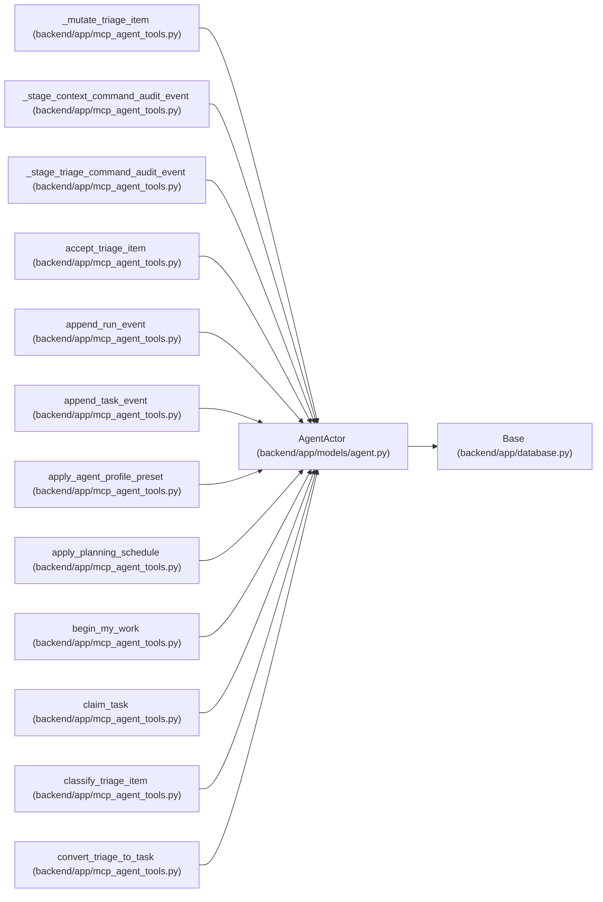

# AgentActor

**Location:** `backend/app/models/agent.py:30`
**Kind:** Class
**Bases:** `Base`
**Module:** [models_agent](../modules/models_agent.md)

## Description

Automated agent identity authorized to operate on tasks.

## Attributes

| Name | Type | Default | Description |
|------|------|---------|-------------|
| `id` | `Mapped[int]` | `mapped_column(Integer, primary_key=True, autoincrement=True)` | — |
| `name` | `Mapped[str]` | `mapped_column(String(100), unique=True, nullable=False)` | — |
| `display_name` | `Mapped[str]` | `mapped_column(String(255), nullable=False)` | — |
| `api_key_hash` | `Mapped[str]` | `mapped_column(String(128), unique=True, nullable=False)` | — |
| `scopes` | `Mapped[str]` | `mapped_column(Text, default='[]', nullable=False)` | — |
| `enabled` | `Mapped[bool]` | `mapped_column(default=True, nullable=False)` | — |
| `lifecycle_state` | `Mapped[str]` | `mapped_column(String(30), default='active', server_default='active', nullable=False)` | — |
| `role` | `Mapped[str]` | `mapped_column(String(30), default='worker', nullable=False)` | — |
| `profile_id` | `Mapped[Optional[int]]` | `mapped_column(Integer, ForeignKey('team_member_profiles.id', ondelete='SET NULL'), nullable=True, index=True)` | — |
| `work_policy` | `Mapped[str]` | `mapped_column(String(40), default='assigned_only', nullable=False)` | — |
| `max_parallel_work` | `Mapped[int]` | `mapped_column(Integer, default=1, nullable=False)` | — |
| `queue_revision` | `Mapped[int]` | `mapped_column(Integer, default=1, nullable=False)` | — |
| `created_at` | `Mapped[datetime]` | `mapped_column(UTCDateTime(), default=utc_now, nullable=False)` | — |
| `last_seen_at` | `Mapped[Optional[datetime]]` | `mapped_column(UTCDateTime(), nullable=True)` | — |
| `claimed_tasks` | `Mapped[list['Task']]` | `relationship('Task', back_populates='claimed_agent')` | — |
| `task_events` | `Mapped[list['TaskEvent']]` | `relationship('TaskEvent', back_populates='actor')` | — |
| `runs` | `Mapped[list['AgentRun']]` | `relationship('AgentRun', back_populates='actor')` | — |
| `project_updates_authored` | `Mapped[list['ProjectUpdateEntry']]` | `relationship('ProjectUpdateEntry', back_populates='created_by_actor')` | — |
| `profile` | `Mapped[Optional['TeamMemberProfile']]` | `relationship('TeamMemberProfile', back_populates='agent_actors')` | — |
| `assignments` | `Mapped[list['AgentTaskAssignment']]` | `relationship('AgentTaskAssignment', foreign_keys='AgentTaskAssignment.actor_id', back_populates='actor')` | — |
| `assignments_created` | `Mapped[list['AgentTaskAssignment']]` | `relationship('AgentTaskAssignment', foreign_keys='AgentTaskAssignment.assigned_by_actor_id', back_populates='assigned_by_actor')` | — |
| `model_bindings` | `Mapped[list['AgentModelBinding']]` | `relationship('AgentModelBinding', back_populates='actor', passive_deletes=True)` | — |
| `routing_assessments_created` | `Mapped[list['TaskRoutingAssessment']]` | `relationship('TaskRoutingAssessment', back_populates='assessor_actor', passive_deletes=True)` | — |

## Methods

*No public methods. Inherits from base classes.*

## Relationships

<!-- Auto-generated relationship summary. Do not edit by hand. -->

### Summary

| Module | Methods | Attributes |
|---|---:|---|
| [models_agent](../modules/models_agent.md) | 0 | `api_key_hash`, `assignments`, `assignments_created`, `claimed_tasks`, `created_at`, `display_name`, `enabled`, `id`, `last_seen_at`, `lifecycle_state`, `max_parallel_work`, `model_bindings` |

### Structure

| Kind | Entity | Module |
|---|---|---|
| Base | `Base` | [app_database](../modules/app_database.md) |

### References

| Reference | Kind | Source | Call sites |
|---|---|---|---:|
| `_mutate_triage_item` | type_reference | [mcp_agent_tools](../modules/mcp_agent_tools.md) | — |
| `_stage_context_command_audit_event` | type_reference | [mcp_agent_tools](../modules/mcp_agent_tools.md) | — |
| `_stage_triage_command_audit_event` | type_reference | [mcp_agent_tools](../modules/mcp_agent_tools.md) | — |
| `accept_triage_item` | type_reference | [mcp_agent_tools](../modules/mcp_agent_tools.md) | — |
| `append_run_event` | type_reference | [mcp_agent_tools](../modules/mcp_agent_tools.md) | — |
| `append_task_event` | type_reference | [mcp_agent_tools](../modules/mcp_agent_tools.md) | — |
| `apply_agent_profile_preset` | type_reference | [mcp_agent_tools](../modules/mcp_agent_tools.md) | — |
| `apply_planning_schedule` | type_reference | [mcp_agent_tools](../modules/mcp_agent_tools.md) | — |
| `begin_my_work` | type_reference | [mcp_agent_tools](../modules/mcp_agent_tools.md) | — |
| `claim_task` | type_reference | [mcp_agent_tools](../modules/mcp_agent_tools.md) | — |
| `classify_triage_item` | type_reference | [mcp_agent_tools](../modules/mcp_agent_tools.md) | — |
| `convert_triage_to_task` | type_reference | [mcp_agent_tools](../modules/mcp_agent_tools.md) | — |

> References: showing 12 of 355 logical references; 343 omitted by the 12-row generated summary limit.
