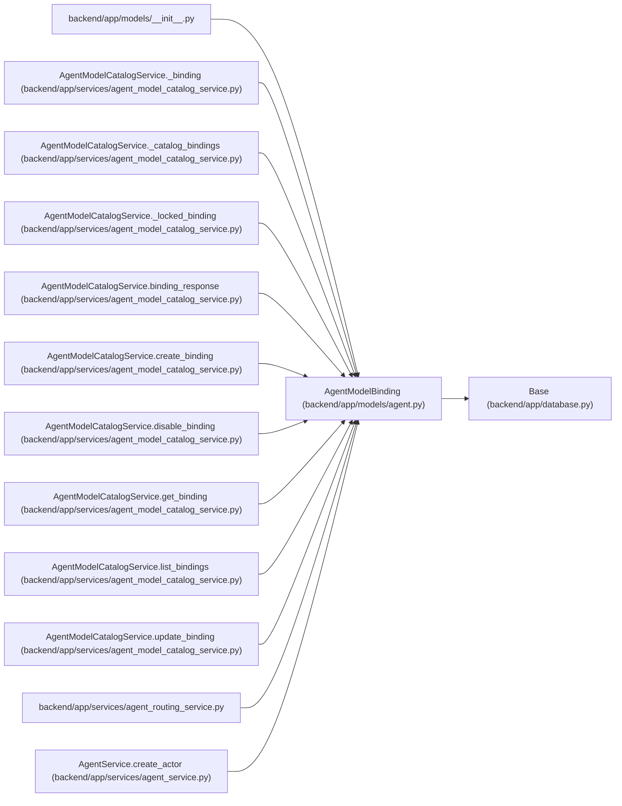

# AgentModelBinding

**Location:** `backend/app/models/agent.py:188`
**Kind:** Class
**Bases:** `Base`
**Module:** [models_agent](../modules/models_agent.md)

## Description

Versioned runtime capability binding owned by one exact actor.

## Attributes

| Name | Type | Default | Description |
|------|------|---------|-------------|
| `id` | `Mapped[int]` | `mapped_column(Integer, primary_key=True, autoincrement=True)` | — |
| `actor_id` | `Mapped[int]` | `mapped_column(Integer, ForeignKey('agent_actors.id', ondelete='CASCADE'), nullable=False)` | — |
| `model_catalog_id` | `Mapped[int]` | `mapped_column(Integer, ForeignKey('agent_model_catalog_entries.id', ondelete='RESTRICT'), nullable=False)` | — |
| `is_default` | `Mapped[bool]` | `mapped_column(Boolean, default=False, nullable=False)` | — |
| `enabled` | `Mapped[bool]` | `mapped_column(Boolean, default=True, nullable=False)` | — |
| `tool_tags` | `Mapped[list[Any]]` | `mapped_column(JSON, default=list, nullable=False)` | — |
| `data_policy_tags` | `Mapped[list[Any]]` | `mapped_column(JSON, default=list, nullable=False)` | — |
| `revision` | `Mapped[int]` | `mapped_column(Integer, default=1, nullable=False)` | — |
| `created_at` | `Mapped[datetime]` | `mapped_column(UTCDateTime(), default=utc_now, nullable=False)` | — |
| `updated_at` | `Mapped[datetime]` | `mapped_column(UTCDateTime(), default=utc_now, onupdate=utc_now, nullable=False)` | — |
| `actor` | `Mapped['AgentActor']` | `relationship('AgentActor', back_populates='model_bindings')` | — |
| `model_catalog` | `Mapped['AgentModelCatalogEntry']` | `relationship('AgentModelCatalogEntry', back_populates='bindings')` | — |
| `assignments` | `Mapped[list['AgentTaskAssignment']]` | `relationship('AgentTaskAssignment', back_populates='model_binding', passive_deletes=True)` | — |
| `runs` | `Mapped[list['AgentRun']]` | `relationship('AgentRun', back_populates='model_binding', passive_deletes=True)` | — |

## Methods

| Method | Signature | Decorators | Description |
|--------|-----------|------------|-------------|
| `model_catalog_key` | `() -> Optional[str]` | `@property` | Expose the stable catalog key without duplicating it in the binding. |
| `selectable` | `() -> bool` | `@property` | Return whether current metadata permits this binding to be selected. |

## Relationships

<!-- Auto-generated relationship summary. Do not edit by hand. -->

### Summary

| Module | Methods | Attributes |
|---|---:|---|
| [models_agent](../modules/models_agent.md) | 2 | `actor`, `actor_id`, `assignments`, `created_at`, `data_policy_tags`, `enabled`, `id`, `is_default`, `model_catalog`, `model_catalog_id`, `revision`, `runs` |

### Structure

| Kind | Entity | Module |
|---|---|---|
| Base | `Base` | [app_database](../modules/app_database.md) |

### References

| Reference | Kind | Source | Call sites |
|---|---|---|---:|
| `__init__` | import | [models___init__](../modules/models___init__.md) | — |
| `AgentModelCatalogService._binding` | type_reference | [agent_model_catalog_service](../modules/agent_model_catalog_service.md) | — |
| `AgentModelCatalogService._catalog_bindings` | type_reference | [agent_model_catalog_service](../modules/agent_model_catalog_service.md) | — |
| `AgentModelCatalogService._locked_binding` | type_reference | [agent_model_catalog_service](../modules/agent_model_catalog_service.md) | — |
| `AgentModelCatalogService.binding_response` | type_reference | [agent_model_catalog_service](../modules/agent_model_catalog_service.md) | — |
| `AgentModelCatalogService.create_binding` | type_reference | [agent_model_catalog_service](../modules/agent_model_catalog_service.md) | — |
| `AgentModelCatalogService.disable_binding` | type_reference | [agent_model_catalog_service](../modules/agent_model_catalog_service.md) | — |
| `AgentModelCatalogService.get_binding` | type_reference | [agent_model_catalog_service](../modules/agent_model_catalog_service.md) | — |
| `AgentModelCatalogService.list_bindings` | type_reference | [agent_model_catalog_service](../modules/agent_model_catalog_service.md) | — |
| `AgentModelCatalogService.update_binding` | type_reference | [agent_model_catalog_service](../modules/agent_model_catalog_service.md) | — |
| `agent_routing_service` | import | [agent_routing_service](../modules/agent_routing_service.md) | — |
| `AgentService.create_actor` | call | [agent_service](../modules/agent_service.md) | 1 |

> References: showing 12 of 30 logical references; 18 omitted by the 12-row generated summary limit.
