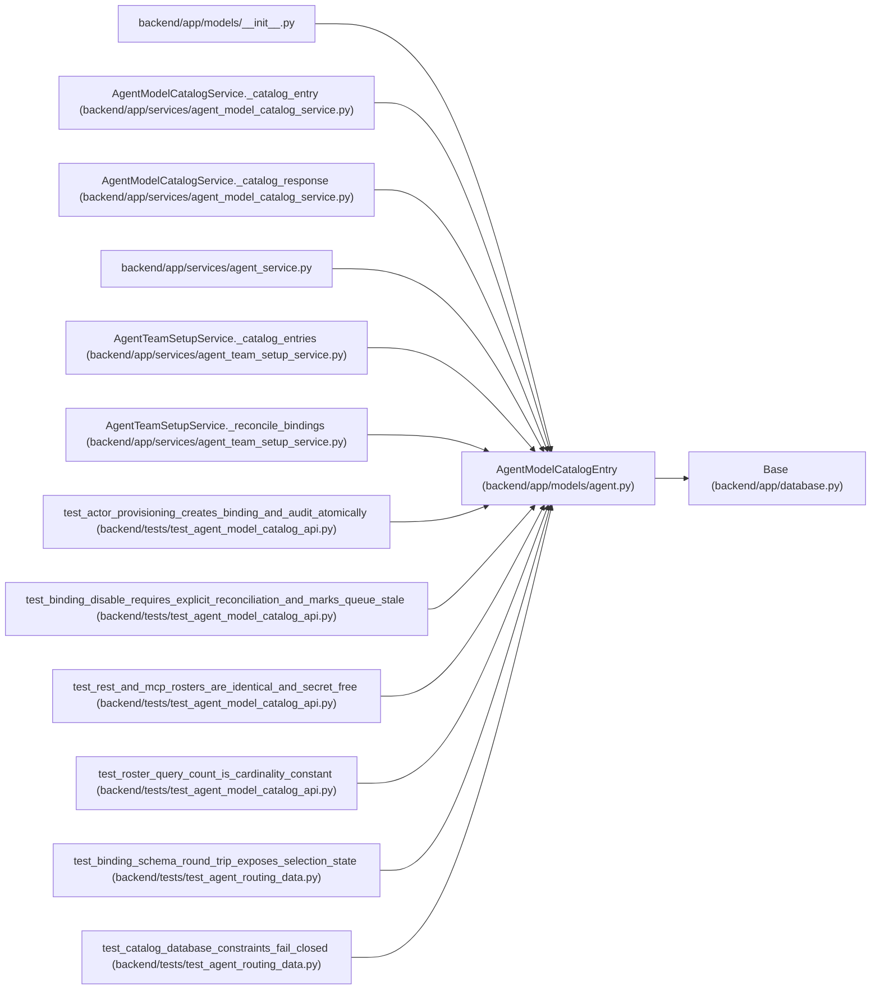

# AgentModelCatalogEntry

**Location:** `backend/app/models/agent.py:114`
**Kind:** Class
**Bases:** `Base`
**Module:** [models_agent](../modules/models_agent.md)

## Description

Secret-free provider-neutral model capability declaration.

## Attributes

| Name | Type | Default | Description |
|------|------|---------|-------------|
| `id` | `Mapped[int]` | `mapped_column(Integer, primary_key=True, autoincrement=True)` | — |
| `key` | `Mapped[str]` | `mapped_column(String(120), unique=True, nullable=False)` | — |
| `provider` | `Mapped[str]` | `mapped_column(String(120), nullable=False)` | — |
| `configured_model_alias` | `Mapped[str]` | `mapped_column(String(255), nullable=False)` | — |
| `reasoning_tier` | `Mapped[int]` | `mapped_column(Integer, nullable=False)` | — |
| `context_tier` | `Mapped[str]` | `mapped_column(String(20), nullable=False)` | — |
| `modality_tags` | `Mapped[list[Any]]` | `mapped_column(JSON, default=lambda: ['text'], nullable=False)` | — |
| `cost_tier` | `Mapped[str]` | `mapped_column(String(20), nullable=False)` | — |
| `latency_tier` | `Mapped[str]` | `mapped_column(String(20), nullable=False)` | — |
| `enabled` | `Mapped[bool]` | `mapped_column(Boolean, default=True, nullable=False)` | — |
| `revision` | `Mapped[int]` | `mapped_column(Integer, default=1, nullable=False)` | — |
| `last_verified_at` | `Mapped[Optional[datetime]]` | `mapped_column(UTCDateTime(), nullable=True)` | — |
| `created_at` | `Mapped[datetime]` | `mapped_column(UTCDateTime(), default=utc_now, nullable=False)` | — |
| `updated_at` | `Mapped[datetime]` | `mapped_column(UTCDateTime(), default=utc_now, onupdate=utc_now, nullable=False)` | — |
| `bindings` | `Mapped[list['AgentModelBinding']]` | `relationship('AgentModelBinding', back_populates='model_catalog', passive_deletes=True)` | — |

## Methods

*No public methods. Inherits from base classes.*

## Relationships

<!-- Auto-generated relationship summary. Do not edit by hand. -->

### Summary

| Module | Methods | Attributes |
|---|---:|---|
| [models_agent](../modules/models_agent.md) | 0 | `bindings`, `configured_model_alias`, `context_tier`, `cost_tier`, `created_at`, `enabled`, `id`, `key`, `last_verified_at`, `latency_tier`, `modality_tags`, `provider` |

### Structure

| Kind | Entity | Module |
|---|---|---|
| Base | `Base` | [app_database](../modules/app_database.md) |

### References

| Reference | Kind | Source | Call sites |
|---|---|---|---:|
| `__init__` | import | [models___init__](../modules/models___init__.md) | — |
| `AgentModelCatalogService._catalog_entry` | type_reference | [agent_model_catalog_service](../modules/agent_model_catalog_service.md) | — |
| `AgentModelCatalogService._catalog_response` | type_reference | [agent_model_catalog_service](../modules/agent_model_catalog_service.md) | — |
| `agent_service` | import | [agent_service](../modules/agent_service.md) | — |
| `AgentTeamSetupService._catalog_entries` | type_reference | [agent_team_setup_service](../modules/agent_team_setup_service.md) | — |
| `AgentTeamSetupService._reconcile_bindings` | type_reference | [agent_team_setup_service](../modules/agent_team_setup_service.md) | — |
| `test_actor_provisioning_creates_binding_and_audit_atomically` | call | [test_agent_model_catalog_api](../modules/test_agent_model_catalog_api.md) | 1 |
| `test_binding_disable_requires_explicit_reconciliation_and_marks_queue_stale` | call | [test_agent_model_catalog_api](../modules/test_agent_model_catalog_api.md) | 1 |
| `test_rest_and_mcp_rosters_are_identical_and_secret_free` | call | [test_agent_model_catalog_api](../modules/test_agent_model_catalog_api.md) | 2 |
| `test_roster_query_count_is_cardinality_constant` | call | [test_agent_model_catalog_api](../modules/test_agent_model_catalog_api.md) | 1 |
| `test_binding_schema_round_trip_exposes_selection_state` | call | [test_agent_routing_data](../modules/test_agent_routing_data.md) | 1 |
| `test_catalog_database_constraints_fail_closed` | call | [test_agent_routing_data](../modules/test_agent_routing_data.md) | 1 |

> References: showing 12 of 26 logical references; 14 omitted by the 12-row generated summary limit.
