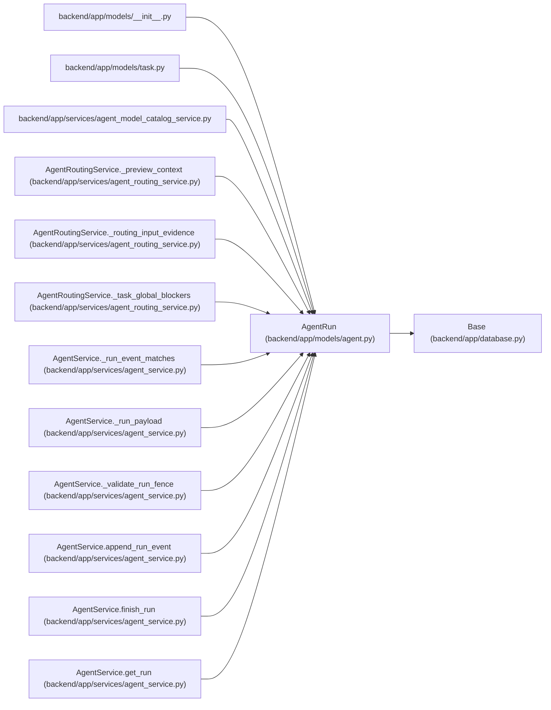

# AgentRun

**Location:** `backend/app/models/agent.py:1031`
**Kind:** Class
**Bases:** `Base`
**Module:** [models_agent](../modules/models_agent.md)

## Description

Trace record for one automated agent execution.

## Attributes

| Name | Type | Default | Description |
|------|------|---------|-------------|
| `id` | `Mapped[int]` | `mapped_column(Integer, primary_key=True, autoincrement=True)` | — |
| `task_id` | `Mapped[Optional[int]]` | `mapped_column(Integer, ForeignKey('tasks.id', ondelete='SET NULL'), nullable=True, index=True)` | — |
| `actor_id` | `Mapped[int]` | `mapped_column(Integer, ForeignKey('agent_actors.id'), nullable=False, index=True)` | — |
| `assignment_id` | `Mapped[Optional[int]]` | `mapped_column(Integer, ForeignKey('agent_task_assignments.id', ondelete='SET NULL'), nullable=True, index=True)` | — |
| `claim_generation` | `Mapped[Optional[int]]` | `mapped_column(Integer, nullable=True)` | — |
| `status` | `Mapped[str]` | `mapped_column(String(50), default='running', nullable=False, index=True)` | — |
| `trace_id` | `Mapped[Optional[str]]` | `mapped_column(String(255), nullable=True, index=True)` | — |
| `model_binding_id` | `Mapped[Optional[int]]` | `mapped_column(Integer, ForeignKey('agent_model_bindings.id', ondelete='RESTRICT'), nullable=True, index=True)` | — |
| `model_binding_revision` | `Mapped[Optional[int]]` | `mapped_column(Integer, nullable=True)` | — |
| `configured_model_alias` | `Mapped[Optional[str]]` | `mapped_column(String(255), nullable=True)` | — |
| `resolved_model_id` | `Mapped[Optional[str]]` | `mapped_column(String(255), nullable=True)` | — |
| `model_trust_state` | `Mapped[str]` | `mapped_column(String(30), default='unreported', server_default='unreported', nullable=False)` | — |
| `model_match_basis` | `Mapped[Optional[str]]` | `mapped_column(String(40), nullable=True)` | — |
| `model` | `Mapped[Optional[str]]` | `mapped_column(String(255), nullable=True)` | — |
| `tool_name` | `Mapped[Optional[str]]` | `mapped_column(String(255), nullable=True)` | — |
| `run_metadata` | `Mapped[str]` | `mapped_column(Text, default='{}', nullable=False)` | — |
| `artifact_links` | `Mapped[str]` | `mapped_column(Text, default='[]', nullable=False)` | — |
| `commit_url` | `Mapped[Optional[str]]` | `mapped_column(String(1000), nullable=True)` | — |
| `pr_url` | `Mapped[Optional[str]]` | `mapped_column(String(1000), nullable=True)` | — |
| `summary` | `Mapped[Optional[str]]` | `mapped_column(Text, nullable=True)` | — |
| `error` | `Mapped[Optional[str]]` | `mapped_column(Text, nullable=True)` | — |
| `idempotency_key` | `Mapped[Optional[str]]` | `mapped_column(String(255), nullable=True, index=True)` | — |
| `started_at` | `Mapped[datetime]` | `mapped_column(UTCDateTime(), default=utc_now, nullable=False, index=True)` | — |
| `ended_at` | `Mapped[Optional[datetime]]` | `mapped_column(UTCDateTime(), nullable=True)` | — |
| `heartbeat_at` | `Mapped[Optional[datetime]]` | `mapped_column(UTCDateTime(), nullable=True)` | — |
| `task` | `Mapped[Optional['Task']]` | `relationship('Task', back_populates='agent_runs')` | — |
| `actor` | `Mapped['AgentActor']` | `relationship('AgentActor', back_populates='runs')` | — |
| `assignment` | `Mapped[Optional['AgentTaskAssignment']]` | `relationship('AgentTaskAssignment', back_populates='runs')` | — |
| `model_binding` | `Mapped[Optional['AgentModelBinding']]` | `relationship('AgentModelBinding', back_populates='runs')` | — |
| `events` | `Mapped[list['AgentRunEvent']]` | `relationship('AgentRunEvent', back_populates='run', cascade='all, delete-orphan', order_by='AgentRunEvent.created_at')` | — |

## Methods

*No public methods. Inherits from base classes.*

## Relationships

<!-- Auto-generated relationship summary. Do not edit by hand. -->

### Summary

| Module | Methods | Attributes |
|---|---:|---|
| [models_agent](../modules/models_agent.md) | 0 | `actor`, `actor_id`, `artifact_links`, `assignment`, `assignment_id`, `claim_generation`, `commit_url`, `configured_model_alias`, `ended_at`, `error`, `events`, `heartbeat_at` |

### Structure

| Kind | Entity | Module |
|---|---|---|
| Base | `Base` | [app_database](../modules/app_database.md) |

### References

| Reference | Kind | Source | Call sites |
|---|---|---|---:|
| `__init__` | import | [models___init__](../modules/models___init__.md) | — |
| `task` | import | [models_task](../modules/models_task.md) | — |
| `agent_model_catalog_service` | import | [agent_model_catalog_service](../modules/agent_model_catalog_service.md) | — |
| `AgentRoutingService._preview_context` | type_reference | [agent_routing_service](../modules/agent_routing_service.md) | — |
| `AgentRoutingService._routing_input_evidence` | type_reference | [agent_routing_service](../modules/agent_routing_service.md) | — |
| `AgentRoutingService._task_global_blockers` | type_reference | [agent_routing_service](../modules/agent_routing_service.md) | — |
| `AgentService._run_event_matches` | type_reference | [agent_service](../modules/agent_service.md) | — |
| `AgentService._run_payload` | type_reference | [agent_service](../modules/agent_service.md) | — |
| `AgentService._validate_run_fence` | type_reference | [agent_service](../modules/agent_service.md) | — |
| `AgentService.append_run_event` | type_reference | [agent_service](../modules/agent_service.md) | — |
| `AgentService.finish_run` | type_reference | [agent_service](../modules/agent_service.md) | — |
| `AgentService.get_run` | type_reference | [agent_service](../modules/agent_service.md) | — |

> References: showing 12 of 39 logical references; 27 omitted by the 12-row generated summary limit.
