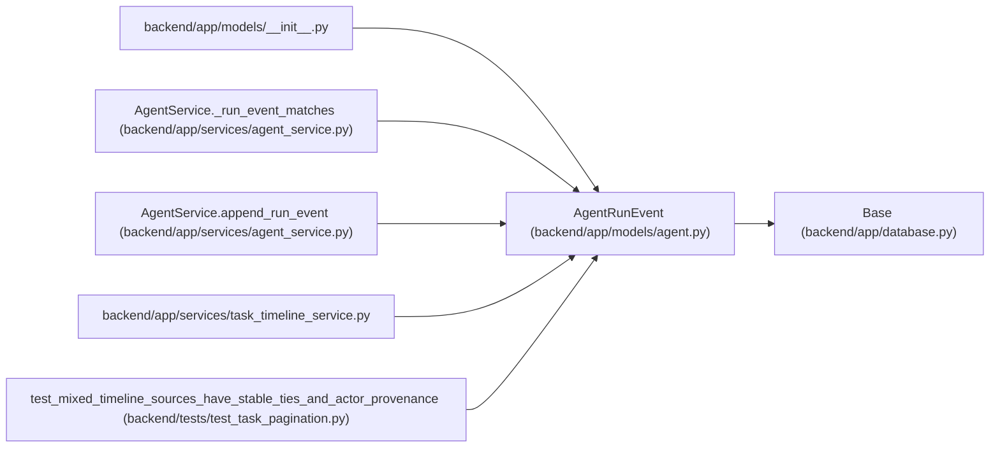

# AgentRunEvent

**Location:** `backend/app/models/agent.py:1133`
**Kind:** Class
**Bases:** `Base`
**Module:** [models_agent](../modules/models_agent.md)

## Description

Append-only event emitted during an agent run.

## Attributes

| Name | Type | Default | Description |
|------|------|---------|-------------|
| `id` | `Mapped[int]` | `mapped_column(Integer, primary_key=True, autoincrement=True)` | — |
| `run_id` | `Mapped[int]` | `mapped_column(Integer, ForeignKey('agent_runs.id', ondelete='CASCADE'), nullable=False, index=True)` | — |
| `event_type` | `Mapped[str]` | `mapped_column(String(100), nullable=False, index=True)` | — |
| `message` | `Mapped[Optional[str]]` | `mapped_column(Text, nullable=True)` | — |
| `payload` | `Mapped[str]` | `mapped_column(Text, default='{}', nullable=False)` | — |
| `trace_id` | `Mapped[Optional[str]]` | `mapped_column(String(255), nullable=True, index=True)` | — |
| `span_id` | `Mapped[Optional[str]]` | `mapped_column(String(255), nullable=True)` | — |
| `correlation_id` | `Mapped[Optional[str]]` | `mapped_column(String(255), nullable=True, index=True)` | — |
| `idempotency_key` | `Mapped[Optional[str]]` | `mapped_column(String(255), nullable=True, index=True)` | — |
| `created_at` | `Mapped[datetime]` | `mapped_column(UTCDateTime(), default=utc_now, nullable=False, index=True)` | — |
| `run` | `Mapped['AgentRun']` | `relationship('AgentRun', back_populates='events')` | — |

## Methods

*No public methods. Inherits from base classes.*

## Relationships

<!-- Auto-generated relationship summary. Do not edit by hand. -->

### Summary

| Module | Methods | Attributes |
|---|---:|---|
| [models_agent](../modules/models_agent.md) | 0 | `correlation_id`, `created_at`, `event_type`, `id`, `idempotency_key`, `message`, `payload`, `run`, `run_id`, `span_id`, `trace_id` |

### Structure

| Kind | Entity | Module |
|---|---|---|
| Base | `Base` | [app_database](../modules/app_database.md) |

### References

| Reference | Kind | Source | Call sites |
|---|---|---|---:|
| `__init__` | import | [models___init__](../modules/models___init__.md) | — |
| `AgentService._run_event_matches` | type_reference | [agent_service](../modules/agent_service.md) | — |
| `AgentService.append_run_event` | call | [agent_service](../modules/agent_service.md) | 1 |
| `AgentService.append_run_event` | type_reference | [agent_service](../modules/agent_service.md) | — |
| `task_timeline_service` | import | [task_timeline_service](../modules/task_timeline_service.md) | — |
| `test_mixed_timeline_sources_have_stable_ties_and_actor_provenance` | call | [test_task_pagination](../modules/test_task_pagination.md) | 1 |
