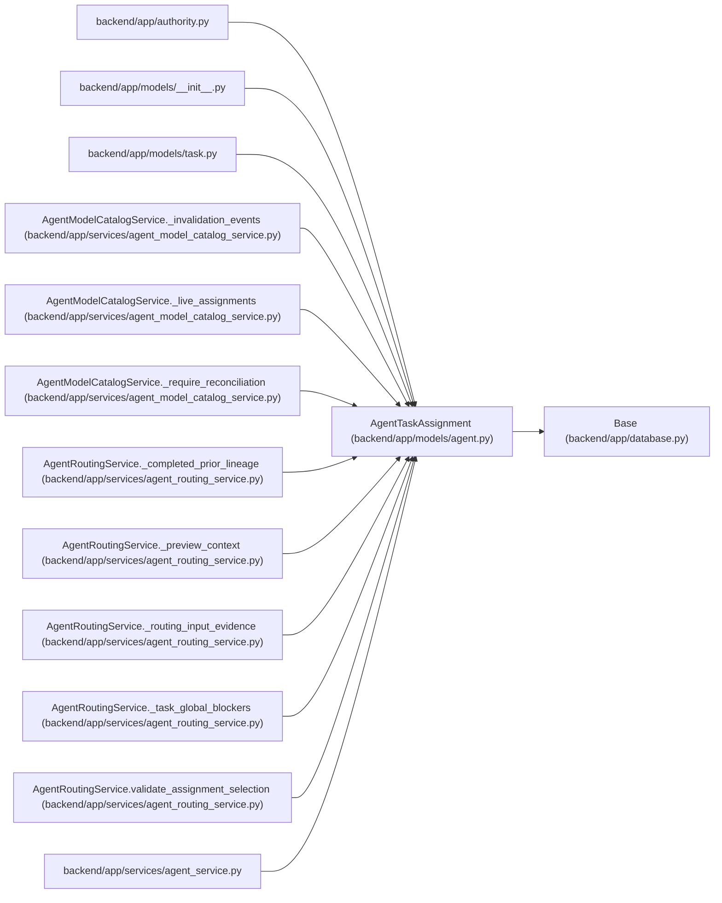

# AgentTaskAssignment

**Location:** `backend/app/models/agent.py:850`
**Kind:** Class
**Bases:** `Base`
**Module:** [models_agent](../modules/models_agent.md)

## Description

Durable delegation of task execution or verification to one actor.

## Attributes

| Name | Type | Default | Description |
|------|------|---------|-------------|
| `id` | `Mapped[int]` | `mapped_column(Integer, primary_key=True, autoincrement=True)` | — |
| `task_id` | `Mapped[int]` | `mapped_column(Integer, ForeignKey('tasks.id', ondelete='CASCADE'), nullable=False, index=True)` | — |
| `actor_id` | `Mapped[int]` | `mapped_column(Integer, ForeignKey('agent_actors.id', ondelete='CASCADE'), nullable=False, index=True)` | — |
| `team_member_id` | `Mapped[Optional[int]]` | `mapped_column(Integer, ForeignKey('team_members.id', ondelete='SET NULL'), nullable=True)` | — |
| `purpose` | `Mapped[str]` | `mapped_column(String(30), default='execution', nullable=False)` | — |
| `queue_class` | `Mapped[str]` | `mapped_column(String(30), default='normal', nullable=False)` | — |
| `state` | `Mapped[str]` | `mapped_column(String(30), default='queued', nullable=False)` | — |
| `queue_rank` | `Mapped[int]` | `mapped_column(Integer, default=1000, nullable=False)` | — |
| `not_before` | `Mapped[Optional[datetime]]` | `mapped_column(UTCDateTime(), nullable=True)` | — |
| `assigned_by_actor_id` | `Mapped[Optional[int]]` | `mapped_column(Integer, ForeignKey('agent_actors.id', ondelete='SET NULL'), nullable=True)` | — |
| `reviewer_profile_id` | `Mapped[Optional[int]]` | `mapped_column(Integer, ForeignKey('team_member_profiles.id', ondelete='SET NULL'), nullable=True)` | — |
| `task_version` | `Mapped[int]` | `mapped_column(Integer, nullable=False)` | — |
| `model_binding_id` | `Mapped[Optional[int]]` | `mapped_column(Integer, ForeignKey('agent_model_bindings.id', ondelete='RESTRICT'), nullable=True, index=True)` | — |
| `model_binding_revision` | `Mapped[Optional[int]]` | `mapped_column(Integer, nullable=True)` | — |
| `routing_snapshot` | `Mapped[str]` | `mapped_column(Text, default='{}', nullable=False)` | — |
| `reason` | `Mapped[Optional[str]]` | `mapped_column(Text, nullable=True)` | — |
| `created_at` | `Mapped[datetime]` | `mapped_column(UTCDateTime(), default=utc_now, nullable=False, index=True)` | — |
| `updated_at` | `Mapped[datetime]` | `mapped_column(UTCDateTime(), default=utc_now, onupdate=utc_now, nullable=False)` | — |
| `task` | `Mapped['Task']` | `relationship('Task', back_populates='agent_assignments')` | — |
| `actor` | `Mapped['AgentActor']` | `relationship('AgentActor', foreign_keys=[actor_id], back_populates='assignments')` | — |
| `assigned_by_actor` | `Mapped[Optional['AgentActor']]` | `relationship('AgentActor', foreign_keys=[assigned_by_actor_id], back_populates='assignments_created')` | — |
| `team_member` | `Mapped[Optional['TeamMember']]` | `relationship('TeamMember')` | — |
| `reviewer_profile` | `Mapped[Optional['TeamMemberProfile']]` | `relationship('TeamMemberProfile', foreign_keys=[reviewer_profile_id])` | — |
| `model_binding` | `Mapped[Optional['AgentModelBinding']]` | `relationship('AgentModelBinding', back_populates='assignments')` | — |
| `runs` | `Mapped[list['AgentRun']]` | `relationship('AgentRun', back_populates='assignment')` | — |

## Methods

*No public methods. Inherits from base classes.*

## Relationships

<!-- Auto-generated relationship summary. Do not edit by hand. -->

### Summary

| Module | Methods | Attributes |
|---|---:|---|
| [models_agent](../modules/models_agent.md) | 0 | `actor`, `actor_id`, `assigned_by_actor`, `assigned_by_actor_id`, `created_at`, `id`, `model_binding`, `model_binding_id`, `model_binding_revision`, `not_before`, `purpose`, `queue_class` |

### Structure

| Kind | Entity | Module |
|---|---|---|
| Base | `Base` | [app_database](../modules/app_database.md) |

### References

| Reference | Kind | Source | Call sites |
|---|---|---|---:|
| `authority` | import | [authority](../modules/authority.md) | — |
| `__init__` | import | [models___init__](../modules/models___init__.md) | — |
| `task` | import | [models_task](../modules/models_task.md) | — |
| `AgentModelCatalogService._invalidation_events` | type_reference | [agent_model_catalog_service](../modules/agent_model_catalog_service.md) | — |
| `AgentModelCatalogService._live_assignments` | type_reference | [agent_model_catalog_service](../modules/agent_model_catalog_service.md) | — |
| `AgentModelCatalogService._require_reconciliation` | type_reference | [agent_model_catalog_service](../modules/agent_model_catalog_service.md) | — |
| `AgentRoutingService._completed_prior_lineage` | type_reference | [agent_routing_service](../modules/agent_routing_service.md) | — |
| `AgentRoutingService._preview_context` | type_reference | [agent_routing_service](../modules/agent_routing_service.md) | — |
| `AgentRoutingService._routing_input_evidence` | type_reference | [agent_routing_service](../modules/agent_routing_service.md) | — |
| `AgentRoutingService._task_global_blockers` | type_reference | [agent_routing_service](../modules/agent_routing_service.md) | — |
| `AgentRoutingService.validate_assignment_selection` | type_reference | [agent_routing_service](../modules/agent_routing_service.md) | — |
| `agent_service` | import | [agent_service](../modules/agent_service.md) | — |

> References: showing 12 of 52 logical references; 40 omitted by the 12-row generated summary limit.
