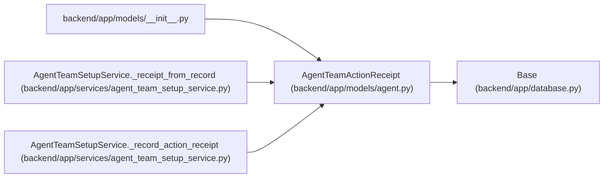

# AgentTeamActionReceipt

**Location:** `backend/app/models/agent.py:651`
**Kind:** Class
**Bases:** `Base`
**Module:** [models_agent](../modules/models_agent.md)

## Description

Durable redacted result for one explicitly approved setup action.

## Attributes

| Name | Type | Default | Description |
|------|------|---------|-------------|
| `id` | `Mapped[int]` | `mapped_column(Integer, primary_key=True, autoincrement=True)` | — |
| `apply_run_id` | `Mapped[int]` | `mapped_column(Integer, ForeignKey('agent_team_apply_runs.id', ondelete='RESTRICT'), nullable=False)` | — |
| `action_id` | `Mapped[str]` | `mapped_column(String(128), nullable=False)` | — |
| `action_digest` | `Mapped[str]` | `mapped_column(String(64), nullable=False)` | — |
| `reconciliation_class` | `Mapped[str]` | `mapped_column(String(40), nullable=False)` | — |
| `operation` | `Mapped[str]` | `mapped_column(String(80), nullable=False)` | — |
| `actor_key` | `Mapped[str]` | `mapped_column(String(100), nullable=False)` | — |
| `status` | `Mapped[str]` | `mapped_column(String(30), nullable=False)` | — |
| `target_actor_id` | `Mapped[Optional[int]]` | `mapped_column(Integer, nullable=True)` | — |
| `before_revision` | `Mapped[Optional[int]]` | `mapped_column(Integer, nullable=True)` | — |
| `after_revision` | `Mapped[Optional[int]]` | `mapped_column(Integer, nullable=True)` | — |
| `blocker_code` | `Mapped[Optional[str]]` | `mapped_column(String(128), nullable=True)` | — |
| `next_action` | `Mapped[Optional[str]]` | `mapped_column(String(255), nullable=True)` | — |
| `result_payload` | `Mapped[str]` | `mapped_column(Text, default='{}', nullable=False)` | — |
| `created_at` | `Mapped[datetime]` | `mapped_column(UTCDateTime(), default=utc_now, nullable=False)` | — |
| `apply_run` | `Mapped['AgentTeamApplyRun']` | `relationship('AgentTeamApplyRun', back_populates='action_receipts')` | — |

## Methods

*No public methods. Inherits from base classes.*

## Relationships

<!-- Auto-generated relationship summary. Do not edit by hand. -->

### Summary

| Module | Methods | Attributes |
|---|---:|---|
| [models_agent](../modules/models_agent.md) | 0 | `action_digest`, `action_id`, `actor_key`, `after_revision`, `apply_run`, `apply_run_id`, `before_revision`, `blocker_code`, `created_at`, `id`, `next_action`, `operation` |

### Structure

| Kind | Entity | Module |
|---|---|---|
| Base | `Base` | [app_database](../modules/app_database.md) |

### References

| Reference | Kind | Source | Call sites |
|---|---|---|---:|
| `__init__` | import | [models___init__](../modules/models___init__.md) | — |
| `AgentTeamSetupService._receipt_from_record` | type_reference | [agent_team_setup_service](../modules/agent_team_setup_service.md) | — |
| `AgentTeamSetupService._record_action_receipt` | call | [agent_team_setup_service](../modules/agent_team_setup_service.md) | 1 |
