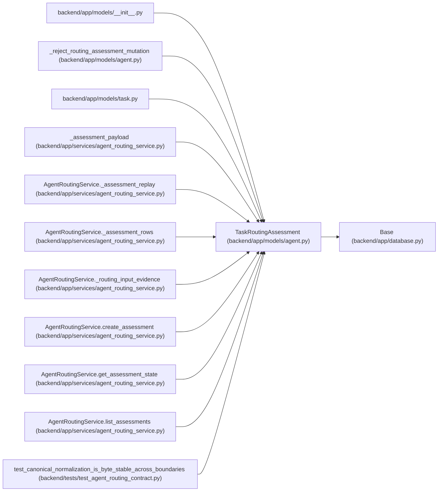

# TaskRoutingAssessment

**Location:** `backend/app/models/agent.py:708`
**Kind:** Class
**Bases:** `Base`
**Module:** [models_agent](../modules/models_agent.md)

## Description

Append-only routing assessment for one concrete task version.

## Attributes

| Name | Type | Default | Description |
|------|------|---------|-------------|
| `id` | `Mapped[int]` | `mapped_column(Integer, primary_key=True, autoincrement=True)` | — |
| `task_id` | `Mapped[int]` | `mapped_column(Integer, ForeignKey('tasks.id', ondelete='CASCADE'), nullable=False)` | — |
| `task_version` | `Mapped[int]` | `mapped_column(Integer, nullable=False)` | — |
| `policy_version` | `Mapped[str]` | `mapped_column(String(80), default='model-aware-routing-v1', nullable=False)` | — |
| `band` | `Mapped[str]` | `mapped_column(String(20), nullable=False)` | — |
| `reasoning_axis` | `Mapped[int]` | `mapped_column(Integer, nullable=False)` | — |
| `ambiguity_axis` | `Mapped[int]` | `mapped_column(Integer, nullable=False)` | — |
| `context_breadth_axis` | `Mapped[int]` | `mapped_column(Integer, nullable=False)` | — |
| `risk_axis` | `Mapped[int]` | `mapped_column(Integer, nullable=False)` | — |
| `verification_burden_axis` | `Mapped[int]` | `mapped_column(Integer, nullable=False)` | — |
| `required_skill_levels` | `Mapped[dict[str, Any]]` | `mapped_column(JSON, default=dict, nullable=False)` | — |
| `required_model` | `Mapped[dict[str, Any]]` | `mapped_column(JSON, default=dict, nullable=False)` | — |
| `review_mode` | `Mapped[str]` | `mapped_column(String(40), nullable=False)` | — |
| `confidence` | `Mapped[float]` | `mapped_column(Float, nullable=False)` | — |
| `reason_codes` | `Mapped[list[Any]]` | `mapped_column(JSON, default=list, nullable=False)` | — |
| `rationale` | `Mapped[str]` | `mapped_column(Text, nullable=False)` | — |
| `assessor` | `Mapped[str]` | `mapped_column(String(255), nullable=False)` | — |
| `assessor_actor_id` | `Mapped[Optional[int]]` | `mapped_column(Integer, ForeignKey('agent_actors.id', ondelete='SET NULL'), nullable=True)` | — |
| `created_at` | `Mapped[datetime]` | `mapped_column(UTCDateTime(), default=utc_now, nullable=False)` | — |
| `task` | `Mapped['Task']` | `relationship('Task', back_populates='routing_assessments')` | — |
| `assessor_actor` | `Mapped[Optional['AgentActor']]` | `relationship('AgentActor', back_populates='routing_assessments_created')` | — |

## Methods

| Method | Signature | Decorators | Description |
|--------|-----------|------------|-------------|
| `axes` | `() -> dict[str, int]` | `@property` | Return the normalized contract shape for the five stored axes. |
| `is_current_for` | `(task_version: int) -> bool` | — | Determine staleness without mutable flags or timestamps. |

## Relationships

<!-- Auto-generated relationship summary. Do not edit by hand. -->

### Summary

| Module | Methods | Attributes |
|---|---:|---|
| [models_agent](../modules/models_agent.md) | 2 | `ambiguity_axis`, `assessor`, `assessor_actor`, `assessor_actor_id`, `band`, `confidence`, `context_breadth_axis`, `created_at`, `id`, `policy_version`, `rationale`, `reason_codes` |

### Structure

| Kind | Entity | Module |
|---|---|---|
| Base | `Base` | [app_database](../modules/app_database.md) |

### References

| Reference | Kind | Source | Call sites |
|---|---|---|---:|
| `__init__` | import | [models___init__](../modules/models___init__.md) | — |
| `_reject_routing_assessment_mutation` | type_reference | [models_agent](../modules/models_agent.md) | — |
| `task` | import | [models_task](../modules/models_task.md) | — |
| `_assessment_payload` | type_reference | [agent_routing_service](../modules/agent_routing_service.md) | — |
| `AgentRoutingService._assessment_replay` | type_reference | [agent_routing_service](../modules/agent_routing_service.md) | — |
| `AgentRoutingService._assessment_rows` | type_reference | [agent_routing_service](../modules/agent_routing_service.md) | — |
| `AgentRoutingService._routing_input_evidence` | type_reference | [agent_routing_service](../modules/agent_routing_service.md) | — |
| `AgentRoutingService.create_assessment` | call | [agent_routing_service](../modules/agent_routing_service.md) | 1 |
| `AgentRoutingService.create_assessment` | type_reference | [agent_routing_service](../modules/agent_routing_service.md) | — |
| `AgentRoutingService.get_assessment_state` | type_reference | [agent_routing_service](../modules/agent_routing_service.md) | — |
| `AgentRoutingService.list_assessments` | type_reference | [agent_routing_service](../modules/agent_routing_service.md) | — |
| `test_canonical_normalization_is_byte_stable_across_boundaries` | call | [test_agent_routing_contract](../modules/test_agent_routing_contract.md) | 1 |

> References: showing 12 of 15 logical references; 3 omitted by the 12-row generated summary limit.
