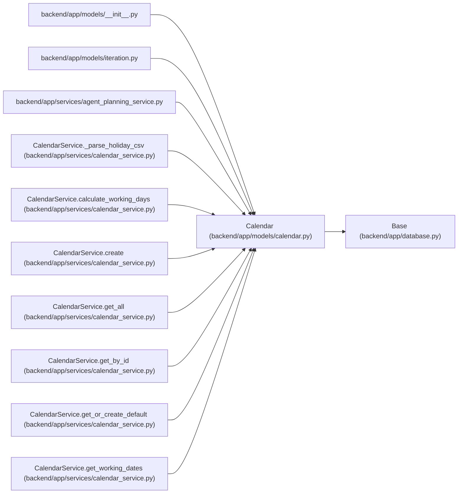

# Calendar

**Location:** `backend/app/models/calendar.py:14`
**Kind:** Class
**Bases:** `Base`
**Module:** [models_calendar](../modules/models_calendar.md)

## Description

Production calendar model.

Stores holidays and weekend days configuration for a year.

## Attributes

| Name | Type | Default | Description |
|------|------|---------|-------------|
| `id` | `Mapped[int]` | `mapped_column(Integer, primary_key=True, autoincrement=True)` | — |
| `name` | `Mapped[str]` | `mapped_column(String(255), nullable=False)` | — |
| `timezone` | `Mapped[str]` | `mapped_column(String(64), default='UTC', server_default='UTC', nullable=False)` | — |
| `nominal_day_hours` | `Mapped[float]` | `mapped_column(Float, default=8.0, server_default='8', nullable=False)` | — |
| `year` | `Mapped[int]` | `mapped_column(Integer, nullable=False)` | — |
| `holidays` | `Mapped[list[str]]` | `mapped_column(JSON, default=list)` | — |
| `weekend_days` | `Mapped[list[int]]` | `mapped_column(JSON, default=[5, 6])` | — |
| `short_days` | `Mapped[list[str]]` | `mapped_column(JSON, default=list)` | — |
| `iterations` | `Mapped[list['Iteration']]` | `relationship('Iteration', back_populates='calendar', cascade='all, delete-orphan')` | — |

## Methods

| Method | Signature | Decorators | Description |
|--------|-----------|------------|-------------|
| `get_holidays_as_dates` | `() -> list[date]` | — | Convert holiday strings to date objects. |

## Relationships

<!-- Auto-generated relationship summary. Do not edit by hand. -->

### Summary

| Module | Methods | Attributes |
|---|---:|---|
| [models_calendar](../modules/models_calendar.md) | 1 | `holidays`, `id`, `iterations`, `name`, `nominal_day_hours`, `short_days`, `timezone`, `weekend_days`, `year` |

### Structure

| Kind | Entity | Module |
|---|---|---|
| Base | `Base` | [app_database](../modules/app_database.md) |

### References

| Reference | Kind | Source | Call sites |
|---|---|---|---:|
| `__init__` | import | [models___init__](../modules/models___init__.md) | — |
| `iteration` | import | [models_iteration](../modules/models_iteration.md) | — |
| `agent_planning_service` | import | [agent_planning_service](../modules/agent_planning_service.md) | — |
| `CalendarService._parse_holiday_csv` | type_reference | [calendar_service](../modules/calendar_service.md) | — |
| `CalendarService.calculate_working_days` | type_reference | [calendar_service](../modules/calendar_service.md) | — |
| `CalendarService.create` | call | [calendar_service](../modules/calendar_service.md) | 1 |
| `CalendarService.create` | type_reference | [calendar_service](../modules/calendar_service.md) | — |
| `CalendarService.get_all` | type_reference | [calendar_service](../modules/calendar_service.md) | — |
| `CalendarService.get_by_id` | type_reference | [calendar_service](../modules/calendar_service.md) | — |
| `CalendarService.get_or_create_default` | call | [calendar_service](../modules/calendar_service.md) | 1 |
| `CalendarService.get_or_create_default` | type_reference | [calendar_service](../modules/calendar_service.md) | — |
| `CalendarService.get_working_dates` | type_reference | [calendar_service](../modules/calendar_service.md) | — |

> References: showing 12 of 32 logical references; 20 omitted by the 12-row generated summary limit.
