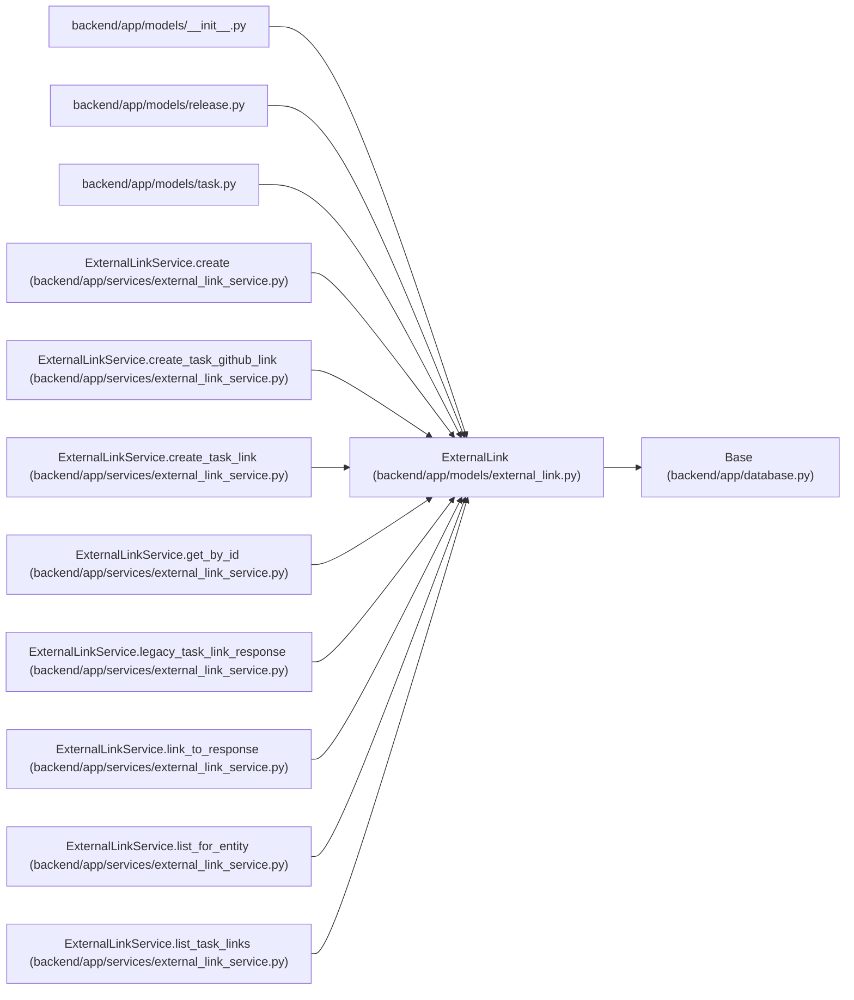

# ExternalLink

**Location:** `backend/app/models/external_link.py:29`
**Kind:** Class
**Bases:** `Base`
**Module:** [models_external_link](../modules/models_external_link.md)

## Description

Generic link from an internal entity to an external delivery artifact.

## Attributes

| Name | Type | Default | Description |
|------|------|---------|-------------|
| `id` | `Mapped[int]` | `mapped_column(Integer, primary_key=True, autoincrement=True)` | — |
| `entity_type` | `Mapped[str]` | `mapped_column(String(50), nullable=False)` | — |
| `entity_id` | `Mapped[int]` | `mapped_column(Integer, nullable=False)` | — |
| `provider` | `Mapped[str]` | `mapped_column(String(50), nullable=False)` | — |
| `external_key` | `Mapped[Optional[str]]` | `mapped_column(String(255), nullable=True)` | — |
| `url` | `Mapped[Optional[str]]` | `mapped_column(String(1000), nullable=True, index=True)` | — |
| `title` | `Mapped[Optional[str]]` | `mapped_column(String(500), nullable=True)` | — |
| `status` | `Mapped[Optional[str]]` | `mapped_column(String(100), nullable=True)` | — |
| `metadata_json` | `Mapped[dict[str, Any]]` | `mapped_column(JSON, default=dict, nullable=False)` | — |
| `created_at` | `Mapped[datetime]` | `mapped_column(UTCDateTime(), default=utc_now, nullable=False)` | — |
| `updated_at` | `Mapped[datetime]` | `mapped_column(UTCDateTime(), default=utc_now, onupdate=utc_now, nullable=False, index=True)` | — |

## Methods

*No public methods. Inherits from base classes.*

## Relationships

<!-- Auto-generated relationship summary. Do not edit by hand. -->

### Summary

| Module | Methods | Attributes |
|---|---:|---|
| [models_external_link](../modules/models_external_link.md) | 0 | `created_at`, `entity_id`, `entity_type`, `external_key`, `id`, `metadata_json`, `provider`, `status`, `title`, `updated_at`, `url` |

### Structure

| Kind | Entity | Module |
|---|---|---|
| Base | `Base` | [app_database](../modules/app_database.md) |

### References

| Reference | Kind | Source | Call sites |
|---|---|---|---:|
| `__init__` | import | [models___init__](../modules/models___init__.md) | — |
| `release` | import | [models_release](../modules/models_release.md) | — |
| `task` | import | [models_task](../modules/models_task.md) | — |
| `ExternalLinkService.create` | call | [external_link_service](../modules/external_link_service.md) | 1 |
| `ExternalLinkService.create` | type_reference | [external_link_service](../modules/external_link_service.md) | — |
| `ExternalLinkService.create_task_github_link` | type_reference | [external_link_service](../modules/external_link_service.md) | — |
| `ExternalLinkService.create_task_link` | type_reference | [external_link_service](../modules/external_link_service.md) | — |
| `ExternalLinkService.get_by_id` | type_reference | [external_link_service](../modules/external_link_service.md) | — |
| `ExternalLinkService.legacy_task_link_response` | type_reference | [external_link_service](../modules/external_link_service.md) | — |
| `ExternalLinkService.link_to_response` | type_reference | [external_link_service](../modules/external_link_service.md) | — |
| `ExternalLinkService.list_for_entity` | type_reference | [external_link_service](../modules/external_link_service.md) | — |
| `ExternalLinkService.list_task_links` | type_reference | [external_link_service](../modules/external_link_service.md) | — |

> References: showing 12 of 20 logical references; 8 omitted by the 12-row generated summary limit.
