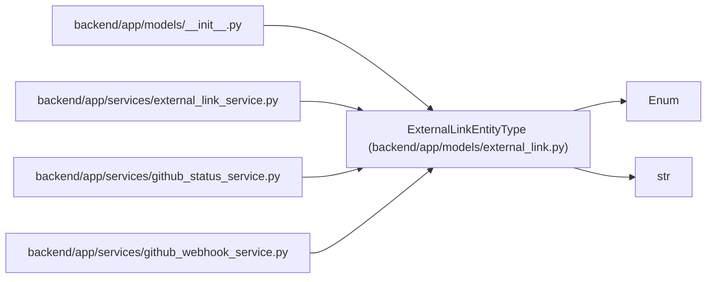

# ExternalLinkEntityType

**Location:** `backend/app/models/external_link.py:13`
**Kind:** Enum
**Bases:** `str`, `Enum`
**Module:** [models_external_link](../modules/models_external_link.md)

## Description

Supported internal entity types for external links.

## Attributes

| Name | Declared value | Description |
|------|-------|-------------|
| `TASK` | `'task'` | — |
| `PROJECT` | `'project'` | — |
| `RELEASE` | `'release'` | — |

## Methods

*No public methods. Inherits from base classes.*

## Relationships

<!-- Auto-generated relationship summary. Do not edit by hand. -->

### Summary

| Module | Methods | Attributes |
|---|---:|---|
| [models_external_link](../modules/models_external_link.md) | 0 | `PROJECT`, `RELEASE`, `TASK` |

### Structure

| Kind | Entity | Module |
|---|---|---|
| Base | `Enum` | — |
| Base | `str` | — |

### References

| Reference | Kind | Source | Call sites |
|---|---|---|---:|
| `__init__` | import | [models___init__](../modules/models___init__.md) | — |
| `external_link_service` | import | [external_link_service](../modules/external_link_service.md) | — |
| `github_status_service` | import | [github_status_service](../modules/github_status_service.md) | — |
| `github_webhook_service` | import | [github_webhook_service](../modules/github_webhook_service.md) | — |
