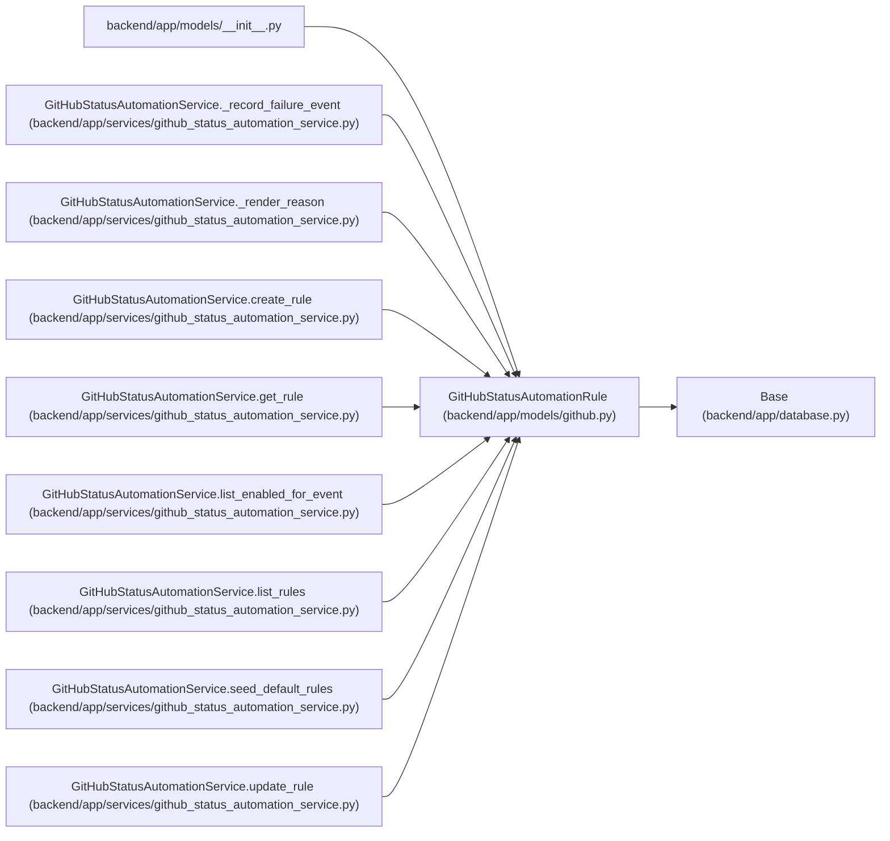

# GitHubStatusAutomationRule

**Location:** `backend/app/models/github.py:23`
**Kind:** Class
**Bases:** `Base`
**Module:** [models_github](../modules/models_github.md)

## Description

Opt-in rule that maps GitHub PR activity to task status changes.

## Attributes

| Name | Type | Default | Description |
|------|------|---------|-------------|
| `id` | `Mapped[int]` | `mapped_column(Integer, primary_key=True, autoincrement=True)` | — |
| `name` | `Mapped[str]` | `mapped_column(String(255), nullable=False)` | — |
| `description` | `Mapped[str \| None]` | `mapped_column(Text, nullable=True)` | — |
| `enabled` | `Mapped[bool]` | `mapped_column(Boolean, default=False, nullable=False)` | — |
| `github_event_type` | `Mapped[str]` | `mapped_column(String(100), nullable=False)` | — |
| `from_status` | `Mapped[str \| None]` | `mapped_column(String(50), nullable=True)` | — |
| `target_status` | `Mapped[str]` | `mapped_column(String(50), nullable=False)` | — |
| `reason_template` | `Mapped[str \| None]` | `mapped_column(Text, nullable=True)` | — |
| `sort_order` | `Mapped[int]` | `mapped_column(Integer, default=0, nullable=False)` | — |
| `created_at` | `Mapped[datetime]` | `mapped_column(UTCDateTime(), default=utc_now, nullable=False)` | — |
| `updated_at` | `Mapped[datetime]` | `mapped_column(UTCDateTime(), default=utc_now, onupdate=utc_now, nullable=False)` | — |

## Methods

*No public methods. Inherits from base classes.*

## Relationships

<!-- Auto-generated relationship summary. Do not edit by hand. -->

### Summary

| Module | Methods | Attributes |
|---|---:|---|
| [models_github](../modules/models_github.md) | 0 | `created_at`, `description`, `enabled`, `from_status`, `github_event_type`, `id`, `name`, `reason_template`, `sort_order`, `target_status`, `updated_at` |

### Structure

| Kind | Entity | Module |
|---|---|---|
| Base | `Base` | [app_database](../modules/app_database.md) |

### References

| Reference | Kind | Source | Call sites |
|---|---|---|---:|
| `__init__` | import | [models___init__](../modules/models___init__.md) | — |
| `GitHubStatusAutomationService._record_failure_event` | type_reference | [github_status_automation_service](../modules/github_status_automation_service.md) | — |
| `GitHubStatusAutomationService._render_reason` | type_reference | [github_status_automation_service](../modules/github_status_automation_service.md) | — |
| `GitHubStatusAutomationService.create_rule` | call | [github_status_automation_service](../modules/github_status_automation_service.md) | 1 |
| `GitHubStatusAutomationService.create_rule` | type_reference | [github_status_automation_service](../modules/github_status_automation_service.md) | — |
| `GitHubStatusAutomationService.get_rule` | type_reference | [github_status_automation_service](../modules/github_status_automation_service.md) | — |
| `GitHubStatusAutomationService.list_enabled_for_event` | type_reference | [github_status_automation_service](../modules/github_status_automation_service.md) | — |
| `GitHubStatusAutomationService.list_rules` | type_reference | [github_status_automation_service](../modules/github_status_automation_service.md) | — |
| `GitHubStatusAutomationService.seed_default_rules` | call | [github_status_automation_service](../modules/github_status_automation_service.md) | 1 |
| `GitHubStatusAutomationService.update_rule` | type_reference | [github_status_automation_service](../modules/github_status_automation_service.md) | — |
