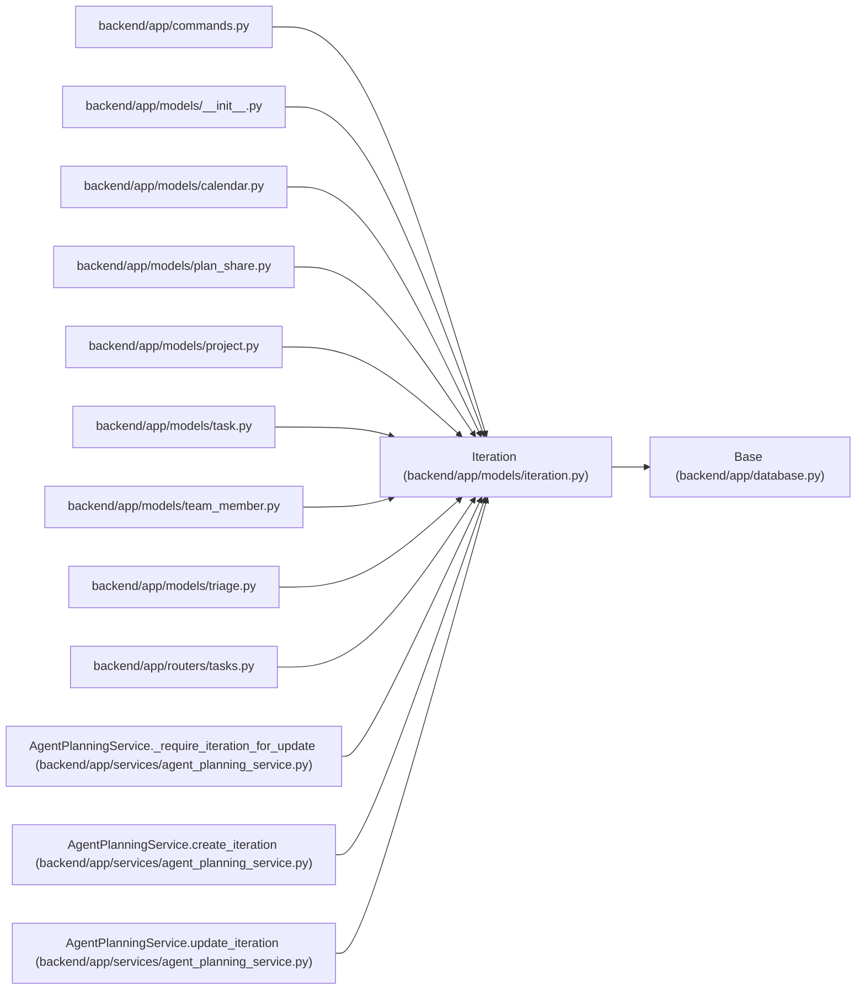

# Iteration

**Location:** `backend/app/models/iteration.py:18`
**Kind:** Class
**Bases:** `Base`
**Module:** [models_iteration](../modules/models_iteration.md)

## Description

Development iteration (sprint) model.

## Attributes

| Name | Type | Default | Description |
|------|------|---------|-------------|
| `id` | `Mapped[int]` | `mapped_column(Integer, primary_key=True, autoincrement=True)` | — |
| `name` | `Mapped[str]` | `mapped_column(String(255), nullable=False)` | — |
| `revision` | `Mapped[int]` | `mapped_column(Integer, default=1, server_default='1', nullable=False)` | — |
| `start_date` | `Mapped[date]` | `mapped_column(Date, nullable=False)` | — |
| `end_date` | `Mapped[date]` | `mapped_column(Date, nullable=False)` | — |
| `manager_email` | `Mapped[Optional[str]]` | `mapped_column(String(255), nullable=True)` | — |
| `calendar_id` | `Mapped[int]` | `mapped_column(Integer, ForeignKey('calendars.id'), nullable=False)` | — |
| `project_id` | `Mapped[Optional[int]]` | `mapped_column(Integer, ForeignKey('projects.id', ondelete='SET NULL', use_alter=True), nullable=True, index=True)` | — |
| `calendar` | `Mapped['Calendar']` | `relationship('Calendar', back_populates='iterations')` | — |
| `project` | `Mapped[Optional['Project']]` | `relationship('Project', back_populates='iterations')` | — |
| `team_members` | `Mapped[list['TeamMember']]` | `relationship('TeamMember', back_populates='iteration')` | — |
| `tasks` | `Mapped[list['Task']]` | `relationship('Task', back_populates='iteration', cascade='all, delete-orphan')` | — |
| `plan_shares` | `Mapped[list['PlanShare']]` | `relationship('PlanShare', back_populates='iteration', cascade='all, delete-orphan')` | — |

## Methods

*No public methods. Inherits from base classes.*

## Relationships

<!-- Auto-generated relationship summary. Do not edit by hand. -->

### Summary

| Module | Methods | Attributes |
|---|---:|---|
| [models_iteration](../modules/models_iteration.md) | 0 | `calendar`, `calendar_id`, `end_date`, `id`, `manager_email`, `name`, `plan_shares`, `project`, `project_id`, `revision`, `start_date`, `tasks` |

### Structure

| Kind | Entity | Module |
|---|---|---|
| Base | `Base` | [app_database](../modules/app_database.md) |

### References

| Reference | Kind | Source | Call sites |
|---|---|---|---:|
| `commands` | import | [commands](../modules/commands.md) | — |
| `__init__` | import | [models___init__](../modules/models___init__.md) | — |
| `calendar` | import | [models_calendar](../modules/models_calendar.md) | — |
| `plan_share` | import | [models_plan_share](../modules/models_plan_share.md) | — |
| `project` | import | [models_project](../modules/models_project.md) | — |
| `task` | import | [models_task](../modules/models_task.md) | — |
| `team_member` | import | [team_member](../modules/team_member.md) | — |
| `triage` | import | [models_triage](../modules/models_triage.md) | — |
| `tasks` | import | [tasks](../modules/tasks.md) | — |
| `AgentPlanningService._require_iteration_for_update` | type_reference | [agent_planning_service](../modules/agent_planning_service.md) | — |
| `AgentPlanningService.create_iteration` | type_reference | [agent_planning_service](../modules/agent_planning_service.md) | — |
| `AgentPlanningService.update_iteration` | type_reference | [agent_planning_service](../modules/agent_planning_service.md) | — |

> References: showing 12 of 82 logical references; 70 omitted by the 12-row generated summary limit.
