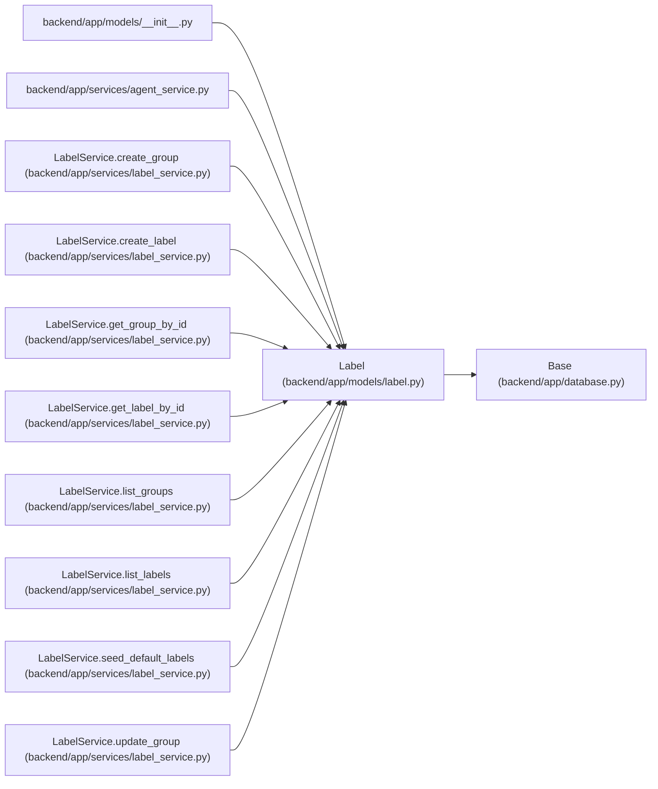

# Label

**Location:** `backend/app/models/label.py:44`
**Kind:** Class
**Bases:** `Base`
**Module:** [models_label](../modules/models_label.md)

## Description

A governed label slug compatible with existing task tag strings.

## Attributes

| Name | Type | Default | Description |
|------|------|---------|-------------|
| `id` | `Mapped[int]` | `mapped_column(Integer, primary_key=True, autoincrement=True)` | — |
| `slug` | `Mapped[str]` | `mapped_column(String(100), nullable=False, index=True)` | — |
| `name` | `Mapped[str]` | `mapped_column(String(255), nullable=False)` | — |
| `group_id` | `Mapped[int]` | `mapped_column(Integer, ForeignKey('label_groups.id', ondelete='CASCADE'), nullable=False, index=True)` | — |
| `description` | `Mapped[Optional[str]]` | `mapped_column(Text, nullable=True)` | — |
| `color` | `Mapped[str]` | `mapped_column(String(7), nullable=False, default='#64748b')` | — |
| `is_active` | `Mapped[bool]` | `mapped_column(Boolean, default=True, nullable=False, index=True)` | — |
| `sort_order` | `Mapped[int]` | `mapped_column(Integer, default=0, nullable=False, index=True)` | — |
| `seed_key` | `Mapped[Optional[str]]` | `mapped_column(String(100), nullable=True, unique=True, index=True)` | — |
| `created_at` | `Mapped[datetime]` | `mapped_column(UTCDateTime(), default=utc_now, nullable=False, index=True)` | — |
| `updated_at` | `Mapped[datetime]` | `mapped_column(UTCDateTime(), default=utc_now, onupdate=utc_now, nullable=False, index=True)` | — |
| `group` | `Mapped[LabelGroup]` | `relationship('LabelGroup', back_populates='labels')` | — |

## Methods

*No public methods. Inherits from base classes.*

## Relationships

<!-- Auto-generated relationship summary. Do not edit by hand. -->

### Summary

| Module | Methods | Attributes |
|---|---:|---|
| [models_label](../modules/models_label.md) | 0 | `color`, `created_at`, `description`, `group`, `group_id`, `id`, `is_active`, `name`, `seed_key`, `slug`, `sort_order`, `updated_at` |

### Structure

| Kind | Entity | Module |
|---|---|---|
| Base | `Base` | [app_database](../modules/app_database.md) |

### References

| Reference | Kind | Source | Call sites |
|---|---|---|---:|
| `__init__` | import | [models___init__](../modules/models___init__.md) | — |
| `agent_service` | import | [agent_service](../modules/agent_service.md) | — |
| `LabelService.create_group` | type_reference | [label_service](../modules/label_service.md) | — |
| `LabelService.create_label` | call | [label_service](../modules/label_service.md) | 1 |
| `LabelService.create_label` | type_reference | [label_service](../modules/label_service.md) | — |
| `LabelService.get_group_by_id` | type_reference | [label_service](../modules/label_service.md) | — |
| `LabelService.get_label_by_id` | type_reference | [label_service](../modules/label_service.md) | — |
| `LabelService.list_groups` | type_reference | [label_service](../modules/label_service.md) | — |
| `LabelService.list_labels` | type_reference | [label_service](../modules/label_service.md) | — |
| `LabelService.seed_default_labels` | call | [label_service](../modules/label_service.md) | 1 |
| `LabelService.seed_default_labels` | type_reference | [label_service](../modules/label_service.md) | — |
| `LabelService.update_group` | type_reference | [label_service](../modules/label_service.md) | — |

> References: showing 12 of 13 logical references; 1 omitted by the 12-row generated summary limit.
