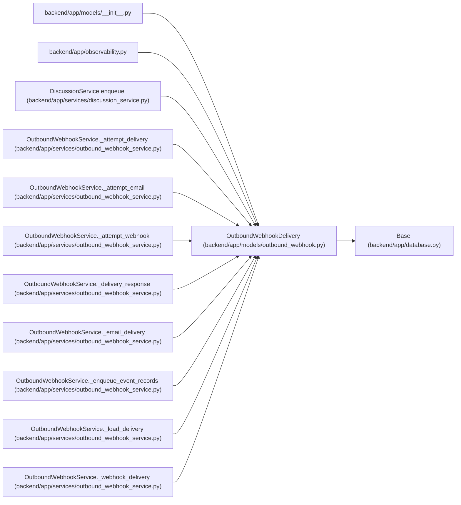

# OutboundWebhookDelivery

**Location:** `backend/app/models/outbound_webhook.py:115`
**Kind:** Class
**Bases:** `Base`
**Module:** [models_outbound_webhook](../modules/models_outbound_webhook.md)

## Description

One delivery attempt log for one target and event.

## Attributes

| Name | Type | Default | Description |
|------|------|---------|-------------|
| `id` | `Mapped[int]` | `mapped_column(Integer, primary_key=True, autoincrement=True)` | — |
| `target_id` | `Mapped[Optional[int]]` | `mapped_column(Integer, ForeignKey('outbound_webhook_targets.id', ondelete='SET NULL'), nullable=True, index=True)` | — |
| `event_id` | `Mapped[int]` | `mapped_column(Integer, ForeignKey('outbound_webhook_events.id', ondelete='CASCADE'), nullable=False, index=True)` | — |
| `target_name` | `Mapped[str]` | `mapped_column(String(255), nullable=False)` | — |
| `target_url` | `Mapped[str]` | `mapped_column(String(1000), nullable=False)` | — |
| `channel` | `Mapped[str]` | `mapped_column(String(30), default=OutboundDeliveryChannel.WEBHOOK.value, nullable=False, index=True)` | — |
| `payload_json` | `Mapped[dict[str, Any]]` | `mapped_column(JSON, default=dict, nullable=False)` | — |
| `status` | `Mapped[str]` | `mapped_column(String(50), default=OutboundWebhookDeliveryStatus.PENDING.value, nullable=False, index=True)` | — |
| `attempt_count` | `Mapped[int]` | `mapped_column(Integer, default=0, nullable=False)` | — |
| `max_attempts` | `Mapped[int]` | `mapped_column(Integer, default=5, nullable=False)` | — |
| `last_http_status` | `Mapped[Optional[int]]` | `mapped_column(Integer, nullable=True)` | — |
| `last_error` | `Mapped[Optional[str]]` | `mapped_column(Text, nullable=True)` | — |
| `last_response_body` | `Mapped[Optional[str]]` | `mapped_column(Text, nullable=True)` | — |
| `last_attempt_at` | `Mapped[Optional[datetime]]` | `mapped_column(UTCDateTime(), nullable=True)` | — |
| `next_retry_at` | `Mapped[Optional[datetime]]` | `mapped_column(UTCDateTime(), nullable=True)` | — |
| `lease_token` | `Mapped[Optional[str]]` | `mapped_column(String(64), nullable=True, index=True)` | — |
| `lease_expires_at` | `Mapped[Optional[datetime]]` | `mapped_column(UTCDateTime(), nullable=True)` | — |
| `terminal_at` | `Mapped[Optional[datetime]]` | `mapped_column(UTCDateTime(), nullable=True)` | — |
| `delivered_at` | `Mapped[Optional[datetime]]` | `mapped_column(UTCDateTime(), nullable=True)` | — |
| `created_at` | `Mapped[datetime]` | `mapped_column(UTCDateTime(), default=utc_now, nullable=False)` | — |
| `updated_at` | `Mapped[datetime]` | `mapped_column(UTCDateTime(), default=utc_now, onupdate=utc_now, nullable=False)` | — |
| `target` | `Mapped[Optional[OutboundWebhookTarget]]` | `relationship('OutboundWebhookTarget', back_populates='deliveries')` | — |
| `event` | `Mapped[OutboundWebhookEvent]` | `relationship('OutboundWebhookEvent', back_populates='deliveries')` | — |

## Methods

*No public methods. Inherits from base classes.*

## Relationships

<!-- Auto-generated relationship summary. Do not edit by hand. -->

### Summary

| Module | Methods | Attributes |
|---|---:|---|
| [models_outbound_webhook](../modules/models_outbound_webhook.md) | 0 | `attempt_count`, `channel`, `created_at`, `delivered_at`, `event`, `event_id`, `id`, `last_attempt_at`, `last_error`, `last_http_status`, `last_response_body`, `lease_expires_at` |

### Structure

| Kind | Entity | Module |
|---|---|---|
| Base | `Base` | [app_database](../modules/app_database.md) |

### References

| Reference | Kind | Source | Call sites |
|---|---|---|---:|
| `__init__` | import | [models___init__](../modules/models___init__.md) | — |
| `observability` | import | [observability](../modules/observability.md) | — |
| `DiscussionService.enqueue` | call | [discussion_service](../modules/discussion_service.md) | 1 |
| `OutboundWebhookService._attempt_delivery` | type_reference | [outbound_webhook_service](../modules/outbound_webhook_service.md) | — |
| `OutboundWebhookService._attempt_email` | type_reference | [outbound_webhook_service](../modules/outbound_webhook_service.md) | — |
| `OutboundWebhookService._attempt_webhook` | type_reference | [outbound_webhook_service](../modules/outbound_webhook_service.md) | — |
| `OutboundWebhookService._delivery_response` | type_reference | [outbound_webhook_service](../modules/outbound_webhook_service.md) | — |
| `OutboundWebhookService._email_delivery` | call | [outbound_webhook_service](../modules/outbound_webhook_service.md) | 1 |
| `OutboundWebhookService._email_delivery` | type_reference | [outbound_webhook_service](../modules/outbound_webhook_service.md) | — |
| `OutboundWebhookService._enqueue_event_records` | type_reference | [outbound_webhook_service](../modules/outbound_webhook_service.md) | — |
| `OutboundWebhookService._load_delivery` | type_reference | [outbound_webhook_service](../modules/outbound_webhook_service.md) | — |
| `OutboundWebhookService._webhook_delivery` | call | [outbound_webhook_service](../modules/outbound_webhook_service.md) | 1 |

> References: showing 12 of 16 logical references; 4 omitted by the 12-row generated summary limit.
