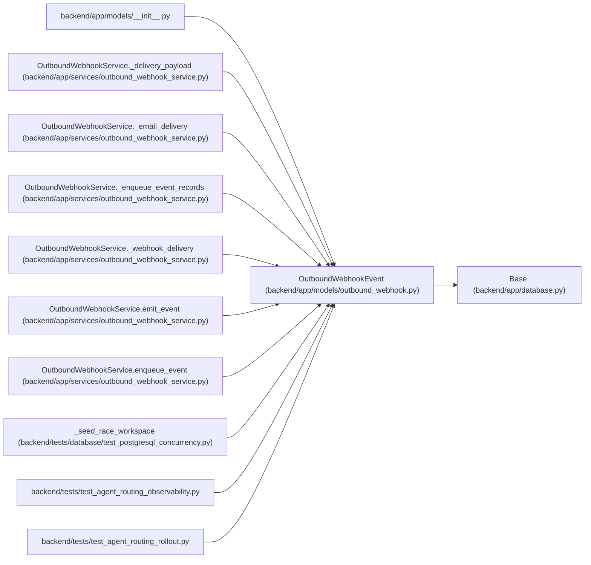

# OutboundWebhookEvent

**Location:** `backend/app/models/outbound_webhook.py:79`
**Kind:** Class
**Bases:** `Base`
**Module:** [models_outbound_webhook](../modules/models_outbound_webhook.md)

## Description

Normalized domain event available for webhook delivery.

## Attributes

| Name | Type | Default | Description |
|------|------|---------|-------------|
| `id` | `Mapped[int]` | `mapped_column(Integer, primary_key=True, autoincrement=True)` | — |
| `event_id` | `Mapped[str]` | `mapped_column(String(64), nullable=False, index=True)` | — |
| `event_type` | `Mapped[str]` | `mapped_column(String(120), nullable=False, index=True)` | — |
| `entity_type` | `Mapped[str]` | `mapped_column(String(80), nullable=False, index=True)` | — |
| `entity_id` | `Mapped[Optional[int]]` | `mapped_column(Integer, nullable=True, index=True)` | — |
| `payload_json` | `Mapped[dict[str, Any]]` | `mapped_column(JSON, default=dict, nullable=False)` | — |
| `occurred_at` | `Mapped[datetime]` | `mapped_column(UTCDateTime(), default=utc_now, nullable=False, index=True)` | — |
| `deliveries` | `Mapped[list['OutboundWebhookDelivery']]` | `relationship('OutboundWebhookDelivery', back_populates='event', cascade='all, delete-orphan', order_by='OutboundWebhookDelivery.created_at.desc(), OutboundWebhookDelivery.id.desc()')` | — |

## Methods

*No public methods. Inherits from base classes.*

## Relationships

<!-- Auto-generated relationship summary. Do not edit by hand. -->

### Summary

| Module | Methods | Attributes |
|---|---:|---|
| [models_outbound_webhook](../modules/models_outbound_webhook.md) | 0 | `deliveries`, `entity_id`, `entity_type`, `event_id`, `event_type`, `id`, `occurred_at`, `payload_json` |

### Structure

| Kind | Entity | Module |
|---|---|---|
| Base | `Base` | [app_database](../modules/app_database.md) |

### References

| Reference | Kind | Source | Call sites |
|---|---|---|---:|
| `__init__` | import | [models___init__](../modules/models___init__.md) | — |
| `OutboundWebhookService._delivery_payload` | type_reference | [outbound_webhook_service](../modules/outbound_webhook_service.md) | — |
| `OutboundWebhookService._email_delivery` | type_reference | [outbound_webhook_service](../modules/outbound_webhook_service.md) | — |
| `OutboundWebhookService._enqueue_event_records` | call | [outbound_webhook_service](../modules/outbound_webhook_service.md) | 1 |
| `OutboundWebhookService._enqueue_event_records` | type_reference | [outbound_webhook_service](../modules/outbound_webhook_service.md) | — |
| `OutboundWebhookService._webhook_delivery` | type_reference | [outbound_webhook_service](../modules/outbound_webhook_service.md) | — |
| `OutboundWebhookService.emit_event` | type_reference | [outbound_webhook_service](../modules/outbound_webhook_service.md) | — |
| `OutboundWebhookService.enqueue_event` | type_reference | [outbound_webhook_service](../modules/outbound_webhook_service.md) | — |
| `_seed_race_workspace` | call | [test_postgresql_concurrency](../modules/test_postgresql_concurrency.md) | 1 |
| `test_agent_routing_observability` | import | [test_agent_routing_observability](../modules/test_agent_routing_observability.md) | — |
| `test_agent_routing_rollout` | import | [test_agent_routing_rollout](../modules/test_agent_routing_rollout.md) | — |
