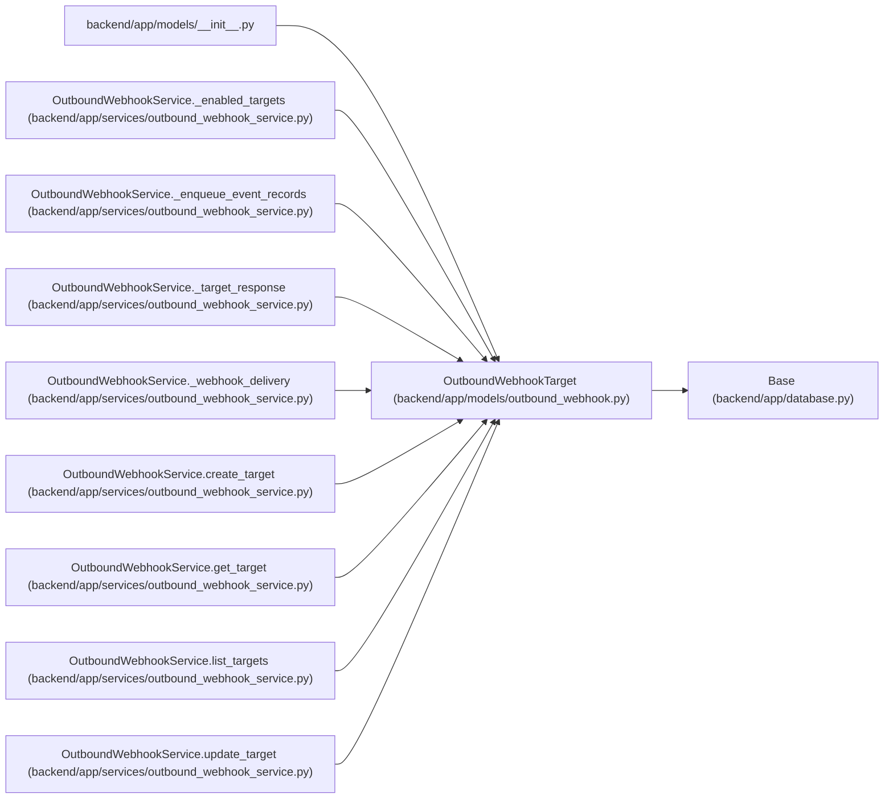

# OutboundWebhookTarget

**Location:** `backend/app/models/outbound_webhook.py:37`
**Kind:** Class
**Bases:** `Base`
**Module:** [models_outbound_webhook](../modules/models_outbound_webhook.md)

## Description

Configurable subscriber for outbound domain events.

## Attributes

| Name | Type | Default | Description |
|------|------|---------|-------------|
| `id` | `Mapped[int]` | `mapped_column(Integer, primary_key=True, autoincrement=True)` | — |
| `name` | `Mapped[str]` | `mapped_column(String(255), nullable=False)` | — |
| `description` | `Mapped[Optional[str]]` | `mapped_column(Text, nullable=True)` | — |
| `url` | `Mapped[str]` | `mapped_column(String(1000), nullable=False)` | — |
| `enabled` | `Mapped[bool]` | `mapped_column(default=True, nullable=False, index=True)` | — |
| `subscribed_events_json` | `Mapped[list[str]]` | `mapped_column(JSON, default=list, nullable=False)` | — |
| `secret` | `Mapped[Optional[str]]` | `mapped_column(String(500), nullable=True)` | — |
| `headers_json` | `Mapped[dict[str, Any]]` | `mapped_column(JSON, default=dict, nullable=False)` | — |
| `created_at` | `Mapped[datetime]` | `mapped_column(UTCDateTime(), default=utc_now, nullable=False, index=True)` | — |
| `updated_at` | `Mapped[datetime]` | `mapped_column(UTCDateTime(), default=utc_now, onupdate=utc_now, nullable=False, index=True)` | — |
| `deliveries` | `Mapped[list['OutboundWebhookDelivery']]` | `relationship('OutboundWebhookDelivery', back_populates='target', passive_deletes=True, order_by='OutboundWebhookDelivery.created_at.desc(), OutboundWebhookDelivery.id.desc()')` | — |

## Methods

*No public methods. Inherits from base classes.*

## Relationships

<!-- Auto-generated relationship summary. Do not edit by hand. -->

### Summary

| Module | Methods | Attributes |
|---|---:|---|
| [models_outbound_webhook](../modules/models_outbound_webhook.md) | 0 | `created_at`, `deliveries`, `description`, `enabled`, `headers_json`, `id`, `name`, `secret`, `subscribed_events_json`, `updated_at`, `url` |

### Structure

| Kind | Entity | Module |
|---|---|---|
| Base | `Base` | [app_database](../modules/app_database.md) |

### References

| Reference | Kind | Source | Call sites |
|---|---|---|---:|
| `__init__` | import | [models___init__](../modules/models___init__.md) | — |
| `OutboundWebhookService._enabled_targets` | type_reference | [outbound_webhook_service](../modules/outbound_webhook_service.md) | — |
| `OutboundWebhookService._enqueue_event_records` | type_reference | [outbound_webhook_service](../modules/outbound_webhook_service.md) | — |
| `OutboundWebhookService._target_response` | type_reference | [outbound_webhook_service](../modules/outbound_webhook_service.md) | — |
| `OutboundWebhookService._webhook_delivery` | type_reference | [outbound_webhook_service](../modules/outbound_webhook_service.md) | — |
| `OutboundWebhookService.create_target` | call | [outbound_webhook_service](../modules/outbound_webhook_service.md) | 1 |
| `OutboundWebhookService.create_target` | type_reference | [outbound_webhook_service](../modules/outbound_webhook_service.md) | — |
| `OutboundWebhookService.get_target` | type_reference | [outbound_webhook_service](../modules/outbound_webhook_service.md) | — |
| `OutboundWebhookService.list_targets` | type_reference | [outbound_webhook_service](../modules/outbound_webhook_service.md) | — |
| `OutboundWebhookService.update_target` | type_reference | [outbound_webhook_service](../modules/outbound_webhook_service.md) | — |
