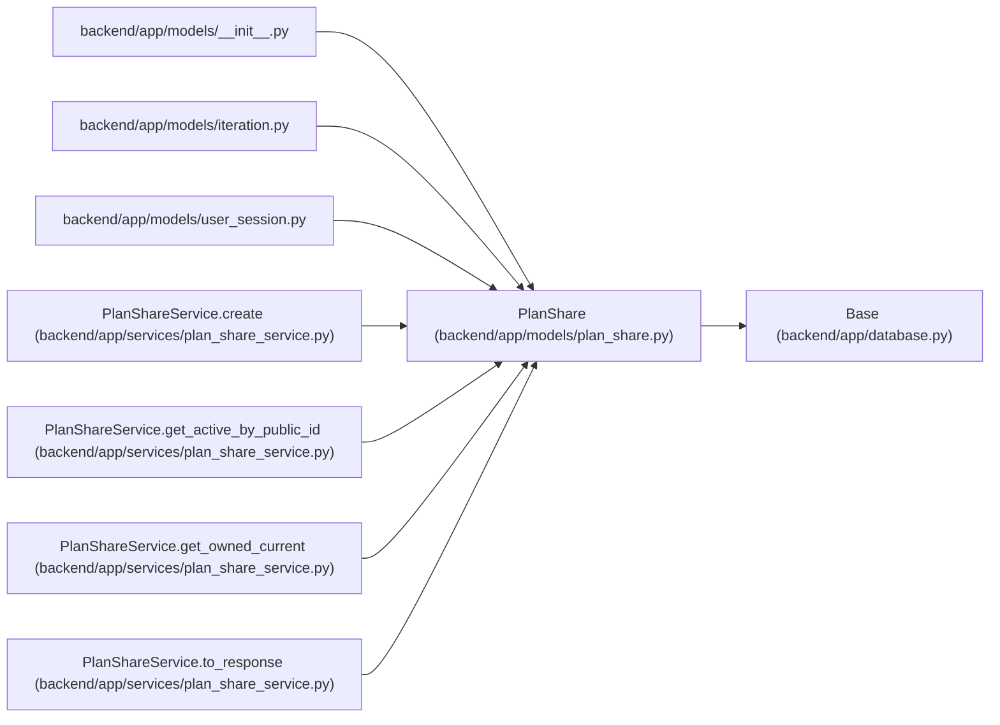

# PlanShare

**Location:** `backend/app/models/plan_share.py:17`
**Kind:** Class
**Bases:** `Base`
**Module:** [models_plan_share](../modules/models_plan_share.md)

## Description

One immutable iteration plan snapshot owned by a browser session.

## Attributes

| Name | Type | Default | Description |
|------|------|---------|-------------|
| `id` | `Mapped[int]` | `mapped_column(Integer, primary_key=True, autoincrement=True)` | — |
| `public_id` | `Mapped[str]` | `mapped_column(String(48), unique=True, index=True, nullable=False)` | — |
| `iteration_id` | `Mapped[int]` | `mapped_column(Integer, ForeignKey('iterations.id', ondelete='CASCADE'), index=True, nullable=False)` | — |
| `created_by_session_id` | `Mapped[int]` | `mapped_column(Integer, ForeignKey('user_sessions.id', ondelete='RESTRICT'), index=True, nullable=False)` | — |
| `snapshot_data` | `Mapped[dict[str, Any]]` | `mapped_column(JSON, nullable=False)` | — |
| `created_at` | `Mapped[datetime]` | `mapped_column(UTCDateTime(), default=utc_now, index=True, nullable=False)` | — |
| `revoked_at` | `Mapped[datetime \| None]` | `mapped_column(UTCDateTime(), index=True, nullable=True)` | — |
| `iteration` | `Mapped['Iteration']` | `relationship('Iteration', back_populates='plan_shares')` | — |
| `created_by_session` | `Mapped['UserSession']` | `relationship('UserSession', back_populates='plan_shares')` | — |

## Methods

*No public methods. Inherits from base classes.*

## Relationships

<!-- Auto-generated relationship summary. Do not edit by hand. -->

### Summary

| Module | Methods | Attributes |
|---|---:|---|
| [models_plan_share](../modules/models_plan_share.md) | 0 | `created_at`, `created_by_session`, `created_by_session_id`, `id`, `iteration`, `iteration_id`, `public_id`, `revoked_at`, `snapshot_data` |

### Structure

| Kind | Entity | Module |
|---|---|---|
| Base | `Base` | [app_database](../modules/app_database.md) |

### References

| Reference | Kind | Source | Call sites |
|---|---|---|---:|
| `__init__` | import | [models___init__](../modules/models___init__.md) | — |
| `iteration` | import | [models_iteration](../modules/models_iteration.md) | — |
| `user_session` | import | [user_session](../modules/user_session.md) | — |
| `PlanShareService.create` | call | [plan_share_service](../modules/plan_share_service.md) | 1 |
| `PlanShareService.create` | type_reference | [plan_share_service](../modules/plan_share_service.md) | — |
| `PlanShareService.get_active_by_public_id` | type_reference | [plan_share_service](../modules/plan_share_service.md) | — |
| `PlanShareService.get_owned_current` | type_reference | [plan_share_service](../modules/plan_share_service.md) | — |
| `PlanShareService.to_response` | type_reference | [plan_share_service](../modules/plan_share_service.md) | — |
