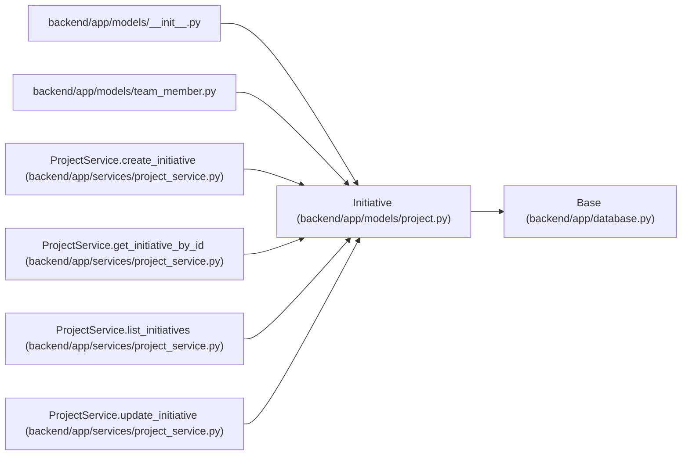

# Initiative

**Location:** `backend/app/models/project.py:48`
**Kind:** Class
**Bases:** `Base`
**Module:** [models_project](../modules/models_project.md)

## Description

Strategic goal that groups related projects on the roadmap.

## Attributes

| Name | Type | Default | Description |
|------|------|---------|-------------|
| `id` | `Mapped[int]` | `mapped_column(Integer, primary_key=True, autoincrement=True)` | — |
| `name` | `Mapped[str]` | `mapped_column(String(255), nullable=False)` | — |
| `description` | `Mapped[Optional[str]]` | `mapped_column(Text, nullable=True)` | — |
| `owner_id` | `Mapped[Optional[int]]` | `mapped_column(Integer, ForeignKey('team_members.id', ondelete='SET NULL'), nullable=True, index=True)` | — |
| `owner_profile_id` | `Mapped[Optional[int]]` | `mapped_column(Integer, ForeignKey('team_member_profiles.id', ondelete='SET NULL'), nullable=True, index=True)` | — |
| `health` | `Mapped[str]` | `mapped_column(String(50), default=ProjectHealth.UNKNOWN.value, nullable=False, index=True)` | — |
| `target_date` | `Mapped[Optional[date]]` | `mapped_column(Date, nullable=True, index=True)` | — |
| `created_at` | `Mapped[datetime]` | `mapped_column(UTCDateTime(), default=utc_now, nullable=False)` | — |
| `updated_at` | `Mapped[datetime]` | `mapped_column(UTCDateTime(), default=utc_now, onupdate=utc_now, nullable=False)` | — |
| `owner` | `Mapped[Optional['TeamMember']]` | `relationship('TeamMember', back_populates='owned_initiatives')` | — |
| `owner_profile` | `Mapped[Optional['TeamMemberProfile']]` | `relationship('TeamMemberProfile', back_populates='owned_initiatives')` | — |
| `projects` | `Mapped[list['Project']]` | `relationship('Project', back_populates='initiative', passive_deletes=True)` | — |

## Methods

*No public methods. Inherits from base classes.*

## Relationships

<!-- Auto-generated relationship summary. Do not edit by hand. -->

### Summary

| Module | Methods | Attributes |
|---|---:|---|
| [models_project](../modules/models_project.md) | 0 | `created_at`, `description`, `health`, `id`, `name`, `owner`, `owner_id`, `owner_profile`, `owner_profile_id`, `projects`, `target_date`, `updated_at` |

### Structure

| Kind | Entity | Module |
|---|---|---|
| Base | `Base` | [app_database](../modules/app_database.md) |

### References

| Reference | Kind | Source | Call sites |
|---|---|---|---:|
| `__init__` | import | [models___init__](../modules/models___init__.md) | — |
| `team_member` | import | [team_member](../modules/team_member.md) | — |
| `ProjectService.create_initiative` | call | [project_service](../modules/project_service.md) | 1 |
| `ProjectService.create_initiative` | type_reference | [project_service](../modules/project_service.md) | — |
| `ProjectService.get_initiative_by_id` | type_reference | [project_service](../modules/project_service.md) | — |
| `ProjectService.list_initiatives` | type_reference | [project_service](../modules/project_service.md) | — |
| `ProjectService.update_initiative` | type_reference | [project_service](../modules/project_service.md) | — |
