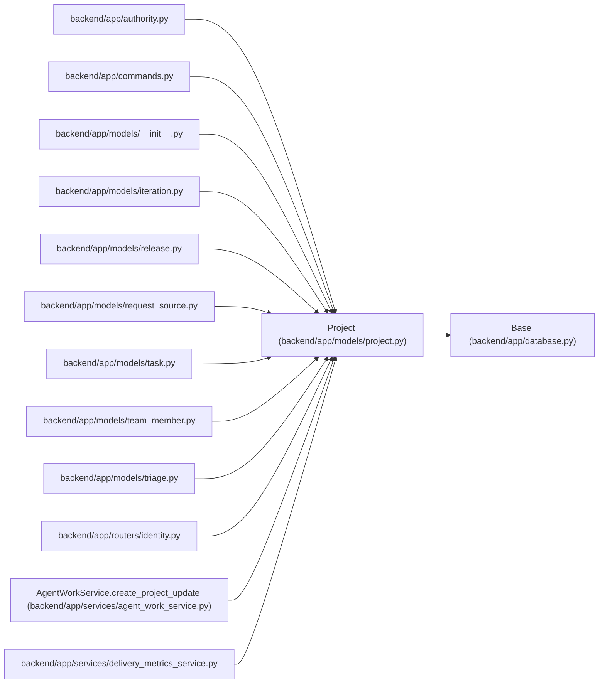

# Project

**Location:** `backend/app/models/project.py:103`
**Kind:** Class
**Bases:** `Base`
**Module:** [models_project](../modules/models_project.md)

## Description

Outcome-oriented planning container above tasks and iterations. SQLite allocates project identifiers without reusing deleted identities; the forward upgrade preserves dependent records and raises the allocation floor above retained historical scope identifiers.

## Attributes

| Name | Type | Default | Description |
|------|------|---------|-------------|
| `id` | `Mapped[int]` | `mapped_column(Integer, primary_key=True, autoincrement=True)` | — |
| `name` | `Mapped[str]` | `mapped_column(String(255), nullable=False)` | — |
| `timezone` | `Mapped[str]` | `mapped_column(String(64), default='UTC', server_default='UTC', nullable=False)` | — |
| `description` | `Mapped[Optional[str]]` | `mapped_column(Text, nullable=True)` | — |
| `status` | `Mapped[str]` | `mapped_column(String(50), default=ProjectStatus.PLANNED.value, nullable=False, index=True)` | — |
| `health` | `Mapped[str]` | `mapped_column(String(50), default=ProjectHealth.UNKNOWN.value, nullable=False, index=True)` | — |
| `start_date` | `Mapped[Optional[date]]` | `mapped_column(Date, nullable=True)` | — |
| `target_date` | `Mapped[Optional[date]]` | `mapped_column(Date, nullable=True, index=True)` | — |
| `completed_at` | `Mapped[Optional[datetime]]` | `mapped_column(UTCDateTime(), nullable=True)` | — |
| `sort_order` | `Mapped[int]` | `mapped_column(Integer, default=0, nullable=False)` | — |
| `created_at` | `Mapped[datetime]` | `mapped_column(UTCDateTime(), default=utc_now, nullable=False)` | — |
| `updated_at` | `Mapped[datetime]` | `mapped_column(UTCDateTime(), default=utc_now, onupdate=utc_now, nullable=False)` | — |
| `owner_id` | `Mapped[Optional[int]]` | `mapped_column(Integer, ForeignKey('team_members.id', ondelete='SET NULL'), nullable=True, index=True)` | — |
| `owner_profile_id` | `Mapped[Optional[int]]` | `mapped_column(Integer, ForeignKey('team_member_profiles.id', ondelete='SET NULL'), nullable=True, index=True)` | — |
| `initiative_id` | `Mapped[Optional[int]]` | `mapped_column(Integer, ForeignKey('initiatives.id', ondelete='SET NULL'), nullable=True, index=True)` | — |
| `owner` | `Mapped[Optional['TeamMember']]` | `relationship('TeamMember', back_populates='owned_projects')` | — |
| `owner_profile` | `Mapped[Optional['TeamMemberProfile']]` | `relationship('TeamMemberProfile', back_populates='owned_projects')` | — |
| `initiative` | `Mapped[Optional['Initiative']]` | `relationship('Initiative', back_populates='projects')` | — |
| `iterations` | `Mapped[list['Iteration']]` | `relationship('Iteration', back_populates='project', passive_deletes=True)` | — |
| `tasks` | `Mapped[list['Task']]` | `relationship('Task', back_populates='project')` | — |
| `updates` | `Mapped[list['ProjectUpdateEntry']]` | `relationship('ProjectUpdateEntry', back_populates='project', cascade='all, delete-orphan', passive_deletes=True)` | — |
| `milestones` | `Mapped[list['ProjectMilestone']]` | `relationship('ProjectMilestone', back_populates='project', cascade='all, delete-orphan', passive_deletes=True, order_by='ProjectMilestone.sort_order, ProjectMilestone.target_date, ProjectMilestone.id')` | — |
| `releases` | `Mapped[list['Release']]` | `relationship('Release', back_populates='project', cascade='all, delete-orphan', passive_deletes=True, order_by=lambda: [Release.target_date.is_(None), Release.target_date, Release.id])` | — |
| `request_source_links` | `Mapped[list['RequestSourceLink']]` | `relationship('RequestSourceLink', back_populates='project', passive_deletes=True, order_by='RequestSourceLink.created_at, RequestSourceLink.id')` | — |

## Methods

*No public methods. Inherits from base classes.*

## Relationships

<!-- Auto-generated relationship summary. Do not edit by hand. -->

### Summary

| Module | Methods | Attributes |
|---|---:|---|
| [models_project](../modules/models_project.md) | 0 | `completed_at`, `created_at`, `description`, `health`, `id`, `initiative`, `initiative_id`, `iterations`, `milestones`, `name`, `owner`, `owner_id` |

### Structure

| Kind | Entity | Module |
|---|---|---|
| Base | `Base` | [app_database](../modules/app_database.md) |

### References

| Reference | Kind | Source | Call sites |
|---|---|---|---:|
| `authority` | import | [authority](../modules/authority.md) | — |
| `commands` | import | [commands](../modules/commands.md) | — |
| `__init__` | import | [models___init__](../modules/models___init__.md) | — |
| `iteration` | import | [models_iteration](../modules/models_iteration.md) | — |
| `release` | import | [models_release](../modules/models_release.md) | — |
| `request_source` | import | [models_request_source](../modules/models_request_source.md) | — |
| `task` | import | [models_task](../modules/models_task.md) | — |
| `team_member` | import | [team_member](../modules/team_member.md) | — |
| `triage` | import | [models_triage](../modules/models_triage.md) | — |
| `identity` | import | [routers_identity](../modules/routers_identity.md) | — |
| `AgentWorkService.create_project_update` | type_reference | [agent_work_service](../modules/agent_work_service.md) | — |
| `delivery_metrics_service` | import | [delivery_metrics_service](../modules/delivery_metrics_service.md) | — |

> References: showing 12 of 54 logical references; 42 omitted by the 12-row generated summary limit.
