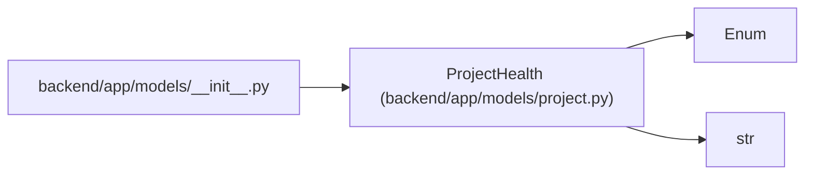

# ProjectHealth

**Location:** `backend/app/models/project.py:32`
**Kind:** Enum
**Bases:** `str`, `Enum`
**Module:** [models_project](../modules/models_project.md)

## Description

Project delivery health.

## Attributes

| Name | Declared value | Description |
|------|-------|-------------|
| `UNKNOWN` | `'unknown'` | — |
| `ON_TRACK` | `'on_track'` | — |
| `AT_RISK` | `'at_risk'` | — |
| `OFF_TRACK` | `'off_track'` | — |

## Methods

*No public methods. Inherits from base classes.*

## Relationships

<!-- Auto-generated relationship summary. Do not edit by hand. -->

### Summary

| Module | Methods | Attributes |
|---|---:|---|
| [models_project](../modules/models_project.md) | 0 | `AT_RISK`, `OFF_TRACK`, `ON_TRACK`, `UNKNOWN` |

### Structure

| Kind | Entity | Module |
|---|---|---|
| Base | `Enum` | — |
| Base | `str` | — |

### References

| Reference | Kind | Source | Call sites |
|---|---|---|---:|
| `__init__` | import | [models___init__](../modules/models___init__.md) | — |
