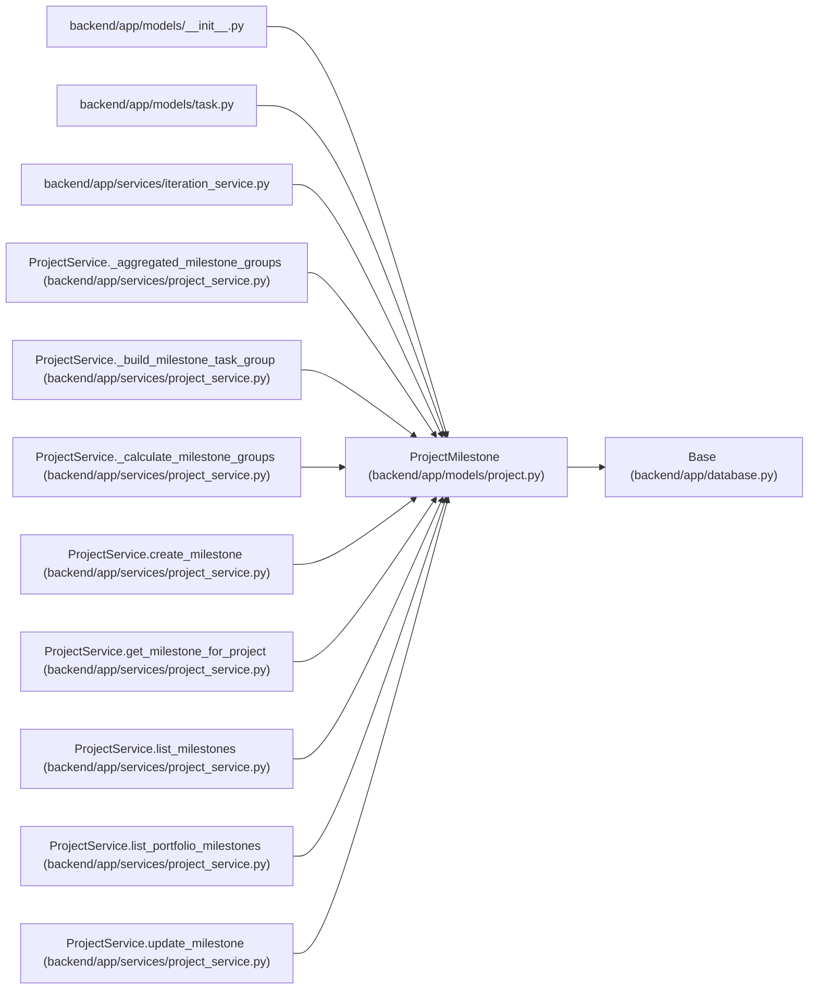

# ProjectMilestone

**Location:** `backend/app/models/project.py:246`
**Kind:** Class
**Bases:** `Base`
**Module:** [models_project](../modules/models_project.md)

## Description

Manually ordered milestone for a single project roadmap.

## Attributes

| Name | Type | Default | Description |
|------|------|---------|-------------|
| `id` | `Mapped[int]` | `mapped_column(Integer, primary_key=True, autoincrement=True)` | — |
| `project_id` | `Mapped[int]` | `mapped_column(Integer, ForeignKey('projects.id', ondelete='CASCADE'), nullable=False, index=True)` | — |
| `name` | `Mapped[str]` | `mapped_column(String(255), nullable=False)` | — |
| `description` | `Mapped[Optional[str]]` | `mapped_column(Text, nullable=True)` | — |
| `target_date` | `Mapped[Optional[date]]` | `mapped_column(Date, nullable=True, index=True)` | — |
| `completed_at` | `Mapped[Optional[datetime]]` | `mapped_column(UTCDateTime(), nullable=True)` | — |
| `sort_order` | `Mapped[int]` | `mapped_column(Integer, default=0, nullable=False)` | — |
| `status` | `Mapped[str]` | `mapped_column(String(50), default=ProjectMilestoneStatus.PLANNED.value, nullable=False, index=True)` | — |
| `created_at` | `Mapped[datetime]` | `mapped_column(UTCDateTime(), default=utc_now, nullable=False)` | — |
| `updated_at` | `Mapped[datetime]` | `mapped_column(UTCDateTime(), default=utc_now, onupdate=utc_now, nullable=False)` | — |
| `project` | `Mapped['Project']` | `relationship('Project', back_populates='milestones')` | — |
| `tasks` | `Mapped[list['Task']]` | `relationship('Task', back_populates='milestone')` | — |

## Methods

*No public methods. Inherits from base classes.*

## Relationships

<!-- Auto-generated relationship summary. Do not edit by hand. -->

### Summary

| Module | Methods | Attributes |
|---|---:|---|
| [models_project](../modules/models_project.md) | 0 | `completed_at`, `created_at`, `description`, `id`, `name`, `project`, `project_id`, `sort_order`, `status`, `target_date`, `tasks`, `updated_at` |

### Structure

| Kind | Entity | Module |
|---|---|---|
| Base | `Base` | [app_database](../modules/app_database.md) |

### References

| Reference | Kind | Source | Call sites |
|---|---|---|---:|
| `__init__` | import | [models___init__](../modules/models___init__.md) | — |
| `task` | import | [models_task](../modules/models_task.md) | — |
| `iteration_service` | import | [iteration_service](../modules/iteration_service.md) | — |
| `ProjectService._aggregated_milestone_groups` | type_reference | [project_service](../modules/project_service.md) | — |
| `ProjectService._build_milestone_task_group` | type_reference | [project_service](../modules/project_service.md) | — |
| `ProjectService._calculate_milestone_groups` | type_reference | [project_service](../modules/project_service.md) | — |
| `ProjectService.create_milestone` | call | [project_service](../modules/project_service.md) | 1 |
| `ProjectService.create_milestone` | type_reference | [project_service](../modules/project_service.md) | — |
| `ProjectService.get_milestone_for_project` | type_reference | [project_service](../modules/project_service.md) | — |
| `ProjectService.list_milestones` | type_reference | [project_service](../modules/project_service.md) | — |
| `ProjectService.list_portfolio_milestones` | type_reference | [project_service](../modules/project_service.md) | — |
| `ProjectService.update_milestone` | type_reference | [project_service](../modules/project_service.md) | — |

> References: showing 12 of 14 logical references; 2 omitted by the 12-row generated summary limit.
