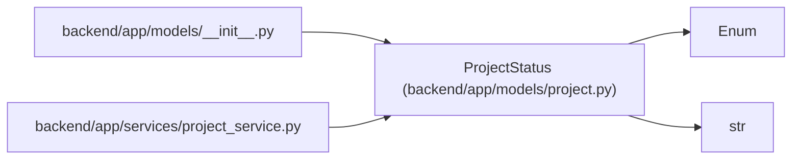

# ProjectStatus

**Location:** `backend/app/models/project.py:22`
**Kind:** Enum
**Bases:** `str`, `Enum`
**Module:** [models_project](../modules/models_project.md)

## Description

Project lifecycle status.

## Attributes

| Name | Declared value | Description |
|------|-------|-------------|
| `PROPOSED` | `'proposed'` | — |
| `PLANNED` | `'planned'` | — |
| `ACTIVE` | `'active'` | — |
| `PAUSED` | `'paused'` | — |
| `COMPLETED` | `'completed'` | — |
| `CANCELED` | `'canceled'` | — |

## Methods

*No public methods. Inherits from base classes.*

## Relationships

<!-- Auto-generated relationship summary. Do not edit by hand. -->

### Summary

| Module | Methods | Attributes |
|---|---:|---|
| [models_project](../modules/models_project.md) | 0 | `ACTIVE`, `CANCELED`, `COMPLETED`, `PAUSED`, `PLANNED`, `PROPOSED` |

### Structure

| Kind | Entity | Module |
|---|---|---|
| Base | `Enum` | — |
| Base | `str` | — |

### References

| Reference | Kind | Source | Call sites |
|---|---|---|---:|
| `__init__` | import | [models___init__](../modules/models___init__.md) | — |
| `project_service` | import | [project_service](../modules/project_service.md) | — |
