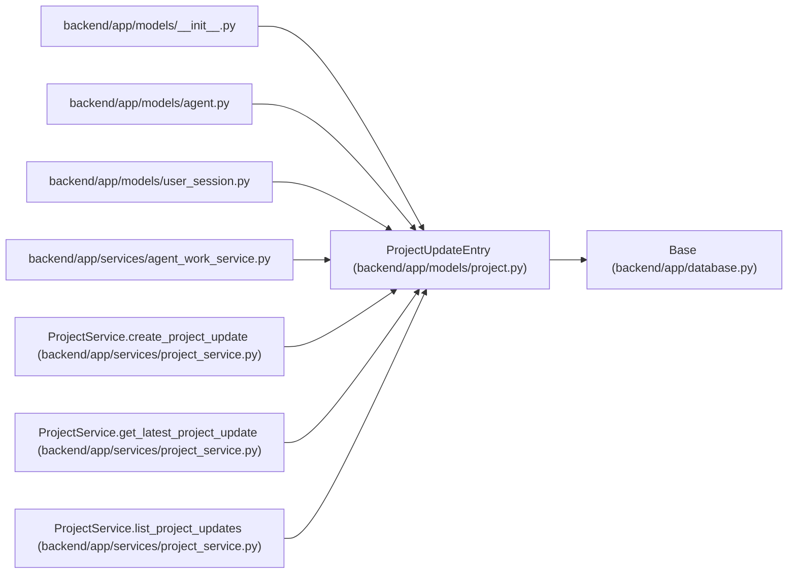

# ProjectUpdateEntry

**Location:** `backend/app/models/project.py:190`
**Kind:** Class
**Bases:** `Base`
**Module:** [models_project](../modules/models_project.md)

## Description

Append-only structured status update for a project.

## Attributes

| Name | Type | Default | Description |
|------|------|---------|-------------|
| `id` | `Mapped[int]` | `mapped_column(Integer, primary_key=True, autoincrement=True)` | — |
| `project_id` | `Mapped[int]` | `mapped_column(Integer, ForeignKey('projects.id', ondelete='CASCADE'), nullable=False, index=True)` | — |
| `health` | `Mapped[str]` | `mapped_column(String(50), nullable=False, index=True)` | — |
| `summary` | `Mapped[str]` | `mapped_column(Text, nullable=False)` | — |
| `progress_text` | `Mapped[Optional[str]]` | `mapped_column(Text, nullable=True)` | — |
| `risks_text` | `Mapped[Optional[str]]` | `mapped_column(Text, nullable=True)` | — |
| `decisions_text` | `Mapped[Optional[str]]` | `mapped_column(Text, nullable=True)` | — |
| `next_steps_text` | `Mapped[Optional[str]]` | `mapped_column(Text, nullable=True)` | — |
| `created_by_session_id` | `Mapped[Optional[int]]` | `mapped_column(Integer, ForeignKey('user_sessions.id', ondelete='SET NULL'), nullable=True, index=True)` | — |
| `created_by_actor_id` | `Mapped[Optional[int]]` | `mapped_column(Integer, ForeignKey('agent_actors.id', ondelete='SET NULL'), nullable=True, index=True)` | — |
| `evidence_json` | `Mapped[dict]` | `mapped_column(JSON, default=dict, nullable=False)` | — |
| `correlation_id` | `Mapped[Optional[str]]` | `mapped_column(String(255), nullable=True, index=True)` | — |
| `idempotency_key` | `Mapped[Optional[str]]` | `mapped_column(String(255), nullable=True, index=True)` | — |
| `created_at` | `Mapped[datetime]` | `mapped_column(UTCDateTime(), default=utc_now, nullable=False, index=True)` | — |
| `project` | `Mapped['Project']` | `relationship('Project', back_populates='updates')` | — |
| `created_by_session` | `Mapped[Optional['UserSession']]` | `relationship('UserSession', back_populates='project_updates')` | — |
| `created_by_actor` | `Mapped[Optional['AgentActor']]` | `relationship('AgentActor', back_populates='project_updates_authored')` | — |

## Methods

*No public methods. Inherits from base classes.*

## Relationships

<!-- Auto-generated relationship summary. Do not edit by hand. -->

### Summary

| Module | Methods | Attributes |
|---|---:|---|
| [models_project](../modules/models_project.md) | 0 | `correlation_id`, `created_at`, `created_by_actor`, `created_by_actor_id`, `created_by_session`, `created_by_session_id`, `decisions_text`, `evidence_json`, `health`, `id`, `idempotency_key`, `next_steps_text` |

### Structure

| Kind | Entity | Module |
|---|---|---|
| Base | `Base` | [app_database](../modules/app_database.md) |

### References

| Reference | Kind | Source | Call sites |
|---|---|---|---:|
| `__init__` | import | [models___init__](../modules/models___init__.md) | — |
| `agent` | import | [models_agent](../modules/models_agent.md) | — |
| `user_session` | import | [user_session](../modules/user_session.md) | — |
| `agent_work_service` | import | [agent_work_service](../modules/agent_work_service.md) | — |
| `ProjectService.create_project_update` | call | [project_service](../modules/project_service.md) | 1 |
| `ProjectService.create_project_update` | type_reference | [project_service](../modules/project_service.md) | — |
| `ProjectService.get_latest_project_update` | type_reference | [project_service](../modules/project_service.md) | — |
| `ProjectService.list_project_updates` | type_reference | [project_service](../modules/project_service.md) | — |
