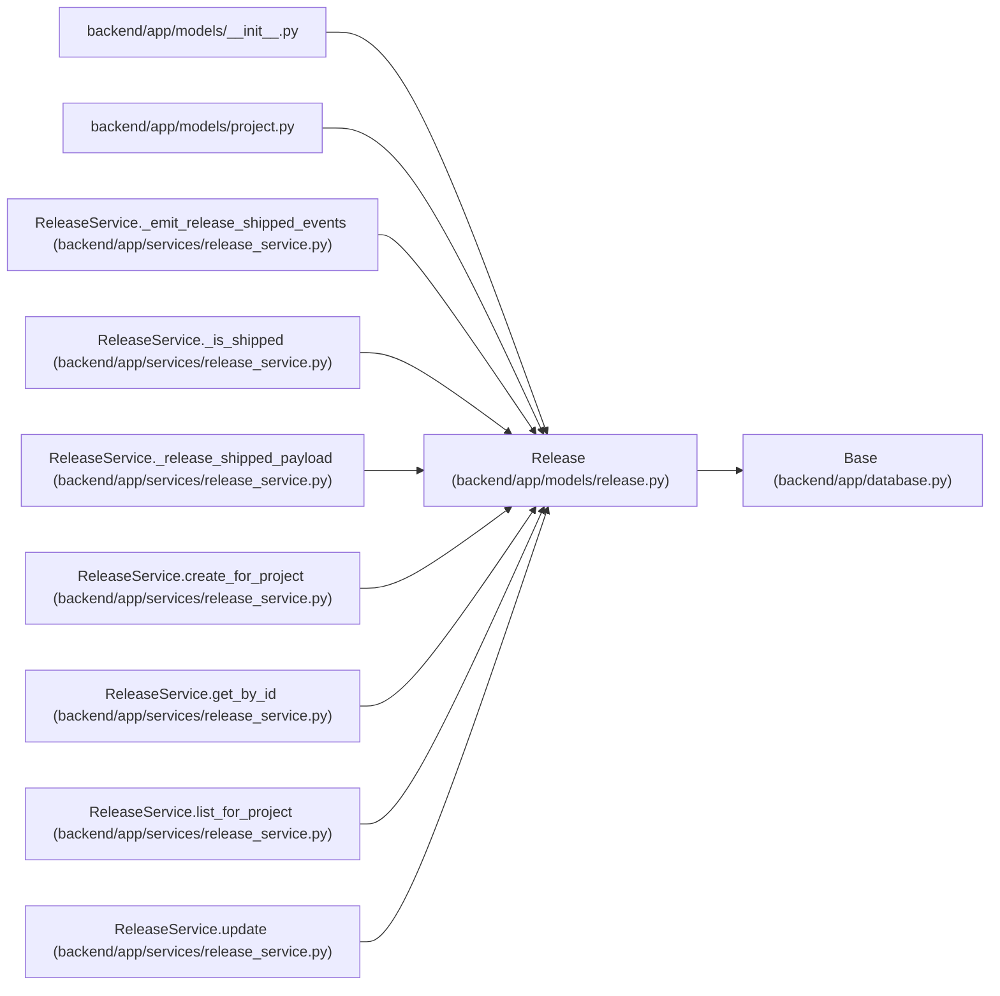

# Release

**Location:** `backend/app/models/release.py:60`
**Kind:** Class
**Bases:** `Base`
**Module:** [models_release](../modules/models_release.md)

## Description

Lightweight shipping record scoped to one project.

## Attributes

| Name | Type | Default | Description |
|------|------|---------|-------------|
| `id` | `Mapped[int]` | `mapped_column(Integer, primary_key=True, autoincrement=True)` | — |
| `name` | `Mapped[str]` | `mapped_column(String(255), nullable=False)` | — |
| `description` | `Mapped[Optional[str]]` | `mapped_column(Text, nullable=True)` | — |
| `project_id` | `Mapped[int]` | `mapped_column(Integer, ForeignKey('projects.id', ondelete='CASCADE'), nullable=False, index=True)` | — |
| `status` | `Mapped[str]` | `mapped_column(String(50), default=ReleaseStatus.PLANNED.value, nullable=False, index=True)` | — |
| `target_date` | `Mapped[Optional[date]]` | `mapped_column(Date, nullable=True, index=True)` | — |
| `shipped_at` | `Mapped[Optional[datetime]]` | `mapped_column(UTCDateTime(), nullable=True)` | — |
| `version` | `Mapped[Optional[str]]` | `mapped_column(String(100), nullable=True)` | — |
| `environment` | `Mapped[Optional[str]]` | `mapped_column(String(100), nullable=True)` | — |
| `created_at` | `Mapped[datetime]` | `mapped_column(UTCDateTime(), default=utc_now, nullable=False)` | — |
| `updated_at` | `Mapped[datetime]` | `mapped_column(UTCDateTime(), default=utc_now, onupdate=utc_now, nullable=False)` | — |
| `project` | `Mapped['Project']` | `relationship('Project', back_populates='releases')` | — |
| `tasks` | `Mapped[list['Task']]` | `relationship('Task', secondary=release_tasks, order_by='Task.sort_order, Task.id')` | — |
| `external_links` | `Mapped[list['ExternalLink']]` | `relationship('ExternalLink', primaryjoin=lambda: and_(Release.id == foreign(ExternalLink.entity_id), ExternalLink.entity_type == 'release'), order_by='ExternalLink.created_at, ExternalLink.id', viewonly=True)` | — |

## Methods

| Method | Signature | Decorators | Description |
|--------|-----------|------------|-------------|
| `task_ids` | `() -> list[int]` | `@property` | Return linked task IDs for response schemas and future service code. |

## Relationships

<!-- Auto-generated relationship summary. Do not edit by hand. -->

### Summary

| Module | Methods | Attributes |
|---|---:|---|
| [models_release](../modules/models_release.md) | 1 | `created_at`, `description`, `environment`, `external_links`, `id`, `name`, `project`, `project_id`, `shipped_at`, `status`, `target_date`, `tasks` |

### Structure

| Kind | Entity | Module |
|---|---|---|
| Base | `Base` | [app_database](../modules/app_database.md) |

### References

| Reference | Kind | Source | Call sites |
|---|---|---|---:|
| `__init__` | import | [models___init__](../modules/models___init__.md) | — |
| `project` | import | [models_project](../modules/models_project.md) | — |
| `ReleaseService._emit_release_shipped_events` | type_reference | [release_service](../modules/release_service.md) | — |
| `ReleaseService._is_shipped` | type_reference | [release_service](../modules/release_service.md) | — |
| `ReleaseService._release_shipped_payload` | type_reference | [release_service](../modules/release_service.md) | — |
| `ReleaseService.create_for_project` | call | [release_service](../modules/release_service.md) | 1 |
| `ReleaseService.create_for_project` | type_reference | [release_service](../modules/release_service.md) | — |
| `ReleaseService.get_by_id` | type_reference | [release_service](../modules/release_service.md) | — |
| `ReleaseService.list_for_project` | type_reference | [release_service](../modules/release_service.md) | — |
| `ReleaseService.update` | type_reference | [release_service](../modules/release_service.md) | — |
