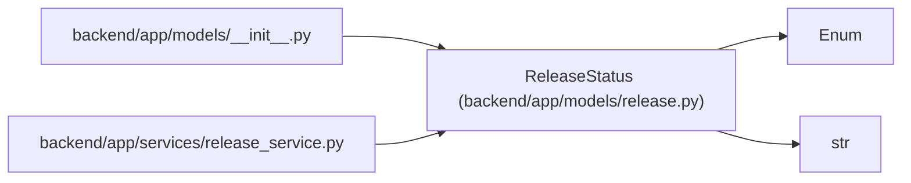

# ReleaseStatus

**Location:** `backend/app/models/release.py:29`
**Kind:** Enum
**Bases:** `str`, `Enum`
**Module:** [models_release](../modules/models_release.md)

## Description

Release lifecycle independent of task status.

## Attributes

| Name | Declared value | Description |
|------|-------|-------------|
| `PLANNED` | `'planned'` | — |
| `BUILDING` | `'building'` | — |
| `SHIPPED` | `'shipped'` | — |
| `CANCELED` | `'canceled'` | — |

## Methods

*No public methods. Inherits from base classes.*

## Relationships

<!-- Auto-generated relationship summary. Do not edit by hand. -->

### Summary

| Module | Methods | Attributes |
|---|---:|---|
| [models_release](../modules/models_release.md) | 0 | `BUILDING`, `CANCELED`, `PLANNED`, `SHIPPED` |

### Structure

| Kind | Entity | Module |
|---|---|---|
| Base | `Enum` | — |
| Base | `str` | — |

### References

| Reference | Kind | Source | Call sites |
|---|---|---|---:|
| `__init__` | import | [models___init__](../modules/models___init__.md) | — |
| `release_service` | import | [release_service](../modules/release_service.md) | — |
