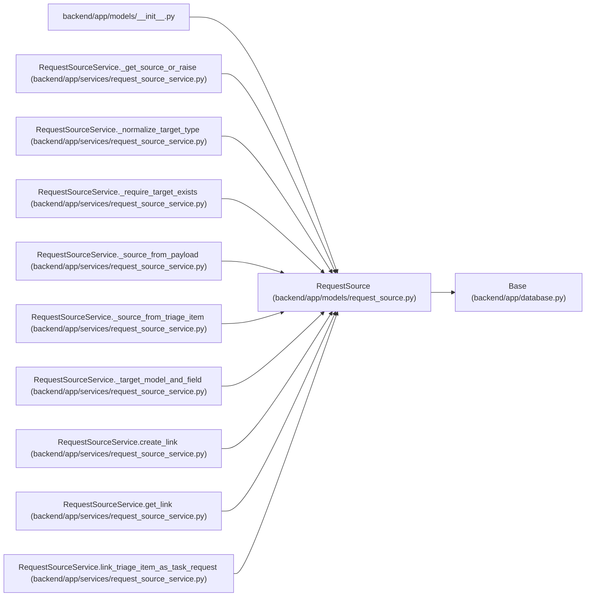

# RequestSource

**Location:** `backend/app/models/request_source.py:37`
**Kind:** Class
**Bases:** `Base`
**Module:** [models_request_source](../modules/models_request_source.md)

## Description

Free-text source record that can be linked to work entities.

## Attributes

| Name | Type | Default | Description |
|------|------|---------|-------------|
| `id` | `Mapped[int]` | `mapped_column(Integer, primary_key=True, autoincrement=True)` | — |
| `title` | `Mapped[str]` | `mapped_column(String(500), nullable=False)` | — |
| `description` | `Mapped[Optional[str]]` | `mapped_column(Text, nullable=True)` | — |
| `source_type` | `Mapped[str]` | `mapped_column(String(50), nullable=False, index=True)` | — |
| `source_name` | `Mapped[Optional[str]]` | `mapped_column(String(255), nullable=True)` | — |
| `source_url` | `Mapped[Optional[str]]` | `mapped_column(String(1000), nullable=True, index=True)` | — |
| `external_key` | `Mapped[Optional[str]]` | `mapped_column(String(255), nullable=True, index=True)` | — |
| `priority_hint` | `Mapped[Optional[int]]` | `mapped_column(Integer, nullable=True)` | — |
| `created_at` | `Mapped[datetime]` | `mapped_column(UTCDateTime(), default=utc_now, nullable=False, index=True)` | — |
| `links` | `Mapped[list['RequestSourceLink']]` | `relationship('RequestSourceLink', back_populates='request_source', cascade='all, delete-orphan', passive_deletes=True, order_by='RequestSourceLink.created_at, RequestSourceLink.id')` | — |

## Methods

*No public methods. Inherits from base classes.*

## Relationships

<!-- Auto-generated relationship summary. Do not edit by hand. -->

### Summary

| Module | Methods | Attributes |
|---|---:|---|
| [models_request_source](../modules/models_request_source.md) | 0 | `created_at`, `description`, `external_key`, `id`, `links`, `priority_hint`, `source_name`, `source_type`, `source_url`, `title` |

### Structure

| Kind | Entity | Module |
|---|---|---|
| Base | `Base` | [app_database](../modules/app_database.md) |

### References

| Reference | Kind | Source | Call sites |
|---|---|---|---:|
| `__init__` | import | [models___init__](../modules/models___init__.md) | — |
| `RequestSourceService._get_source_or_raise` | type_reference | [request_source_service](../modules/request_source_service.md) | — |
| `RequestSourceService._normalize_target_type` | type_reference | [request_source_service](../modules/request_source_service.md) | — |
| `RequestSourceService._require_target_exists` | type_reference | [request_source_service](../modules/request_source_service.md) | — |
| `RequestSourceService._source_from_payload` | call | [request_source_service](../modules/request_source_service.md) | 1 |
| `RequestSourceService._source_from_payload` | type_reference | [request_source_service](../modules/request_source_service.md) | — |
| `RequestSourceService._source_from_triage_item` | call | [request_source_service](../modules/request_source_service.md) | 1 |
| `RequestSourceService._source_from_triage_item` | type_reference | [request_source_service](../modules/request_source_service.md) | — |
| `RequestSourceService._target_model_and_field` | type_reference | [request_source_service](../modules/request_source_service.md) | — |
| `RequestSourceService.create_link` | type_reference | [request_source_service](../modules/request_source_service.md) | — |
| `RequestSourceService.get_link` | type_reference | [request_source_service](../modules/request_source_service.md) | — |
| `RequestSourceService.link_triage_item_as_task_request` | type_reference | [request_source_service](../modules/request_source_service.md) | — |

> References: showing 12 of 14 logical references; 2 omitted by the 12-row generated summary limit.
