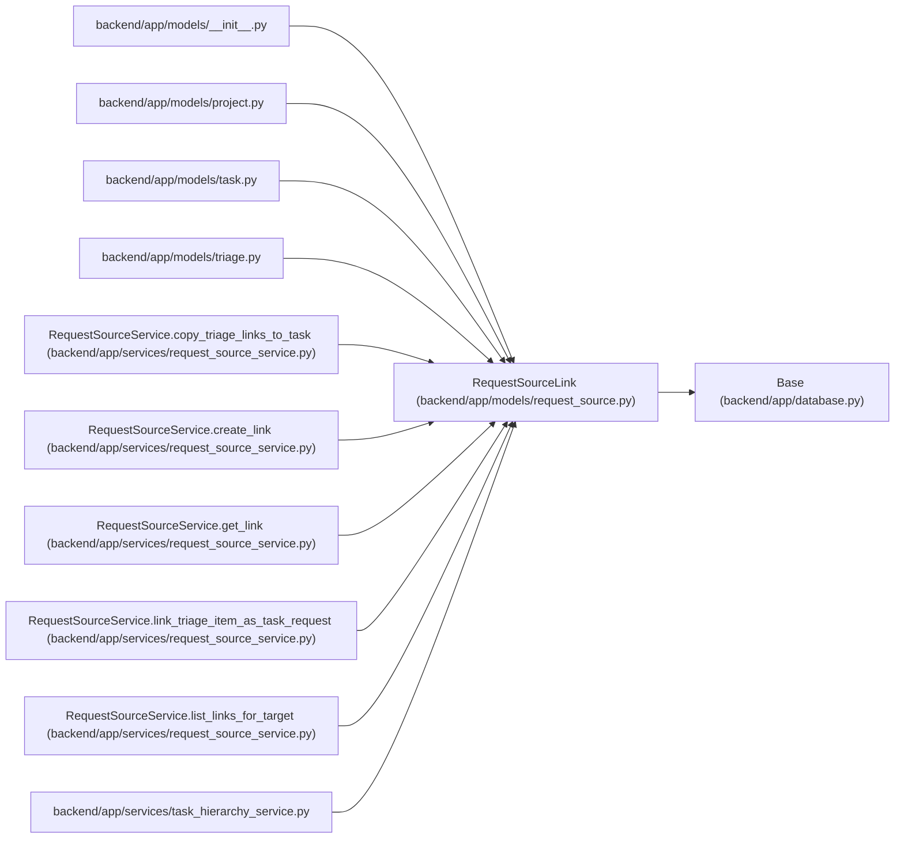

# RequestSourceLink

**Location:** `backend/app/models/request_source.py:76`
**Kind:** Class
**Bases:** `Base`
**Module:** [models_request_source](../modules/models_request_source.md)

## Description

Link from one request source to exactly one supported target.

## Attributes

| Name | Type | Default | Description |
|------|------|---------|-------------|
| `id` | `Mapped[int]` | `mapped_column(Integer, primary_key=True, autoincrement=True)` | — |
| `request_source_id` | `Mapped[int]` | `mapped_column(Integer, ForeignKey('request_sources.id', ondelete='CASCADE'), nullable=False)` | — |
| `triage_item_id` | `Mapped[Optional[int]]` | `mapped_column(Integer, ForeignKey('triage_items.id', ondelete='CASCADE'), nullable=True)` | — |
| `task_id` | `Mapped[Optional[int]]` | `mapped_column(Integer, ForeignKey('tasks.id', ondelete='CASCADE'), nullable=True)` | — |
| `project_id` | `Mapped[Optional[int]]` | `mapped_column(Integer, ForeignKey('projects.id', ondelete='CASCADE'), nullable=True)` | — |
| `created_at` | `Mapped[datetime]` | `mapped_column(UTCDateTime(), default=utc_now, nullable=False)` | — |
| `request_source` | `Mapped['RequestSource']` | `relationship('RequestSource', back_populates='links')` | — |
| `triage_item` | `Mapped[Optional['TriageItem']]` | `relationship('TriageItem', back_populates='request_source_links')` | — |
| `task` | `Mapped[Optional['Task']]` | `relationship('Task', back_populates='request_source_links')` | — |
| `project` | `Mapped[Optional['Project']]` | `relationship('Project', back_populates='request_source_links')` | — |

## Methods

*No public methods. Inherits from base classes.*

## Relationships

<!-- Auto-generated relationship summary. Do not edit by hand. -->

### Summary

| Module | Methods | Attributes |
|---|---:|---|
| [models_request_source](../modules/models_request_source.md) | 0 | `created_at`, `id`, `project`, `project_id`, `request_source`, `request_source_id`, `task`, `task_id`, `triage_item`, `triage_item_id` |

### Structure

| Kind | Entity | Module |
|---|---|---|
| Base | `Base` | [app_database](../modules/app_database.md) |

### References

| Reference | Kind | Source | Call sites |
|---|---|---|---:|
| `__init__` | import | [models___init__](../modules/models___init__.md) | — |
| `project` | import | [models_project](../modules/models_project.md) | — |
| `task` | import | [models_task](../modules/models_task.md) | — |
| `triage` | import | [models_triage](../modules/models_triage.md) | — |
| `RequestSourceService.copy_triage_links_to_task` | call | [request_source_service](../modules/request_source_service.md) | 1 |
| `RequestSourceService.create_link` | call | [request_source_service](../modules/request_source_service.md) | 1 |
| `RequestSourceService.create_link` | type_reference | [request_source_service](../modules/request_source_service.md) | — |
| `RequestSourceService.get_link` | type_reference | [request_source_service](../modules/request_source_service.md) | — |
| `RequestSourceService.link_triage_item_as_task_request` | call | [request_source_service](../modules/request_source_service.md) | 1 |
| `RequestSourceService.link_triage_item_as_task_request` | type_reference | [request_source_service](../modules/request_source_service.md) | — |
| `RequestSourceService.list_links_for_target` | type_reference | [request_source_service](../modules/request_source_service.md) | — |
| `task_hierarchy_service` | import | [task_hierarchy_service](../modules/task_hierarchy_service.md) | — |

> References: showing 12 of 13 logical references; 1 omitted by the 12-row generated summary limit.
