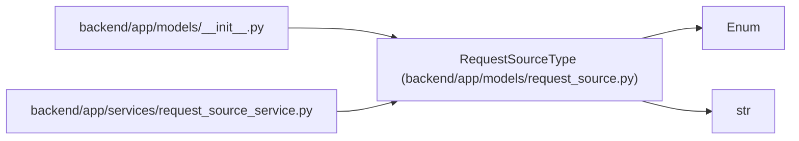

# RequestSourceType

**Location:** `backend/app/models/request_source.py:26`
**Kind:** Enum
**Bases:** `str`, `Enum`
**Module:** [models_request_source](../modules/models_request_source.md)

## Description

Supported lightweight request intake source types.

## Attributes

| Name | Declared value | Description |
|------|-------|-------------|
| `CUSTOMER` | `'customer'` | — |
| `INTERNAL` | `'internal'` | — |
| `SUPPORT` | `'support'` | — |
| `EMAIL` | `'email'` | — |
| `WEB` | `'web'` | — |
| `IMPORT` | `'import'` | — |

## Methods

*No public methods. Inherits from base classes.*

## Relationships

<!-- Auto-generated relationship summary. Do not edit by hand. -->

### Summary

| Module | Methods | Attributes |
|---|---:|---|
| [models_request_source](../modules/models_request_source.md) | 0 | `CUSTOMER`, `EMAIL`, `IMPORT`, `INTERNAL`, `SUPPORT`, `WEB` |

### Structure

| Kind | Entity | Module |
|---|---|---|
| Base | `Enum` | — |
| Base | `str` | — |

### References

| Reference | Kind | Source | Call sites |
|---|---|---|---:|
| `__init__` | import | [models___init__](../modules/models___init__.md) | — |
| `request_source_service` | import | [request_source_service](../modules/request_source_service.md) | — |
