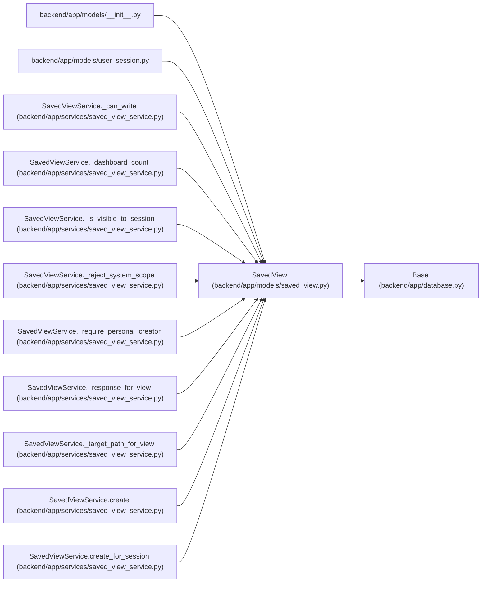

# SavedView

**Location:** `backend/app/models/saved_view.py:30`
**Kind:** Class
**Bases:** `Base`
**Module:** [models_saved_view](../modules/models_saved_view.md)

## Description

Persisted filter, sort, and column configuration for reusable views.

## Attributes

| Name | Type | Default | Description |
|------|------|---------|-------------|
| `id` | `Mapped[int]` | `mapped_column(Integer, primary_key=True, autoincrement=True)` | — |
| `name` | `Mapped[str]` | `mapped_column(String(255), nullable=False)` | — |
| `description` | `Mapped[Optional[str]]` | `mapped_column(Text, nullable=True)` | — |
| `seed_key` | `Mapped[Optional[str]]` | `mapped_column(String(100), nullable=True, unique=True, index=True)` | — |
| `view_type` | `Mapped[str]` | `mapped_column(String(50), nullable=False, index=True)` | — |
| `scope` | `Mapped[str]` | `mapped_column(String(50), nullable=False, index=True)` | — |
| `filters_json` | `Mapped[dict[str, Any]]` | `mapped_column(JSON, default=dict, nullable=False)` | — |
| `sort_json` | `Mapped[dict[str, Any]]` | `mapped_column(JSON, default=dict, nullable=False)` | — |
| `columns_json` | `Mapped[dict[str, Any]]` | `mapped_column(JSON, default=dict, nullable=False)` | — |
| `created_by_session_id` | `Mapped[Optional[int]]` | `mapped_column(Integer, ForeignKey('user_sessions.id', ondelete='SET NULL'), nullable=True, index=True)` | — |
| `schema_version` | `Mapped[int]` | `mapped_column(Integer, default=1, nullable=False)` | — |
| `metric_migration_note` | `Mapped[str \| None]` | `mapped_column(String(64))` | — |
| `owner_principal_id` | `Mapped[int \| None]` | `mapped_column(ForeignKey('principals.id', ondelete='RESTRICT'), index=True)` | — |
| `created_at` | `Mapped[datetime]` | `mapped_column(UTCDateTime(), default=utc_now, nullable=False, index=True)` | — |
| `updated_at` | `Mapped[datetime]` | `mapped_column(UTCDateTime(), default=utc_now, onupdate=utc_now, nullable=False, index=True)` | — |
| `created_by_session` | `Mapped[Optional['UserSession']]` | `relationship('UserSession', back_populates='saved_views')` | — |

## Methods

*No public methods. Inherits from base classes.*

## Relationships

<!-- Auto-generated relationship summary. Do not edit by hand. -->

### Summary

| Module | Methods | Attributes |
|---|---:|---|
| [models_saved_view](../modules/models_saved_view.md) | 0 | `columns_json`, `created_at`, `created_by_session`, `created_by_session_id`, `description`, `filters_json`, `id`, `metric_migration_note`, `name`, `owner_principal_id`, `schema_version`, `scope` |

### Structure

| Kind | Entity | Module |
|---|---|---|
| Base | `Base` | [app_database](../modules/app_database.md) |

### References

| Reference | Kind | Source | Call sites |
|---|---|---|---:|
| `__init__` | import | [models___init__](../modules/models___init__.md) | — |
| `user_session` | import | [user_session](../modules/user_session.md) | — |
| `SavedViewService._can_write` | type_reference | [saved_view_service](../modules/saved_view_service.md) | — |
| `SavedViewService._dashboard_count` | type_reference | [saved_view_service](../modules/saved_view_service.md) | — |
| `SavedViewService._is_visible_to_session` | type_reference | [saved_view_service](../modules/saved_view_service.md) | — |
| `SavedViewService._reject_system_scope` | type_reference | [saved_view_service](../modules/saved_view_service.md) | — |
| `SavedViewService._require_personal_creator` | type_reference | [saved_view_service](../modules/saved_view_service.md) | — |
| `SavedViewService._response_for_view` | type_reference | [saved_view_service](../modules/saved_view_service.md) | — |
| `SavedViewService._target_path_for_view` | type_reference | [saved_view_service](../modules/saved_view_service.md) | — |
| `SavedViewService.create` | call | [saved_view_service](../modules/saved_view_service.md) | 1 |
| `SavedViewService.create` | type_reference | [saved_view_service](../modules/saved_view_service.md) | — |
| `SavedViewService.create_for_session` | type_reference | [saved_view_service](../modules/saved_view_service.md) | — |

> References: showing 12 of 27 logical references; 15 omitted by the 12-row generated summary limit.
