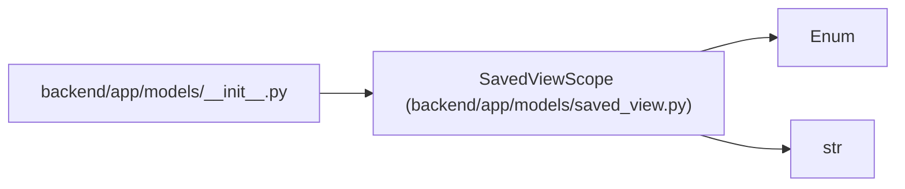

# SavedViewScope

**Location:** `backend/app/models/saved_view.py:23`
**Kind:** Enum
**Bases:** `str`, `Enum`
**Module:** [models_saved_view](../modules/models_saved_view.md)

## Description

Visibility scope for a saved view.

## Attributes

| Name | Declared value | Description |
|------|-------|-------------|
| `PERSONAL` | `'personal'` | — |
| `SHARED` | `'shared'` | — |
| `SYSTEM` | `'system'` | — |

## Methods

*No public methods. Inherits from base classes.*

## Relationships

<!-- Auto-generated relationship summary. Do not edit by hand. -->

### Summary

| Module | Methods | Attributes |
|---|---:|---|
| [models_saved_view](../modules/models_saved_view.md) | 0 | `PERSONAL`, `SHARED`, `SYSTEM` |

### Structure

| Kind | Entity | Module |
|---|---|---|
| Base | `Enum` | — |
| Base | `str` | — |

### References

| Reference | Kind | Source | Call sites |
|---|---|---|---:|
| `__init__` | import | [models___init__](../modules/models___init__.md) | — |
