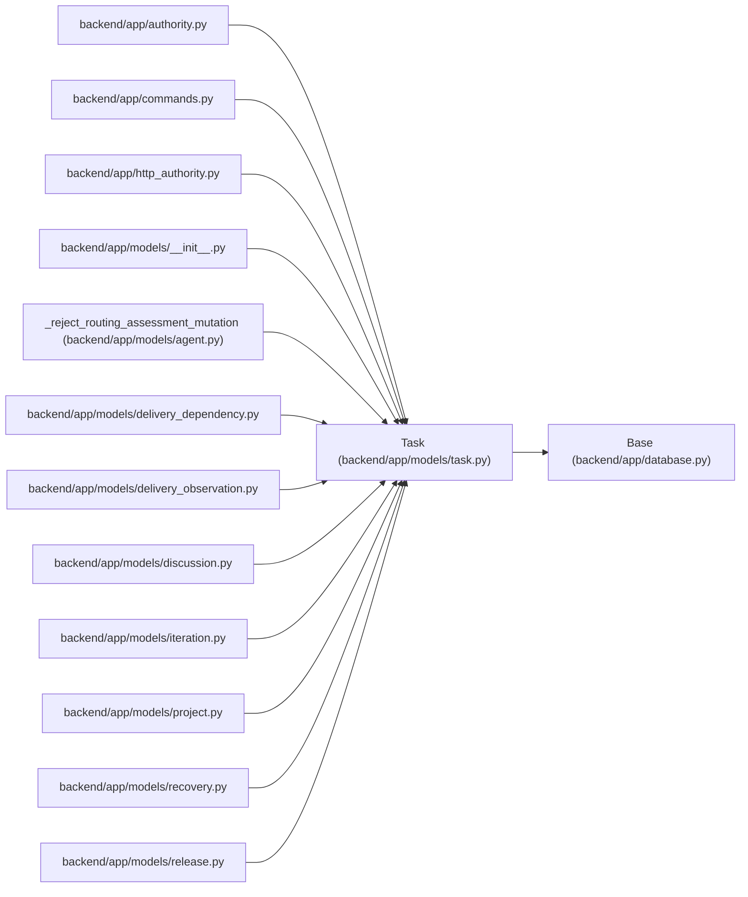

# Task

**Location:** `backend/app/models/task.py:45`
**Kind:** Class
**Bases:** `Base`
**Module:** [models_task](../modules/models_task.md)

## Description

Task model with tree structure and dependencies.

A durable work item has either iteration scope or explicit project backlog scope. Human ownership, capacity, execution identity, estimate provenance and acceptance are distinct fields. Current acceptance is valid only for its task version; cancellation and summary status do not create delivered leaf work.

## Attributes

| Name | Type | Default | Description |
|------|------|---------|-------------|
| `id` | `Mapped[int]` | `mapped_column(Integer, primary_key=True, autoincrement=True)` | — |
| `title` | `Mapped[str]` | `mapped_column(String(500), nullable=False)` | — |
| `is_summary` | `Mapped[bool]` | `mapped_column(default=False, server_default=false(), nullable=False)` | — |
| `baseline_start_date` | `Mapped[date \| None]` | `mapped_column(Date)` | — |
| `baseline_end_date` | `Mapped[date \| None]` | `mapped_column(Date)` | — |
| `baseline_revision` | `Mapped[int]` | `mapped_column(Integer, default=0, server_default='0', nullable=False)` | — |
| `baseline_provenance` | `Mapped[str]` | `mapped_column(String(32), default='uncommitted', server_default='legacy_unknown', nullable=False)` | — |
| `started_at` | `Mapped[datetime \| None]` | `mapped_column(UTCDateTime())` | — |
| `resolved_at` | `Mapped[datetime \| None]` | `mapped_column(UTCDateTime())` | — |
| `accepted_at` | `Mapped[datetime \| None]` | `mapped_column(UTCDateTime())` | — |
| `accepted_version` | `Mapped[int \| None]` | `mapped_column(Integer)` | — |
| `executed_by_principal_id` | `Mapped[int \| None]` | `mapped_column(ForeignKey('principals.id', ondelete='RESTRICT'))` | — |
| `accepted_by_principal_id` | `Mapped[int \| None]` | `mapped_column(ForeignKey('principals.id', ondelete='RESTRICT'))` | — |
| `description` | `Mapped[Optional[str]]` | `mapped_column(Text, nullable=True)` | — |
| `priority` | `Mapped[int]` | `mapped_column(Integer, default=5)` | — |
| `_legacy_effort_days` | `Mapped[float \| None]` | `mapped_column('effort_days', Float, nullable=True)` | — |
| `effort_hours` | `Mapped[float \| None]` | `mapped_column(Float, nullable=True)` | — |
| `nominal_day_hours` | `Mapped[float]` | `mapped_column(Float, default=8.0, server_default='8', nullable=False)` | — |
| `estimate_provenance` | `Mapped[str]` | `mapped_column(String(32), default='unknown', server_default='unknown', nullable=False)` | — |
| `legacy_estimate` | `Mapped[dict \| None]` | `mapped_column(JSON, nullable=True)` | — |
| `domain_backfill_version` | `Mapped[int]` | `mapped_column(Integer, default=1, server_default='0', nullable=False)` | — |
| `domain_migration_notes` | `Mapped[list \| None]` | `mapped_column(JSON)` | — |
| `owner_profile_id` | `Mapped[int \| None]` | `mapped_column(ForeignKey('team_member_profiles.id', ondelete='RESTRICT'), index=True)` | — |
| `ownership_provenance` | `Mapped[str]` | `mapped_column(String(32), default='unassigned', server_default='unassigned', nullable=False)` | — |
| `blocked_reason` | `Mapped[str \| None]` | `mapped_column(Text)` | — |
| `canceled_at` | `Mapped[datetime \| None]` | `mapped_column(UTCDateTime())` | — |
| `canceled_reason` | `Mapped[str \| None]` | `mapped_column(Text)` | — |
| `canceled_by_principal_id` | `Mapped[int \| None]` | `mapped_column(ForeignKey('principals.id', ondelete='RESTRICT'))` | — |
| `execution_mode` | `Mapped[str]` | `mapped_column(String(16), default='scheduled', server_default='scheduled', nullable=False)` | — |
| `brief` | `Mapped[dict \| None]` | `mapped_column(JSON)` | — |
| `brief_revision` | `Mapped[int]` | `mapped_column(Integer, default=0, server_default='0', nullable=False)` | — |
| `brief_provenance` | `Mapped[str]` | `mapped_column(String(32), default='legacy_text', server_default='legacy_text', nullable=False)` | — |
| `legacy_description` | `Mapped[str \| None]` | `mapped_column(Text)` | — |
| `brief_migration_notes` | `Mapped[list \| None]` | `mapped_column(JSON)` | — |
| `artifact_revision` | `Mapped[int]` | `mapped_column(Integer, default=0, server_default='0', nullable=False)` | — |
| `progress` | `Mapped[dict \| None]` | `mapped_column(JSON)` | — |
| `status` | `Mapped[str]` | `mapped_column(String(50), default=TaskStatus.PLANNED.value)` | — |
| `start_date` | `Mapped[Optional[date]]` | `mapped_column(Date, nullable=True)` | — |
| `end_date` | `Mapped[Optional[date]]` | `mapped_column(Date, nullable=True)` | — |
| `actual_start_date` | `Mapped[Optional[date]]` | `mapped_column(Date, nullable=True)` | — |
| `actual_end_date` | `Mapped[Optional[date]]` | `mapped_column(Date, nullable=True)` | — |
| `calculated_effort_days` | `Mapped[Optional[float]]` | `mapped_column(Float, nullable=True)` | — |
| `min_start_date` | `Mapped[Optional[date]]` | `mapped_column(Date, nullable=True)` | — |
| `max_end_date` | `Mapped[Optional[date]]` | `mapped_column(Date, nullable=True)` | — |
| `is_optional` | `Mapped[bool]` | `mapped_column(default=False)` | — |
| `is_deferred` | `Mapped[bool]` | `mapped_column(default=False)` | — |
| `tags` | `Mapped[Optional[str]]` | `mapped_column(String(1000), nullable=True, default='[]')` | — |
| `sort_order` | `Mapped[int]` | `mapped_column(Integer, default=0)` | — |
| `external_key` | `Mapped[Optional[str]]` | `mapped_column(String(255), nullable=True, index=True)` | — |
| `source` | `Mapped[Optional[str]]` | `mapped_column(String(100), nullable=True)` | — |
| `source_url` | `Mapped[Optional[str]]` | `mapped_column(String(1000), nullable=True)` | — |
| `version` | `Mapped[int]` | `mapped_column(Integer, default=1, nullable=False)` | — |
| `claim_expires_at` | `Mapped[Optional[datetime]]` | `mapped_column(UTCDateTime(), nullable=True)` | — |
| `claim_id` | `Mapped[Optional[str]]` | `mapped_column(String(64), nullable=True, index=True)` | — |
| `claim_generation` | `Mapped[int]` | `mapped_column(Integer, default=0, nullable=False)` | — |
| `updated_at` | `Mapped[datetime]` | `mapped_column(UTCDateTime(), default=utc_now, onupdate=utc_now, nullable=False)` | — |
| `iteration_id` | `Mapped[int \| None]` | `mapped_column(Integer, ForeignKey('iterations.id'), nullable=True)` | — |
| `project_id` | `Mapped[Optional[int]]` | `mapped_column(Integer, ForeignKey('projects.id', ondelete='SET NULL'), nullable=True, index=True)` | — |
| `milestone_id` | `Mapped[Optional[int]]` | `mapped_column(Integer, ForeignKey('project_milestones.id', ondelete='SET NULL'), nullable=True, index=True)` | — |
| `parent_id` | `Mapped[Optional[int]]` | `mapped_column(Integer, ForeignKey('tasks.id'), nullable=True)` | — |
| `assignee_id` | `Mapped[Optional[int]]` | `mapped_column(Integer, ForeignKey('team_members.id'), nullable=True)` | — |
| `claimed_by` | `Mapped[Optional[int]]` | `mapped_column(Integer, ForeignKey('agent_actors.id'), nullable=True)` | — |
| `owner_profile` | `Mapped[Optional['TeamMemberProfile']]` | `relationship('TeamMemberProfile')` | — |
| `iteration` | `Mapped[Optional['Iteration']]` | `relationship('Iteration', back_populates='tasks')` | — |
| `project` | `Mapped[Optional['Project']]` | `relationship('Project', back_populates='tasks')` | — |
| `milestone` | `Mapped[Optional['ProjectMilestone']]` | `relationship('ProjectMilestone', back_populates='tasks')` | — |
| `assignee` | `Mapped[Optional['TeamMember']]` | `relationship('TeamMember', back_populates='tasks')` | — |
| `claimed_agent` | `Mapped[Optional['AgentActor']]` | `relationship('AgentActor', back_populates='claimed_tasks')` | — |
| `parent` | `Mapped[Optional['Task']]` | `relationship('Task', back_populates='children', remote_side=[id])` | — |
| `children` | `Mapped[list['Task']]` | `relationship('Task', back_populates='parent', cascade='all, delete-orphan', order_by='Task.sort_order, Task.id')` | — |
| `dependencies` | `Mapped[list['TaskDependency']]` | `relationship('TaskDependency', foreign_keys='TaskDependency.task_id', back_populates='task', cascade='all, delete-orphan')` | — |
| `dependents` | `Mapped[list['TaskDependency']]` | `relationship('TaskDependency', foreign_keys='TaskDependency.depends_on_id', back_populates='depends_on', cascade='all, delete-orphan')` | — |
| `status_logs` | `Mapped[list['TaskStatusLog']]` | `relationship('TaskStatusLog', back_populates='task', cascade='all, delete-orphan', order_by='TaskStatusLog.changed_at.desc()')` | — |
| `events` | `Mapped[list['TaskEvent']]` | `relationship('TaskEvent', back_populates='task', passive_deletes=True, order_by='TaskEvent.created_at.desc()')` | — |
| `agent_runs` | `Mapped[list['AgentRun']]` | `relationship('AgentRun', back_populates='task', passive_deletes=True, order_by='AgentRun.started_at.desc()')` | — |
| `agent_assignments` | `Mapped[list['AgentTaskAssignment']]` | `relationship('AgentTaskAssignment', back_populates='task', cascade='all, delete-orphan', order_by='AgentTaskAssignment.created_at.desc()')` | — |
| `routing_assessments` | `Mapped[list['TaskRoutingAssessment']]` | `relationship('TaskRoutingAssessment', back_populates='task', passive_deletes=True, order_by='TaskRoutingAssessment.task_version.desc(), TaskRoutingAssessment.created_at.desc()')` | — |
| `external_links` | `Mapped[list['ExternalLink']]` | `relationship('ExternalLink', primaryjoin=lambda: and_(Task.id == foreign(ExternalLink.entity_id), ExternalLink.entity_type == 'task'), order_by='ExternalLink.created_at, ExternalLink.id', viewonly=True)` | — |
| `request_source_links` | `Mapped[list['RequestSourceLink']]` | `relationship('RequestSourceLink', back_populates='task', passive_deletes=True, order_by='RequestSourceLink.created_at, RequestSourceLink.id')` | — |

## Methods

| Method | Signature | Decorators | Description |
|--------|-----------|------------|-------------|
| `effort_days` | `() -> float \| None` | `@hybrid_property` | — |
| `_set_effort_days` | `(value: float \| None) -> None` | `@effort_days.inplace.setter` | — |
| `_effort_days_expression` | `()` | `@effort_days.inplace.expression`, `@classmethod` | — |

## Relationships

<!-- Auto-generated relationship summary. Do not edit by hand. -->

### Summary

| Module | Methods | Attributes |
|---|---:|---|
| [models_task](../modules/models_task.md) | 3 | `_legacy_effort_days`, `accepted_at`, `accepted_by_principal_id`, `accepted_version`, `actual_end_date`, `actual_start_date`, `agent_assignments`, `agent_runs`, `artifact_revision`, `assignee`, `assignee_id`, `baseline_end_date` |

### Structure

| Kind | Entity | Module |
|---|---|---|
| Base | `Base` | [app_database](../modules/app_database.md) |

### References

| Reference | Kind | Source | Call sites |
|---|---|---|---:|
| `authority` | import | [authority](../modules/authority.md) | — |
| `commands` | import | [commands](../modules/commands.md) | — |
| `http_authority` | import | [http_authority](../modules/http_authority.md) | — |
| `__init__` | import | [models___init__](../modules/models___init__.md) | — |
| `_reject_routing_assessment_mutation` | type_reference | [models_agent](../modules/models_agent.md) | — |
| `delivery_dependency` | import | [delivery_dependency](../modules/delivery_dependency.md) | — |
| `delivery_observation` | import | [delivery_observation](../modules/delivery_observation.md) | — |
| `discussion` | import | [models_discussion](../modules/models_discussion.md) | — |
| `iteration` | import | [models_iteration](../modules/models_iteration.md) | — |
| `project` | import | [models_project](../modules/models_project.md) | — |
| `recovery` | import | [recovery](../modules/recovery.md) | — |
| `release` | import | [models_release](../modules/models_release.md) | — |

> References: showing 12 of 265 logical references; 253 omitted by the 12-row generated summary limit.
