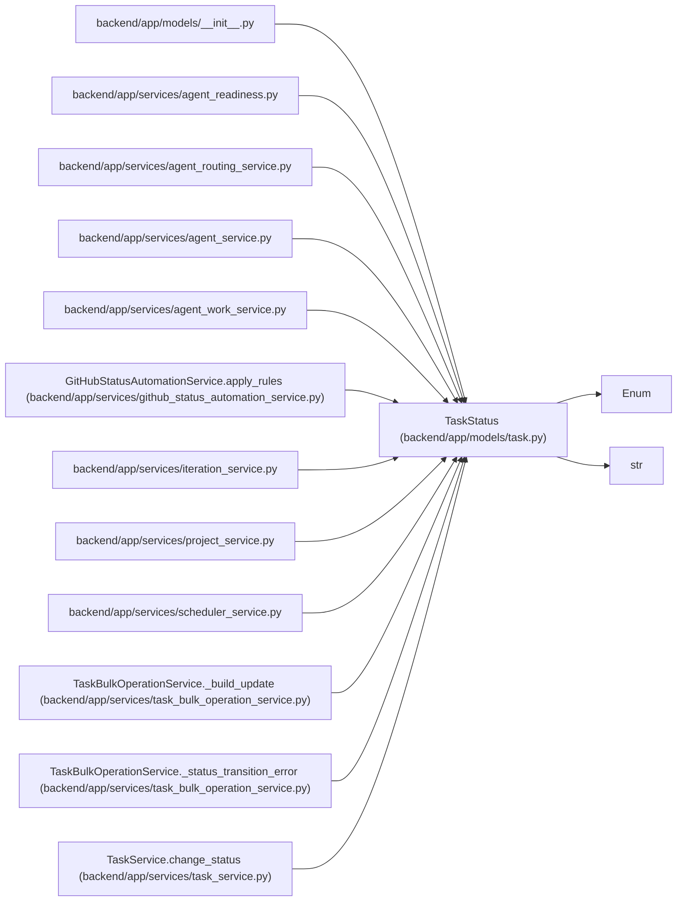

# TaskStatus

**Location:** `backend/app/models/task.py:30`
**Kind:** Enum
**Bases:** `str`, `Enum`
**Module:** [models_task](../modules/models_task.md)

## Description

Task status enumeration for work tracking.

Workflow: PLANNED -> ACTIVE -> RESOLVED -> CLOSED
- PLANNED: Auto-assigned on task creation
- ACTIVE: Work has started
- RESOLVED: Work completed, pending validation
- CLOSED: Fully completed and validated

## Attributes

| Name | Declared value | Description |
|------|-------|-------------|
| `PLANNED` | `'planned'` | — |
| `ACTIVE` | `'active'` | — |
| `RESOLVED` | `'resolved'` | — |
| `CLOSED` | `'closed'` | — |

## Methods

*No public methods. Inherits from base classes.*

## Relationships

<!-- Auto-generated relationship summary. Do not edit by hand. -->

### Summary

| Module | Methods | Attributes |
|---|---:|---|
| [models_task](../modules/models_task.md) | 0 | `ACTIVE`, `CLOSED`, `PLANNED`, `RESOLVED` |

### Structure

| Kind | Entity | Module |
|---|---|---|
| Base | `Enum` | — |
| Base | `str` | — |

### References

| Reference | Kind | Source | Call sites |
|---|---|---|---:|
| `__init__` | import | [models___init__](../modules/models___init__.md) | — |
| `agent_readiness` | import | [agent_readiness](../modules/agent_readiness.md) | — |
| `agent_routing_service` | import | [agent_routing_service](../modules/agent_routing_service.md) | — |
| `agent_service` | import | [agent_service](../modules/agent_service.md) | — |
| `agent_work_service` | import | [agent_work_service](../modules/agent_work_service.md) | — |
| `GitHubStatusAutomationService.apply_rules` | call | [github_status_automation_service](../modules/github_status_automation_service.md) | 1 |
| `iteration_service` | import | [iteration_service](../modules/iteration_service.md) | — |
| `project_service` | import | [project_service](../modules/project_service.md) | — |
| `scheduler_service` | import | [scheduler_service](../modules/scheduler_service.md) | — |
| `TaskBulkOperationService._build_update` | call | [task_bulk_operation_service](../modules/task_bulk_operation_service.md) | 1 |
| `TaskBulkOperationService._status_transition_error` | type_reference | [task_bulk_operation_service](../modules/task_bulk_operation_service.md) | — |
| `TaskService.change_status` | type_reference | [task_service](../modules/task_service.md) | — |

> References: showing 12 of 13 logical references; 1 omitted by the 12-row generated summary limit.
