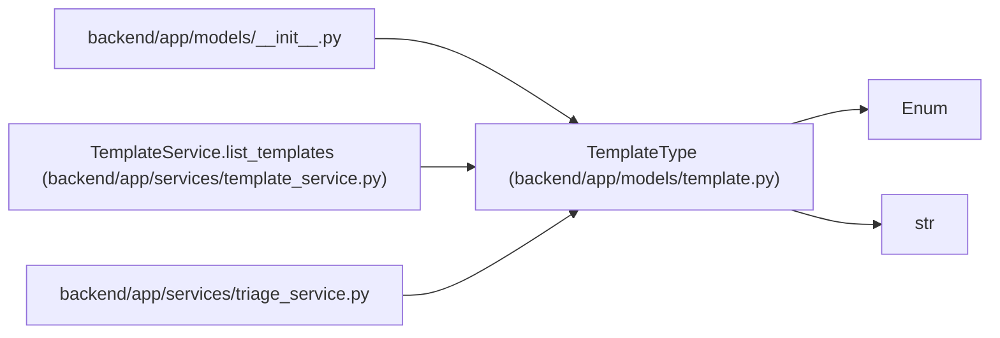

# TemplateType

**Location:** `backend/app/models/template.py:13`
**Kind:** Enum
**Bases:** `str`, `Enum`
**Module:** [models_template](../modules/models_template.md)

## Description

Template target type.

## Attributes

| Name | Declared value | Description |
|------|-------|-------------|
| `TASK` | `'task'` | — |
| `PROJECT` | `'project'` | — |
| `TRIAGE` | `'triage'` | — |

## Methods

*No public methods. Inherits from base classes.*

## Relationships

<!-- Auto-generated relationship summary. Do not edit by hand. -->

### Summary

| Module | Methods | Attributes |
|---|---:|---|
| [models_template](../modules/models_template.md) | 0 | `PROJECT`, `TASK`, `TRIAGE` |

### Structure

| Kind | Entity | Module |
|---|---|---|
| Base | `Enum` | — |
| Base | `str` | — |

### References

| Reference | Kind | Source | Call sites |
|---|---|---|---:|
| `__init__` | import | [models___init__](../modules/models___init__.md) | — |
| `TemplateService.list_templates` | type_reference | [template_service](../modules/template_service.md) | — |
| `triage_service` | import | [triage_service](../modules/triage_service.md) | — |
