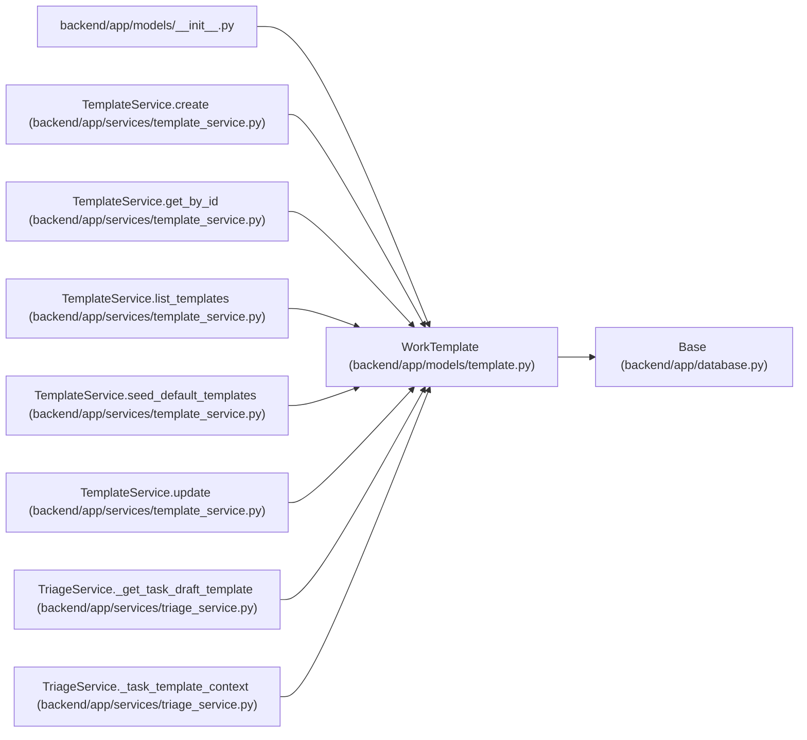

# WorkTemplate

**Location:** `backend/app/models/template.py:20`
**Kind:** Class
**Bases:** `Base`
**Module:** [models_template](../modules/models_template.md)

## Description

Reusable defaults for creating tasks, projects, or triage items.

## Attributes

| Name | Type | Default | Description |
|------|------|---------|-------------|
| `id` | `Mapped[int]` | `mapped_column(Integer, primary_key=True, autoincrement=True)` | — |
| `name` | `Mapped[str]` | `mapped_column(String(255), nullable=False)` | — |
| `description` | `Mapped[Optional[str]]` | `mapped_column(Text, nullable=True)` | — |
| `seed_key` | `Mapped[Optional[str]]` | `mapped_column(String(100), nullable=True, unique=True, index=True)` | — |
| `template_type` | `Mapped[str]` | `mapped_column(String(50), nullable=False, index=True)` | — |
| `default_title` | `Mapped[Optional[str]]` | `mapped_column(String(500), nullable=True)` | — |
| `default_description` | `Mapped[Optional[str]]` | `mapped_column(Text, nullable=True)` | — |
| `default_priority` | `Mapped[Optional[int]]` | `mapped_column(Integer, nullable=True)` | — |
| `default_effort_days` | `Mapped[Optional[float]]` | `mapped_column(Float, nullable=True)` | — |
| `default_labels` | `Mapped[list[str]]` | `mapped_column(JSON, default=list, nullable=False)` | — |
| `default_checklist` | `Mapped[list[str]]` | `mapped_column(JSON, default=list, nullable=False)` | — |
| `default_payload` | `Mapped[dict[str, Any]]` | `mapped_column(JSON, default=dict, nullable=False)` | — |
| `is_active` | `Mapped[bool]` | `mapped_column(Boolean, default=True, nullable=False, index=True)` | — |
| `sort_order` | `Mapped[int]` | `mapped_column(Integer, default=0, nullable=False, index=True)` | — |
| `created_at` | `Mapped[datetime]` | `mapped_column(UTCDateTime(), default=utc_now, nullable=False, index=True)` | — |
| `updated_at` | `Mapped[datetime]` | `mapped_column(UTCDateTime(), default=utc_now, onupdate=utc_now, nullable=False, index=True)` | — |

## Methods

*No public methods. Inherits from base classes.*

## Relationships

<!-- Auto-generated relationship summary. Do not edit by hand. -->

### Summary

| Module | Methods | Attributes |
|---|---:|---|
| [models_template](../modules/models_template.md) | 0 | `created_at`, `default_checklist`, `default_description`, `default_effort_days`, `default_labels`, `default_payload`, `default_priority`, `default_title`, `description`, `id`, `is_active`, `name` |

### Structure

| Kind | Entity | Module |
|---|---|---|
| Base | `Base` | [app_database](../modules/app_database.md) |

### References

| Reference | Kind | Source | Call sites |
|---|---|---|---:|
| `__init__` | import | [models___init__](../modules/models___init__.md) | — |
| `TemplateService.create` | call | [template_service](../modules/template_service.md) | 1 |
| `TemplateService.create` | type_reference | [template_service](../modules/template_service.md) | — |
| `TemplateService.get_by_id` | type_reference | [template_service](../modules/template_service.md) | — |
| `TemplateService.list_templates` | type_reference | [template_service](../modules/template_service.md) | — |
| `TemplateService.seed_default_templates` | call | [template_service](../modules/template_service.md) | 1 |
| `TemplateService.seed_default_templates` | type_reference | [template_service](../modules/template_service.md) | — |
| `TemplateService.update` | type_reference | [template_service](../modules/template_service.md) | — |
| `TriageService._get_task_draft_template` | type_reference | [triage_service](../modules/triage_service.md) | — |
| `TriageService._task_template_context` | type_reference | [triage_service](../modules/triage_service.md) | — |
