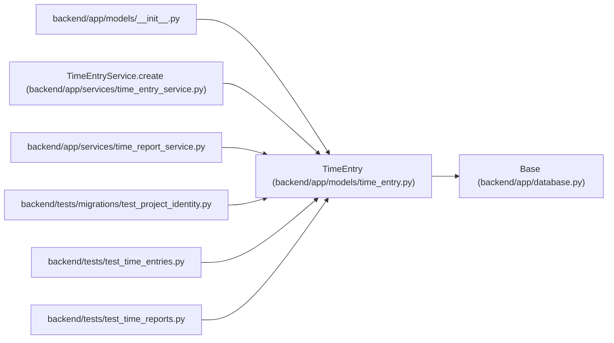

# TimeEntry

**Location:** `backend/app/models/time_entry.py:12`
**Kind:** Class
**Bases:** `Base`
**Module:** [models_time_entry](../modules/models_time_entry.md)

## Description

_Auto-generated from `TimeEntry` in `backend/app/models/time_entry.py`._

## Attributes

| Name | Type | Default | Description |
|------|------|---------|-------------|
| `id` | `Mapped[int]` | `mapped_column(Integer, primary_key=True)` | — |
| `project_id` | `Mapped[int]` | `mapped_column(Integer, nullable=False)` | — |
| `task_id` | `Mapped[int \| None]` | `mapped_column(Integer)` | — |
| `principal_id` | `Mapped[int]` | `mapped_column(Integer, nullable=False)` | — |
| `task_title` | `Mapped[str \| None]` | `mapped_column(String(500))` | — |
| `request_id` | `Mapped[str]` | `mapped_column(String(36), nullable=False)` | — |
| `creation_digest` | `Mapped[str]` | `mapped_column(String(64), nullable=False)` | — |
| `work_date` | `Mapped[date]` | `mapped_column(Date, nullable=False)` | — |
| `timezone` | `Mapped[str]` | `mapped_column(String(64), nullable=False)` | — |
| `minutes` | `Mapped[int]` | `mapped_column(Integer, nullable=False)` | — |
| `note` | `Mapped[str]` | `mapped_column(Text, nullable=False, default='')` | — |
| `version` | `Mapped[int]` | `mapped_column(Integer, nullable=False, default=1)` | — |
| `voided` | `Mapped[bool]` | `mapped_column(nullable=False, default=False)` | — |
| `created_at` | `Mapped[datetime]` | `mapped_column(UTCDateTime(), nullable=False, default=utc_now)` | — |
| `updated_at` | `Mapped[datetime]` | `mapped_column(UTCDateTime(), nullable=False, default=utc_now)` | — |

## Methods

*No public methods. Inherits from base classes.*

## Relationships

<!-- Auto-generated relationship summary. Do not edit by hand. -->

### Summary

| Module | Methods | Attributes |
|---|---:|---|
| [models_time_entry](../modules/models_time_entry.md) | 0 | `created_at`, `creation_digest`, `id`, `minutes`, `note`, `principal_id`, `project_id`, `request_id`, `task_id`, `task_title`, `timezone`, `updated_at` |

### Structure

| Kind | Entity | Module |
|---|---|---|
| Base | `Base` | [app_database](../modules/app_database.md) |

### References

| Reference | Kind | Source | Call sites |
|---|---|---|---:|
| `__init__` | import | [models___init__](../modules/models___init__.md) | — |
| `TimeEntryService.create` | call | [time_entry_service](../modules/time_entry_service.md) | 1 |
| `time_report_service` | import | [time_report_service](../modules/time_report_service.md) | — |
| `test_project_identity` | import | [test_project_identity](../modules/test_project_identity.md) | — |
| `test_time_entries` | import | [test_time_entries](../modules/test_time_entries.md) | — |
| `test_time_reports` | import | [test_time_reports](../modules/test_time_reports.md) | — |
