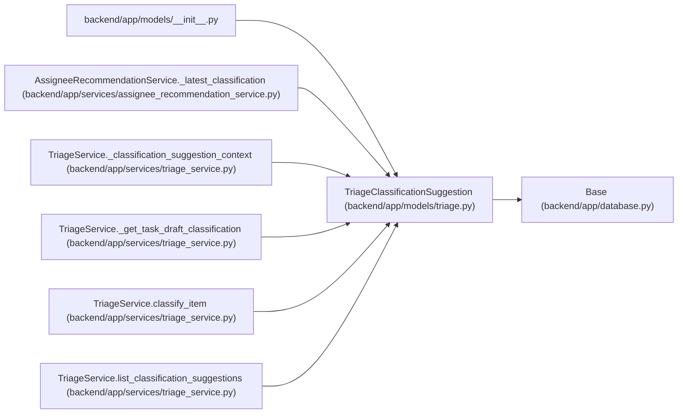

# TriageClassificationSuggestion

**Location:** `backend/app/models/triage.py:130`
**Kind:** Class
**Bases:** `Base`
**Module:** [models_triage](../modules/models_triage.md)

## Description

Stored advisory AI classification for a triage item.

## Attributes

| Name | Type | Default | Description |
|------|------|---------|-------------|
| `id` | `Mapped[int]` | `mapped_column(Integer, primary_key=True, autoincrement=True)` | — |
| `triage_item_id` | `Mapped[int]` | `mapped_column(Integer, ForeignKey('triage_items.id', ondelete='CASCADE'), nullable=False, index=True)` | — |
| `suggested_type_label_slug` | `Mapped[Optional[str]]` | `mapped_column(String(100), nullable=True)` | — |
| `suggested_area_label_slug` | `Mapped[Optional[str]]` | `mapped_column(String(100), nullable=True)` | — |
| `suggested_priority` | `Mapped[Optional[int]]` | `mapped_column(Integer, nullable=True)` | — |
| `suggested_label_slugs` | `Mapped[list[str]]` | `mapped_column(JSON, default=list, nullable=False)` | — |
| `unmatched_label_text` | `Mapped[list[str]]` | `mapped_column(JSON, default=list, nullable=False)` | — |
| `suggested_assignee_id` | `Mapped[Optional[int]]` | `mapped_column(Integer, ForeignKey('team_members.id', ondelete='SET NULL'), nullable=True, index=True)` | — |
| `suggested_assignee_hint` | `Mapped[Optional[str]]` | `mapped_column(String(255), nullable=True)` | — |
| `suggested_project_id` | `Mapped[Optional[int]]` | `mapped_column(Integer, ForeignKey('projects.id', ondelete='SET NULL'), nullable=True, index=True)` | — |
| `duplicate_candidates` | `Mapped[list[dict]]` | `mapped_column(JSON, default=list, nullable=False)` | — |
| `confidence` | `Mapped[float]` | `mapped_column(Float, default=0.0, nullable=False)` | — |
| `rationale` | `Mapped[Optional[str]]` | `mapped_column(Text, nullable=True)` | — |
| `provider` | `Mapped[Optional[str]]` | `mapped_column(String(100), nullable=True)` | — |
| `model` | `Mapped[Optional[str]]` | `mapped_column(String(255), nullable=True)` | — |
| `is_fallback` | `Mapped[bool]` | `mapped_column(Boolean, default=False, nullable=False, index=True)` | — |
| `raw_response_json` | `Mapped[dict]` | `mapped_column(JSON, default=dict, nullable=False)` | — |
| `created_at` | `Mapped[datetime]` | `mapped_column(UTCDateTime(), default=utc_now, nullable=False, index=True)` | — |
| `triage_item` | `Mapped['TriageItem']` | `relationship('TriageItem', back_populates='classification_suggestions')` | — |
| `suggested_assignee` | `Mapped[Optional['TeamMember']]` | `relationship('TeamMember')` | — |
| `suggested_project` | `Mapped[Optional['Project']]` | `relationship('Project')` | — |

## Methods

| Method | Signature | Decorators | Description |
|--------|-----------|------------|-------------|
| `language` | `() -> Optional[str]` | `@property` | Return the stored AI output language when available. |

## Relationships

<!-- Auto-generated relationship summary. Do not edit by hand. -->

### Summary

| Module | Methods | Attributes |
|---|---:|---|
| [models_triage](../modules/models_triage.md) | 1 | `confidence`, `created_at`, `duplicate_candidates`, `id`, `is_fallback`, `model`, `provider`, `rationale`, `raw_response_json`, `suggested_area_label_slug`, `suggested_assignee`, `suggested_assignee_hint` |

### Structure

| Kind | Entity | Module |
|---|---|---|
| Base | `Base` | [app_database](../modules/app_database.md) |

### References

| Reference | Kind | Source | Call sites |
|---|---|---|---:|
| `__init__` | import | [models___init__](../modules/models___init__.md) | — |
| `AssigneeRecommendationService._latest_classification` | type_reference | [assignee_recommendation_service](../modules/assignee_recommendation_service.md) | — |
| `TriageService._classification_suggestion_context` | type_reference | [triage_service](../modules/triage_service.md) | — |
| `TriageService._get_task_draft_classification` | type_reference | [triage_service](../modules/triage_service.md) | — |
| `TriageService.classify_item` | call | [triage_service](../modules/triage_service.md) | 1 |
| `TriageService.classify_item` | type_reference | [triage_service](../modules/triage_service.md) | — |
| `TriageService.list_classification_suggestions` | type_reference | [triage_service](../modules/triage_service.md) | — |
