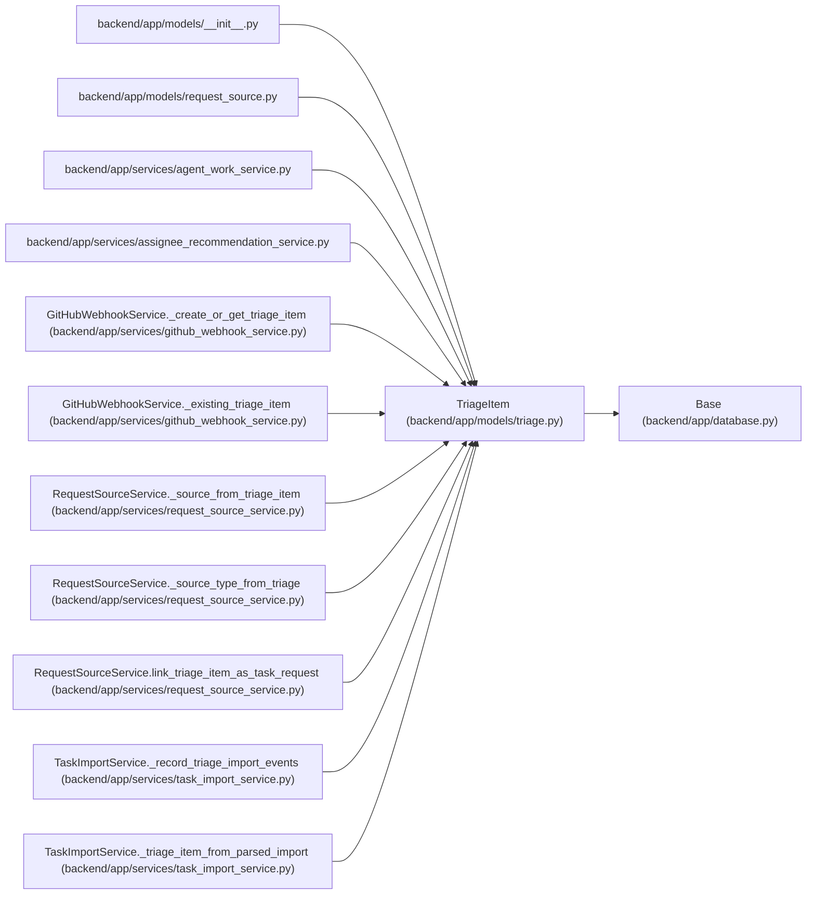

# TriageItem

**Location:** `backend/app/models/triage.py:30`
**Kind:** Class
**Bases:** `Base`
**Module:** [models_triage](../modules/models_triage.md)

## Description

Raw inbound work item before it becomes scheduled task work.

## Attributes

| Name | Type | Default | Description |
|------|------|---------|-------------|
| `id` | `Mapped[int]` | `mapped_column(Integer, primary_key=True, autoincrement=True)` | — |
| `title` | `Mapped[str]` | `mapped_column(String(500), nullable=False)` | — |
| `description` | `Mapped[Optional[str]]` | `mapped_column(Text, nullable=True)` | — |
| `source` | `Mapped[Optional[str]]` | `mapped_column(String(100), nullable=True)` | — |
| `source_url` | `Mapped[Optional[str]]` | `mapped_column(String(1000), nullable=True)` | — |
| `external_key` | `Mapped[Optional[str]]` | `mapped_column(String(255), nullable=True, index=True)` | — |
| `status` | `Mapped[str]` | `mapped_column(String(50), default=TriageItemStatus.NEW.value, nullable=False, index=True)` | — |
| `priority_hint` | `Mapped[Optional[int]]` | `mapped_column(Integer, nullable=True)` | — |
| `assignee_hint` | `Mapped[Optional[str]]` | `mapped_column(String(255), nullable=True)` | — |
| `labels` | `Mapped[list[str]]` | `mapped_column(JSON, default=list, nullable=False)` | — |
| `metadata_json` | `Mapped[dict[str, Any]]` | `mapped_column(JSON, default=dict, nullable=False)` | — |
| `snoozed_until` | `Mapped[Optional[datetime]]` | `mapped_column(UTCDateTime(), nullable=True, index=True)` | — |
| `created_at` | `Mapped[datetime]` | `mapped_column(UTCDateTime(), default=utc_now, nullable=False, index=True)` | — |
| `updated_at` | `Mapped[datetime]` | `mapped_column(UTCDateTime(), default=utc_now, onupdate=utc_now, nullable=False, index=True)` | — |
| `project_hint_id` | `Mapped[Optional[int]]` | `mapped_column(Integer, ForeignKey('projects.id', ondelete='SET NULL'), nullable=True, index=True)` | — |
| `iteration_hint_id` | `Mapped[Optional[int]]` | `mapped_column(Integer, ForeignKey('iterations.id', ondelete='SET NULL'), nullable=True, index=True)` | — |
| `duplicate_of_id` | `Mapped[Optional[int]]` | `mapped_column(Integer, ForeignKey('triage_items.id', ondelete='SET NULL'), nullable=True, index=True)` | — |
| `duplicate_task_id` | `Mapped[Optional[int]]` | `mapped_column(Integer, ForeignKey('tasks.id', ondelete='SET NULL'), nullable=True, index=True)` | — |
| `converted_task_id` | `Mapped[Optional[int]]` | `mapped_column(Integer, ForeignKey('tasks.id', ondelete='SET NULL'), nullable=True, index=True)` | — |
| `project_hint` | `Mapped[Optional['Project']]` | `relationship('Project', foreign_keys=[project_hint_id])` | — |
| `iteration_hint` | `Mapped[Optional['Iteration']]` | `relationship('Iteration', foreign_keys=[iteration_hint_id])` | — |
| `duplicate_of` | `Mapped[Optional['TriageItem']]` | `relationship('TriageItem', remote_side=[id], foreign_keys=[duplicate_of_id], back_populates='duplicate_items')` | — |
| `duplicate_items` | `Mapped[list['TriageItem']]` | `relationship('TriageItem', foreign_keys=[duplicate_of_id], back_populates='duplicate_of')` | — |
| `duplicate_task` | `Mapped[Optional['Task']]` | `relationship('Task', foreign_keys=[duplicate_task_id])` | — |
| `converted_task` | `Mapped[Optional['Task']]` | `relationship('Task', foreign_keys=[converted_task_id])` | — |
| `request_source_links` | `Mapped[list['RequestSourceLink']]` | `relationship('RequestSourceLink', back_populates='triage_item', passive_deletes=True, order_by='RequestSourceLink.created_at, RequestSourceLink.id')` | — |
| `classification_suggestions` | `Mapped[list['TriageClassificationSuggestion']]` | `relationship('TriageClassificationSuggestion', back_populates='triage_item', cascade='all, delete-orphan', passive_deletes=True, order_by='TriageClassificationSuggestion.created_at.desc(), TriageClassificationSuggestion.id.desc()')` | — |

## Methods

| Method | Signature | Decorators | Description |
|--------|-----------|------------|-------------|
| `request_count` | `() -> int` | `@property` | Return loaded direct request-source link count without triggering IO. |

## Relationships

<!-- Auto-generated relationship summary. Do not edit by hand. -->

### Summary

| Module | Methods | Attributes |
|---|---:|---|
| [models_triage](../modules/models_triage.md) | 1 | `assignee_hint`, `classification_suggestions`, `converted_task`, `converted_task_id`, `created_at`, `description`, `duplicate_items`, `duplicate_of`, `duplicate_of_id`, `duplicate_task`, `duplicate_task_id`, `external_key` |

### Structure

| Kind | Entity | Module |
|---|---|---|
| Base | `Base` | [app_database](../modules/app_database.md) |

### References

| Reference | Kind | Source | Call sites |
|---|---|---|---:|
| `__init__` | import | [models___init__](../modules/models___init__.md) | — |
| `request_source` | import | [models_request_source](../modules/models_request_source.md) | — |
| `agent_work_service` | import | [agent_work_service](../modules/agent_work_service.md) | — |
| `assignee_recommendation_service` | import | [assignee_recommendation_service](../modules/assignee_recommendation_service.md) | — |
| `GitHubWebhookService._create_or_get_triage_item` | type_reference | [github_webhook_service](../modules/github_webhook_service.md) | — |
| `GitHubWebhookService._existing_triage_item` | type_reference | [github_webhook_service](../modules/github_webhook_service.md) | — |
| `RequestSourceService._source_from_triage_item` | type_reference | [request_source_service](../modules/request_source_service.md) | — |
| `RequestSourceService._source_type_from_triage` | type_reference | [request_source_service](../modules/request_source_service.md) | — |
| `RequestSourceService.link_triage_item_as_task_request` | type_reference | [request_source_service](../modules/request_source_service.md) | — |
| `TaskImportService._record_triage_import_events` | type_reference | [task_import_service](../modules/task_import_service.md) | — |
| `TaskImportService._triage_item_from_parsed_import` | call | [task_import_service](../modules/task_import_service.md) | 1 |
| `TaskImportService._triage_item_from_parsed_import` | type_reference | [task_import_service](../modules/task_import_service.md) | — |

> References: showing 12 of 33 logical references; 21 omitted by the 12-row generated summary limit.
