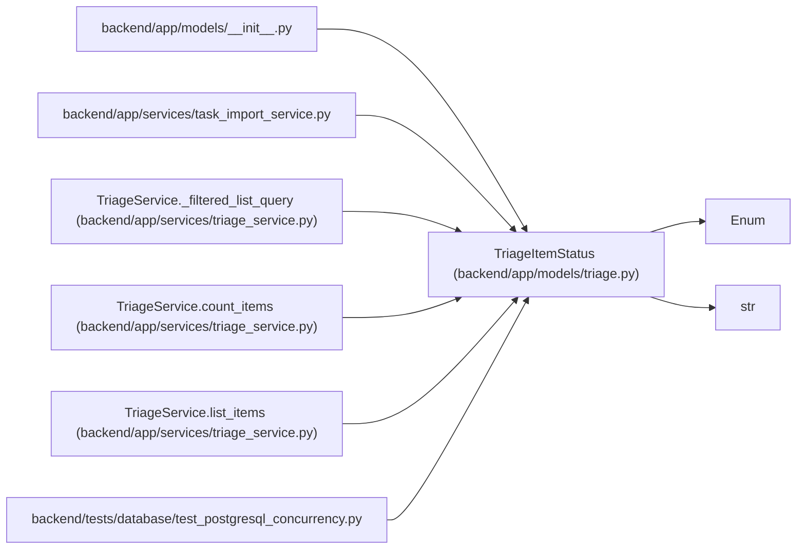

# TriageItemStatus

**Location:** `backend/app/models/triage.py:20`
**Kind:** Enum
**Bases:** `str`, `Enum`
**Module:** [models_triage](../modules/models_triage.md)

## Description

Triage item lifecycle status.

## Attributes

| Name | Declared value | Description |
|------|-------|-------------|
| `NEW` | `'new'` | — |
| `ACCEPTED` | `'accepted'` | — |
| `DECLINED` | `'declined'` | — |
| `DUPLICATE` | `'duplicate'` | — |
| `SNOOZED` | `'snoozed'` | — |
| `CONVERTED` | `'converted'` | — |

## Methods

*No public methods. Inherits from base classes.*

## Relationships

<!-- Auto-generated relationship summary. Do not edit by hand. -->

### Summary

| Module | Methods | Attributes |
|---|---:|---|
| [models_triage](../modules/models_triage.md) | 0 | `ACCEPTED`, `CONVERTED`, `DECLINED`, `DUPLICATE`, `NEW`, `SNOOZED` |

### Structure

| Kind | Entity | Module |
|---|---|---|
| Base | `Enum` | — |
| Base | `str` | — |

### References

| Reference | Kind | Source | Call sites |
|---|---|---|---:|
| `__init__` | import | [models___init__](../modules/models___init__.md) | — |
| `task_import_service` | import | [task_import_service](../modules/task_import_service.md) | — |
| `TriageService._filtered_list_query` | type_reference | [triage_service](../modules/triage_service.md) | — |
| `TriageService.count_items` | type_reference | [triage_service](../modules/triage_service.md) | — |
| `TriageService.list_items` | type_reference | [triage_service](../modules/triage_service.md) | — |
| `test_postgresql_concurrency` | import | [test_postgresql_concurrency](../modules/test_postgresql_concurrency.md) | — |
