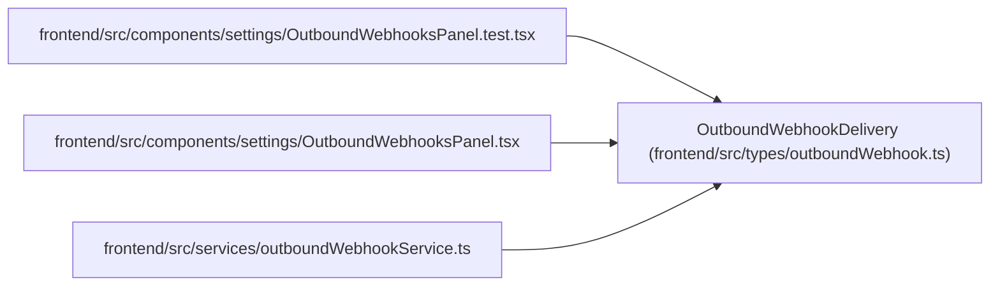

# OutboundWebhookDelivery

**Location:** `frontend/src/types/outboundWebhook.ts:38`
**Kind:** Class
**Bases:** —
**Module:** [outboundWebhook](../modules/outboundWebhook.md)

## Description

_Auto-generated from `OutboundWebhookDelivery` in `frontend/src/types/outboundWebhook.ts`._

## Attributes

| Name | Type | Default | Description |
|------|------|---------|-------------|
| `id` | `number` | *required* | — |
| `target_id` | `number \| null` | *required* | — |
| `event_id` | `number` | *required* | — |
| `target_name` | `string \| null` | *required* | — |
| `target_url` | `string \| null` | *required* | — |
| `status` | `OutboundWebhookDeliveryStatus` | *required* | — |
| `attempt_count` | `number` | *required* | — |
| `last_http_status` | `number \| null` | *required* | — |
| `last_error` | `string \| null` | *required* | — |
| `last_response_body` | `string \| null` | *required* | — |
| `last_attempt_at` | `string \| null` | *required* | — |
| `next_retry_at` | `string \| null` | *required* | — |
| `delivered_at` | `string \| null` | *required* | — |
| `created_at` | `string` | *required* | — |
| `updated_at` | `string` | *required* | — |
| `event` | `OutboundWebhookEvent` | *required* | — |

## Methods

*No public methods. Inherits from base classes.*

## Relationships

<!-- Auto-generated relationship summary. Do not edit by hand. -->

### Summary

| Module | Methods | Attributes |
|---|---:|---|
| [outboundWebhook](../modules/outboundWebhook.md) | 0 | `attempt_count`, `created_at`, `delivered_at`, `event`, `event_id`, `id`, `last_attempt_at`, `last_error`, `last_http_status`, `last_response_body`, `next_retry_at`, `status` |

### References

| Reference | Kind | Source | Call sites |
|---|---|---|---:|
| `OutboundWebhooksPanel.test` | import | [OutboundWebhooksPanel.test](../modules/OutboundWebhooksPanel.test.md) | — |
| `OutboundWebhooksPanel` | import | [OutboundWebhooksPanel](../modules/OutboundWebhooksPanel.md) | — |
| `outboundWebhookService` | import | [outboundWebhookService](../modules/outboundWebhookService.md) | — |
