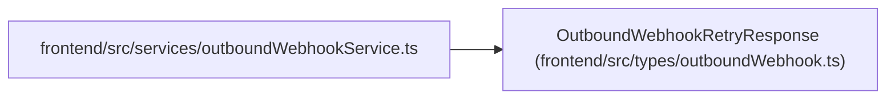

# OutboundWebhookRetryResponse

**Location:** `frontend/src/types/outboundWebhook.ts:57`
**Kind:** Class
**Bases:** —
**Module:** [outboundWebhook](../modules/outboundWebhook.md)

## Description

_Auto-generated from `OutboundWebhookRetryResponse` in `frontend/src/types/outboundWebhook.ts`._

## Attributes

| Name | Type | Required | Default | Description |
|------|------|----------|---------|-------------|
| `delivery` | `OutboundWebhookDelivery` | Yes | — | — |

## Methods

*No public methods. Inherits from base classes.*

## Relationships

<!-- Auto-generated relationship summary. Do not edit by hand. -->

### Summary

| Module | Methods | Attributes |
|---|---:|---|
| [outboundWebhook](../modules/outboundWebhook.md) | 0 | `delivery` |

### References

| Reference | Kind | Source | Call sites |
|---|---|---|---:|
| `outboundWebhookService` | import | [outboundWebhookService](../modules/outboundWebhookService.md) | — |
