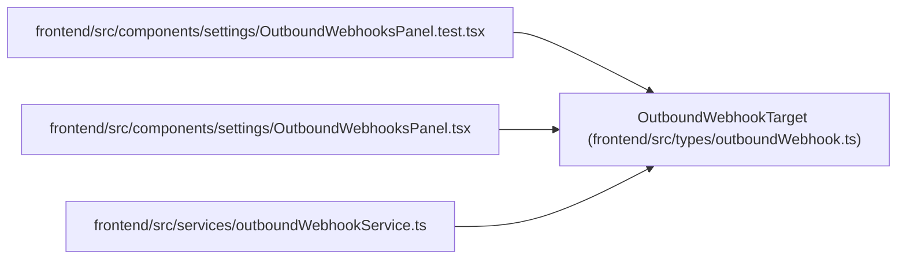

# OutboundWebhookTarget

**Location:** `frontend/src/types/outboundWebhook.ts:3`
**Kind:** Class
**Bases:** —
**Module:** [outboundWebhook](../modules/outboundWebhook.md)

## Description

_Auto-generated from `OutboundWebhookTarget` in `frontend/src/types/outboundWebhook.ts`._

## Attributes

| Name | Type | Required | Default | Description |
|------|------|----------|---------|-------------|
| `id` | `number` | Yes | — | — |
| `name` | `string` | Yes | — | — |
| `description` | `string \| null` | No | — | — |
| `url` | `string` | Yes | — | — |
| `enabled` | `boolean` | Yes | — | — |
| `subscribed_events_json` | `string[]` | Yes | — | — |
| `has_secret` | `boolean` | Yes | — | — |
| `headers_json` | `Record<string, string>` | Yes | — | — |
| `created_at` | `string` | Yes | — | — |
| `updated_at` | `string` | Yes | — | — |

## Methods

*No public methods. Inherits from base classes.*

## Relationships

<!-- Auto-generated relationship summary. Do not edit by hand. -->

### Summary

| Module | Methods | Attributes |
|---|---:|---|
| [outboundWebhook](../modules/outboundWebhook.md) | 0 | `created_at`, `description`, `enabled`, `has_secret`, `headers_json`, `id`, `name`, `subscribed_events_json`, `updated_at`, `url` |

### References

| Reference | Kind | Source | Call sites |
|---|---|---|---:|
| `OutboundWebhooksPanel.test` | import | [OutboundWebhooksPanel.test](../modules/OutboundWebhooksPanel.test.md) | — |
| `OutboundWebhooksPanel` | import | [OutboundWebhooksPanel](../modules/OutboundWebhooksPanel.md) | — |
| `outboundWebhookService` | import | [outboundWebhookService](../modules/outboundWebhookService.md) | — |
