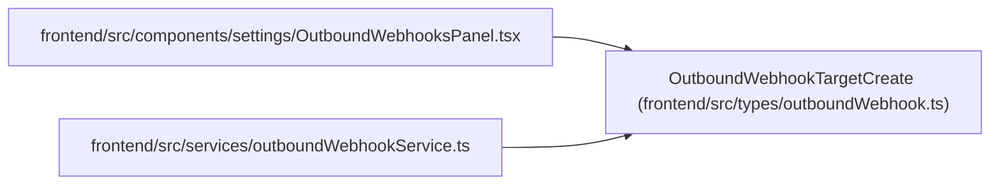

# OutboundWebhookTargetCreate

**Location:** `frontend/src/types/outboundWebhook.ts:16`
**Kind:** Class
**Bases:** —
**Module:** [outboundWebhook](../modules/outboundWebhook.md)

## Description

_Auto-generated from `OutboundWebhookTargetCreate` in `frontend/src/types/outboundWebhook.ts`._

## Attributes

| Name | Type | Required | Default | Description |
|------|------|----------|---------|-------------|
| `name` | `string` | Yes | — | — |
| `description` | `string \| null` | No | — | — |
| `url` | `string` | Yes | — | — |
| `enabled` | `boolean` | Yes | — | — |
| `subscribed_events_json` | `string[]` | Yes | — | — |
| `secret` | `string \| null` | No | — | — |
| `headers_json` | `Record<string, string>` | No | — | — |

## Methods

*No public methods. Inherits from base classes.*

## Relationships

<!-- Auto-generated relationship summary. Do not edit by hand. -->

### Summary

| Module | Methods | Attributes |
|---|---:|---|
| [outboundWebhook](../modules/outboundWebhook.md) | 0 | `description`, `enabled`, `headers_json`, `name`, `secret`, `subscribed_events_json`, `url` |

### References

| Reference | Kind | Source | Call sites |
|---|---|---|---:|
| `OutboundWebhooksPanel` | import | [OutboundWebhooksPanel](../modules/OutboundWebhooksPanel.md) | — |
| `outboundWebhookService` | import | [outboundWebhookService](../modules/outboundWebhookService.md) | — |
