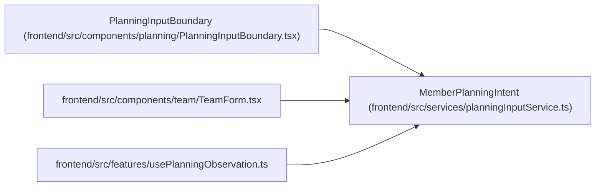

# MemberPlanningIntent

**Location:** `frontend/src/services/planningInputService.ts:12`
**Kind:** Type alias
**Bases:** —
**Module:** [planningInputService](../modules/planningInputService.md)

## Description

_Auto-generated from `MemberPlanningIntent` in `frontend/src/services/planningInputService.ts`._

## Attributes

*No annotated attributes found.*

## Methods

*No public methods. Inherits from base classes.*

## Relationships

<!-- Auto-generated relationship summary. Do not edit by hand. -->

### Summary

| Module | Methods | Attributes |
|---|---:|---|
| [planningInputService](../modules/planningInputService.md) | 0 | — |

### References

| Reference | Kind | Source | Call sites |
|---|---|---|---:|
| `PlanningInputBoundary` | type_reference | [PlanningInputBoundary](../modules/PlanningInputBoundary.md) | — |
| `TeamForm` | import | [TeamForm](../modules/TeamForm.md) | — |
| `usePlanningObservation` | import | [usePlanningObservation](../modules/usePlanningObservation.md) | — |
