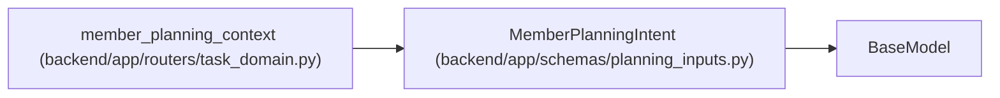

# MemberPlanningIntent

**Location:** `backend/app/schemas/planning_inputs.py:31`
**Kind:** Pydantic model
**Bases:** `BaseModel`
**Module:** [planning_inputs](../modules/planning_inputs.md)

## Description

_Auto-generated from `MemberPlanningIntent` in `backend/app/schemas/planning_inputs.py`._

## Attributes

| Name | Type | Wire name | Required | Nullable | Default | Constraints | Examples | Description |
|------|------|-----------|----------|----------|---------|-------------|-------------|----------|
| `profile_id` | `PositiveInt \| None` | `profile_id` | No | Yes | `None` | — | — | — |
| `name` | `str` | `name` | No | No | `''` | max_length=255 | — | — |
| `email` | `str \| None` | `email` | No | Yes | `None` | max_length=255 | — | — |
| `text` | `str \| None` | `text` | No | Yes | `None` | max_length=unknown (2 * 1024 * 1024) | — | — |
| `csv_text` | `str \| None` | `csv_text` | No | Yes | `None` | max_length=unknown (2 * 1024 * 1024) | — | — |

## Methods

*No public methods. Inherits from base classes.*

## Relationships

<!-- Auto-generated relationship summary. Do not edit by hand. -->

### Summary

| Module | Methods | Attributes |
|---|---:|---|
| [planning_inputs](../modules/planning_inputs.md) | 0 | `csv_text`, `email`, `name`, `profile_id`, `text` |

### Structure

| Kind | Entity | Module |
|---|---|---|
| Base | `BaseModel` | — |

### References

| Reference | Kind | Source | Call sites |
|---|---|---|---:|
| `member_planning_context` | type_reference | [routers_task_domain](../modules/routers_task_domain.md) | — |
