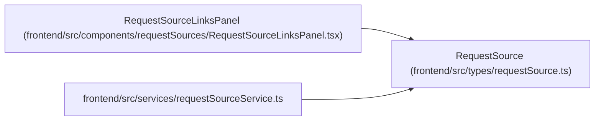

# RequestSource

**Location:** `frontend/src/types/requestSource.ts:4`
**Kind:** Class
**Bases:** —
**Module:** [requestSource](../modules/requestSource.md)

## Description

_Auto-generated from `RequestSource` in `frontend/src/types/requestSource.ts`._

## Attributes

| Name | Type | Required | Default | Description |
|------|------|----------|---------|-------------|
| `id` | `number` | Yes | — | — |
| `title` | `string` | Yes | — | — |
| `description` | `string \| null` | No | — | — |
| `source_type` | `RequestSourceType` | Yes | — | — |
| `source_name` | `string \| null` | No | — | — |
| `source_url` | `string \| null` | No | — | — |
| `external_key` | `string \| null` | No | — | — |
| `priority_hint` | `number \| null` | No | — | — |
| `created_at` | `string` | Yes | — | — |

## Methods

*No public methods. Inherits from base classes.*

## Relationships

<!-- Auto-generated relationship summary. Do not edit by hand. -->

### Summary

| Module | Methods | Attributes |
|---|---:|---|
| [requestSource](../modules/requestSource.md) | 0 | `created_at`, `description`, `external_key`, `id`, `priority_hint`, `source_name`, `source_type`, `source_url`, `title` |

### References

| Reference | Kind | Source | Call sites |
|---|---|---|---:|
| `RequestSourceLinksPanel` | type_reference | [RequestSourceLinksPanel](../modules/RequestSourceLinksPanel.md) | — |
| `requestSourceService` | import | [requestSourceService](../modules/requestSourceService.md) | — |
