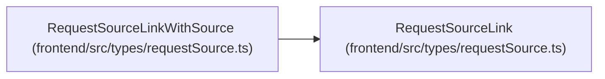

# RequestSourceLink

**Location:** `frontend/src/types/requestSource.ts:26`
**Kind:** Class
**Bases:** —
**Module:** [requestSource](../modules/requestSource.md)

## Description

_Auto-generated from `RequestSourceLink` in `frontend/src/types/requestSource.ts`._

## Attributes

| Name | Type | Default | Description |
|------|------|---------|-------------|
| `id` | `number` | *required* | — |
| `request_source_id` | `number` | *required* | — |
| `triage_item_id` | `number \| null` | *required* | — |
| `task_id` | `number \| null` | *required* | — |
| `project_id` | `number \| null` | *required* | — |
| `created_at` | `string` | *required* | — |

## Methods

*No public methods. Inherits from base classes.*

## Relationships

<!-- Auto-generated relationship summary. Do not edit by hand. -->

### Summary

| Module | Methods | Attributes |
|---|---:|---|
| [requestSource](../modules/requestSource.md) | 0 | `created_at`, `id`, `project_id`, `request_source_id`, `task_id`, `triage_item_id` |

### Structure

| Kind | Entity | Module |
|---|---|---|
| Subclass | `RequestSourceLinkWithSource` | [requestSource](../modules/requestSource.md) |
