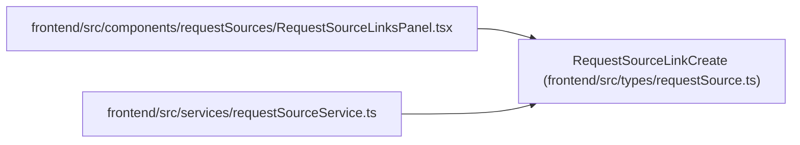

# RequestSourceLinkCreate

**Location:** `frontend/src/types/requestSource.ts:39`
**Kind:** Type alias
**Bases:** —
**Module:** [requestSource](../modules/requestSource.md)

## Description

_Auto-generated from `RequestSourceLinkCreate` in `frontend/src/types/requestSource.ts`._

## Attributes

*No annotated attributes found.*

## Methods

*No public methods. Inherits from base classes.*

## Relationships

<!-- Auto-generated relationship summary. Do not edit by hand. -->

### Summary

| Module | Methods | Attributes |
|---|---:|---|
| [requestSource](../modules/requestSource.md) | 0 | — |

### References

| Reference | Kind | Source | Call sites |
|---|---|---|---:|
| `RequestSourceLinksPanel` | import | [RequestSourceLinksPanel](../modules/RequestSourceLinksPanel.md) | — |
| `requestSourceService` | import | [requestSourceService](../modules/requestSourceService.md) | — |
