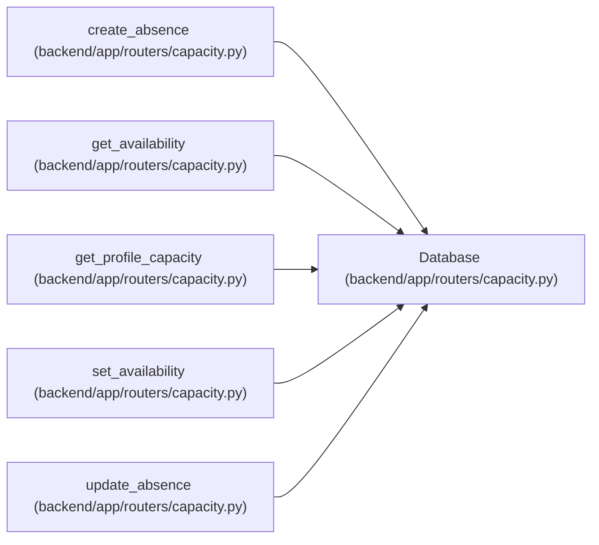

# Database

**Location:** `backend/app/routers/capacity.py:14`
**Kind:** Type alias
**Bases:** —
**Module:** [routers_capacity](../modules/routers_capacity.md)
**Target:** `Annotated[AsyncSession, Depends(get_db, scope='function')]`

## Description

_Auto-generated from `Database` in `backend/app/routers/capacity.py`._

## Attributes

*No annotated attributes found.*

## Methods

*No public methods. Inherits from base classes.*

## Relationships

<!-- Auto-generated relationship summary. Do not edit by hand. -->

### Summary

| Module | Methods | Attributes |
|---|---:|---|
| [routers_capacity](../modules/routers_capacity.md) | 0 | — |

### References

| Reference | Kind | Source | Call sites |
|---|---|---|---:|
| `create_absence` | type_reference | [routers_capacity](../modules/routers_capacity.md) | — |
| `get_availability` | type_reference | [routers_capacity](../modules/routers_capacity.md) | — |
| `get_profile_capacity` | type_reference | [routers_capacity](../modules/routers_capacity.md) | — |
| `set_availability` | type_reference | [routers_capacity](../modules/routers_capacity.md) | — |
| `update_absence` | type_reference | [routers_capacity](../modules/routers_capacity.md) | — |
